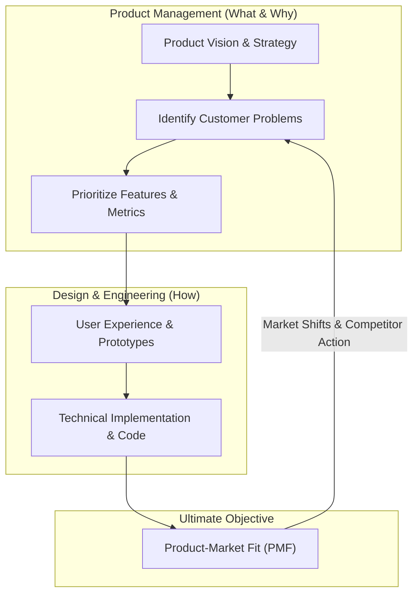

[← Previous Lecture](unavailable)
·
[Section Overview](./README.md)
·
[Part Overview](../README.md)
·
[Next Lecture →](unavailable)

# What Does a PM Do?

> **Material level:** Level 2 — Introduces foundational boundaries of the PM role (What and Why vs. How), the Product Lifecycle, and Product-Market Fit (PMF), which are core mental models for the course.

## Lecture Overview

This lecture explains the primary responsibilities of a Product Manager (PM). By the end, you should be able to:
* Distinguish between the decision ownership of the PM (What/Why) and the execution ownership of Design and Engineering (How).
* Map the stages of the Product Lifecycle and explain the PM's role in extending it.
* Define Product-Market Fit (PMF) and the questions required to establish and maintain it in a shifting market.

## Central Argument

The Product Manager drives a cross-functional team through the product lifecycle to find and maintain product-market fit by owning the **"what"** and **"why"** decisions, while Design and Engineering own the **"how."**

---

## 1. The Decision Boundary: What and Why vs. How

A fundamental mental model of product development is the division of decision-making ownership:
* **The Product Manager owns the "What" and "Why"**: The PM is responsible for deciding what features are built, why they are important, who the target customers are, how the product is priced, and how to position the product against competitors.
* **Design and Engineering own the "How"**: Designers and software engineers are responsible for determining how the product will look, feel, behave, and be technically implemented. 

*Product Management owns the strategic direction (what/why), while Design and Engineering own the technical and visual execution (how).*

The PM does not do everything. A PM does not write production code, design high-fidelity user interfaces, or run marketing campaigns. Instead, they drive the process by aligning these distinct disciplines toward a unified goal.

## 2. Driving the Product Lifecycle

A product behaves much like a living organism, moving through a predictable lifecycle. The PM is responsible for driving the product through these stages and actively extending its relevance:

1. **Inception / Idea**: Initiated by a product vision or an initial idea.
2. **Introduction**: The product is built and launched to early customers.
3. **Growth**: The customer base expands, and adoption increases.
4. **Maturity**: Growth stabilizes. As technology advances and competitors emerge, the product risks stagnation.
5. **Decline**: The product begins to lose relevance and market share.

*Active Product Management extends a product's maturity phase and prevents decline by re-finding product-market fit.*

The instructor emphasizes that a critical role of the PM is to **extend the product's lifecycle**—keeping it alive, modern, and relevant before it slides into decline.

## 3. Uniting the Cross-Functional Team to Find Product-Market Fit

At the heart of the PM's role is the pursuit of **Product-Market Fit (PMF)**. In simple terms, PMF answers the question: *Are there people who will buy my product?*

In practice, achieving PMF requires continuous validation. The product team must answer four key questions:
* What do our customers look like?
* Do we solve a critical problem for them?
* Are they willing to pay for this solution?
* How do we verify that they need it?

*Product-Market Fit is found at the intersection of a validated customer profile, a critical problem, and commercial willingness to pay.*

PMF is not a one-time achievement. Because markets, technologies, and customer expectations constantly change, PMs and their teams must continuously evaluate and re-find PMF even for mature and highly successful products.

---

## Comparison

The table below contrasts the ownership areas between Product Management and the Design/Engineering disciplines:

| Area of Ownership | Product Management (What & Why) | Design & Engineering (How) |
|---|---|---|
| **Strategic Focus** | Target customer segments, pricing, competitor positioning, partnerships. | User experience, interface layout, technical architecture, codebase scaling. |
| **Feature Validation** | Determining if a feature solves a critical problem and drives business success. | Determining how to implement the feature reliably, securely, and intuitively. |
| **Success Metrics** | Product-market fit, customer retention, revenue, adoption. | System uptime, performance latency, usability benchmarks, defect rates. |

---

## Practical Product Management Example

### Situation
A candidate-assessment platform experiences a decline in customer growth because competitors have launched AI-assisted screening filters. The engineering team wants to rebuild the platform's video-interview storage architecture to support high-definition video, while sales wants a custom interface for a single large customer.

### Decision
The PM decides to focus the next development cycle on validating and building an automated candidate shortlisting assistant (the **What** and **Why**), deferring the database rebuild and the custom client request.

### Reasoning
The PM's market analysis shows that recruiters' primary pain point is screening time, not video quality. Rebuilding storage or catering to one client does not address the broader market threat. The PM aligns the engineers and designers on the core problem: reducing time-to-hire.

### Consequence
Designers map a streamlined shortlisting flow, and Engineers design the AI pipeline architecture (the **How**). The new assistant successfully reduces screening time by 40%, keeping the platform competitive and re-establishing its product-market fit.

### Transferable Lesson
PMs must guide teams toward validating and solving market-wide customer problems rather than focusing on low-priority technical updates or isolated customer requests.

---

## Common Misunderstandings

### "The PM is the 'CEO of the Product' and dictates the solution"
* **The Reality**: The PM drives the direction by owning the problem space (what/why) but does not dictate the technical execution. The PM must rely on influence and collaboration, uniting designers, engineers, data scientists, and stakeholders to define the solution together.

### "Product-Market Fit is a one-time milestone"
* **The Reality**: Achieving PMF at launch does not guarantee future success. A changing market, new technologies, or competitor actions can degrade fit. Finding and re-finding PMF is an ongoing, continuous responsibility.

---

## Key Concepts and Definitions

| Concept | Simple definition |
|---|---|
| **Product Manager (PM)** | The role responsible for driving a product from inception to delivery by owning the "what" and "why" decisions. |
| **Product-Market Fit (PMF)** | The sweet spot where a product successfully solves a critical problem for a customer base that is willing to buy it. |
| **Product Lifecycle** | The stages a product moves through from idea, introduction, and growth, to maturity and eventual decline. |

---

## Key Takeaways

1. **Own the What and Why**: The PM's core responsibility is to define what to build and why it is valuable, leaving the "how" to Design and Engineering.
2. **Drive, Don't Do Everything**: A PM does not write code or design screens but coordinates cross-functional teams to work as a well-oiled machine.
3. **Extend the Lifecycle**: PMs must proactively iterate on mature products to keep them relevant and prevent them from sliding into decline.
4. **PMF is Customer-Centric**: Finding PMF requires a deep understanding of target customers, their critical problems, and their willingness to pay.
5. **Continuous Re-evaluation**: Because markets shift, maintaining product-market fit is a continuous process of discovery and execution.
6. **Unify the Team**: Success depends on aligning diverse roles (engineering, design, data science, legal, marketing) around a single goal: delivering value.

---

## Visual Summary

---

## One-Minute Review

Product Managers own the **"what"** and **"why"** decisions of a product, defining features, targets, pricing, and success, while Design and Engineering own the **"how"** of user experience and implementation. The PM drives the product through its entire lifecycle (inception, introduction, growth, maturity, decline) with the core goal of achieving and maintaining **Product-Market Fit (PMF)**—ensuring the product solves critical customer problems that people are willing to pay for in a constantly changing market.

---

## Recommended Visual Illustrations

### Illustration 1: The What & Why vs. How Boundary
* **Concept**: The division of ownership between Product Management and Design/Engineering.
* **Purpose**: Helps the developer-turned-learner visually distinguish between product decisions and execution domains.
* **Suggested structure**: A split-screen column layout. The left column (PM) lists items like Target Customers, Pricing, Competitor Analysis, and Feature Selection under a large header: **What & Why**. The right column (Design & Engineering) lists Interface Design, Code Architecture, Technical Implementation, and Usability under the header: **How**. An arrow of collaboration connects the two columns.

### Illustration 2: Product Lifecycle Curve and PM Extension
* **Concept**: The lifecycle stages of a product and the PM's role in extending relevance.
* **Purpose**: Visualizes the lifecycle curve and shows the impact of active PM intervention.
* **Suggested structure**: An X-axis (Time) and Y-axis (Market Relevance/Adoption) graph showing a curve rising from Inception, peaking at Maturity, and starting to slope downward. A teal branching curve extends from the peak of Maturity, curving upward and outward labeled **PM Extension: Re-finding Product-Market Fit**, while the original line slopes down into **Decline**.

### Illustration 3: The Product-Market Fit (PMF) Sweet Spot
* **Concept**: The alignment of customer needs, problem validity, and commercial feasibility.
* **Purpose**: Visually communicates the elements required to establish PMF.
* **Suggested structure**: A Venn diagram showing three overlapping circles: "Target Customer Profiles," "Validated Critical Problems," and "Willingness to Pay." The sweet spot where all three circles overlap is highlighted in teal and labeled **Product-Market Fit (PMF)**.

**Recommended total:** 3 illustrations

---

## Related Concepts

* [Product Discovery](../../GLOSSARY.md#product-discovery)
* [Product Delivery](../../GLOSSARY.md#product-delivery)

## Visuals in This Lecture

* [The What & Why vs. How Boundary](./visuals/03-what-and-why-vs-how-boundary.png)
* [Product Lifecycle Curve and PM Extension](./visuals/03-product-lifecycle-curve.png)
* [The Product-Market Fit (PMF) Sweet Spot](./visuals/03-product-market-fit-sweet-spot.png)

---

## Interactive Lesson

- [Open the interactive companion](./interactive/03-what-does-a-pm-do.html)

---

## Source

- [Original lecture transcript](../../sources/01-introduction/01-introduction/03-what-does-a-pm-do-transcript.md)

---

## Continue Learning

- Previous: (Unavailable)
- Section: [Section 1: Introduction](./README.md)
- Part: [Part 1: Introduction](../README.md)
- Next: (Unavailable)
- Course index: [Full Course Index](../../COURSE-INDEX.md)
