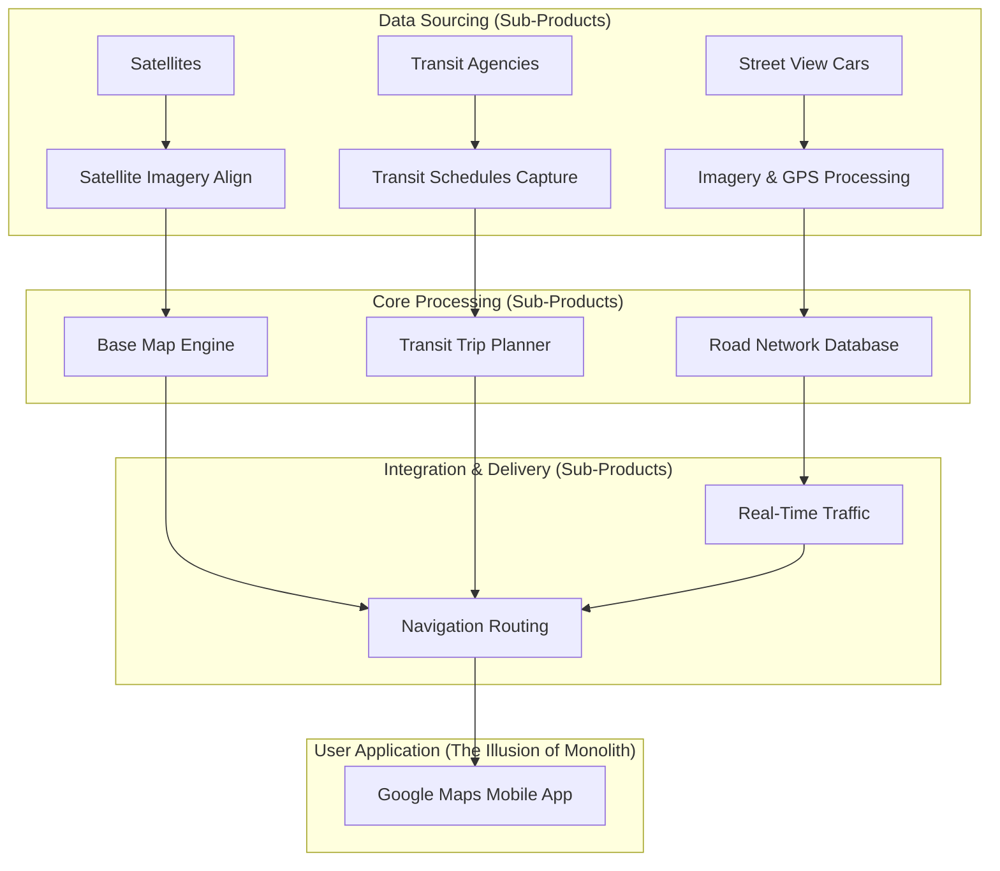

[← Previous Lecture](./03-what-does-a-pm-do.md)
·
[Section Overview](./README.md)
·
[Part Overview](../README.md)
·
[Next Lecture →](unavailable)

# What's a Product?

> **Material level:** Level 2 — Defines a digital product, the abstraction of cloud-running software, and the foundational concept of product decomposition at scale (modular sub-products).

## Lecture Overview

This lecture defines what a "product" is in the digital space and explores how large-scale software platforms are structured. By the end, you should be able to:
* Distinguish between physical goods and abstract, cloud-running digital products.
* Explain the concept of product decomposition (dividing large software products into smaller modular components).
* Describe how a complex platform (e.g., Google Maps) operates as a federation of distinct sub-products managed by different PMs.

## Central Argument

In the digital world, a product is often an abstract, cloud-running software service. To manage complexity at scale, software companies decompose large products into modular sub-products, each owned by its own Product Manager, while maintaining a seamless, single-product experience for the end user.

---

## 1. Defining the Digital Product: Physical vs. Abstract

In the consumer goods space, defining a product is simple: it is a physical item you can hold in your hand, like a bar of soap or toothpaste. In the software industry, however, a product is much more abstract:
* **Abstract Form**: Most digital products are software applications running on local hardware or remotely on servers.
* **Cloud Infrastructure**: Many modern applications run entirely in the cloud, meaning the user does not install software locally but accesses it through a network.
* **Developer Products**: Digital products are not just consumer applications; they also include datasets, APIs, and infrastructure tools built for other developers.

## 2. Product Decomposition: Managing Scale

For large software companies, a digital product can become too massive and complex for a single team to manage. To maintain development speed and focus, organizations use **product decomposition**:
* **Modular Separation**: The monolithic product is split into multiple smaller, self-contained sub-products.
* **Clear Ownership**: Each sub-product is assigned its own Product Manager (PM) and dedicated engineering team.
* **The Illusion of Monolith**: If designed and integrated correctly, these sub-products interact via APIs and shared data layers to offer a seamless user interface. The end user is entirely unaware of the underlying organizational and component boundaries.

*A seamless user interface hides the modular separation of backend sub-product teams.*

## 3. Case Study: Google Maps Team Topology

Google Maps is a prime example of product decomposition at serious scale, serving over 1.1 billion consumers (14% of the world's population) and supporting over 5 million business integrations. To manage this scale, Google Maps employs over 100 Product Managers and 1,000 Engineers, organized into specialized sub-product teams:

*Multiple data ingestion and imagery sub-products feed into the core maps engine.*

* **Data Collection & Ingestion**: Focused on keeping regional geographical data updated. PMs here coordinate ingestion of third-party data, algorithms to detect spam/fraud, and direct outreach to businesses. (20 million contributions/day, 200/second).
* **Street View**: Focused on sourcing, stitching, and mapping 360-degree street-level imagery. PMs here address image-processing seams and overlay GPS/sensor telemetry from survey cars onto map routes.
* **Satellite Imagery**: Manages sourcing, quality processing, and coordinate alignment of space-based images.
* **Traffic**: Algorithmic engine that calculates and paints current traffic conditions onto the map in real time.
* **Road Network**: Focuses on road attribute metadata (speed limits, lanes, one-way markers, road closures, and traffic light locations).
* **Transit**: Captures public transit schedules, routes, and stops by partnering with global transportation providers and integrating them into the Maps trip planner.
* **Navigation**: Consumes road network, traffic, and transit data to calculate optimal travel paths and ETA.

---

## Comparison

The table below contrasts physical consumer goods with modern cloud-based digital products:

| Dimension | Physical Consumer Goods | Cloud-based Digital Products |
|---|---|---|
| **Form & Delivery** | Tangible object (held, shipped, stored locally). | Abstract software running on remote servers or in the cloud. |
| **Release Cycles** | Sequential manufacturing runs; updates require new production. | Continuous deployment; updates are rolled out in real time. |
| **Team Structure** | Unified brand/product team managing the physical item. | Federated sub-product teams owning distinct modular features or data layers. |
| **Integrations** | Minimal external dependencies. | Extensive API networks (e.g., Maps data powering 5 million business apps). |

---

## Practical Product Management Example

### Situation
A large ride-sharing application depends on real-time location data, routing calculations, and traffic updates to calculate fares and match drivers with passengers. 

### Decision
Rather than attempting to build all mapping, traffic, and street-level components from scratch, the product team decides to treat navigation as a separate subsystem and integrate Google Maps' data APIs as a business user.

### Reasoning
Location data, traffic routing, and street imagery are massive, separate domains requiring specialized algorithms and global databases. Utilizing an established mapping service (which is itself maintained by dozens of specialized sub-product teams) allows the ride-sharing company to focus its resources on its core value proposition: matching drivers and passengers.

### Consequence
The ride-sharing app achieves immediate global launch capabilities with high-fidelity navigation. It leverages Google's real-time traffic updates and road closure data, avoiding the massive capital expenditure of building proprietary data collection networks.

### Transferable Lesson
PMs should leverage specialized external API products for non-core capabilities, respecting the boundary between their core product and infrastructure dependencies.

---

## Common Misunderstandings

### "A digital product is defined by its visual user interface (UI)"
* **The Reality**: The user interface is merely the surface layer. A digital product can be a data feed, a machine learning model, an API, or a background processing service (like the Google Maps road network engine) that has no user-facing UI but provides critical functional value.

### "Adding more features to a product requires expanding the core team's scope"
* **The Reality**: Beyond a certain scale, scaling a single team leads to coordination bottlenecks. Feature expansion must be managed by creating modular sub-products with distinct ownership boundaries, enabling teams to operate in parallel.

---

## Key Concepts and Definitions

| Concept | Simple definition |
|---|---|
| **Digital Product** | A software-based, often cloud-running value proposition (such as an application, API, or dataset) that solves user problems. |
| **Product Decomposition** | The practice of dividing a complex, large-scale software system into self-contained sub-products with individual ownership. |
| **Modular Ownership** | An organizational model where separate teams and PMs own distinct components or data layers of a single user-facing platform. |

---

## Key Takeaways

1. **Digital Products are Abstract**: Unlike physical goods, digital products reside on hardware, remote servers, or in the cloud.
2. **Decompose to Scale**: Managing massive products requires modular division into sub-products to maintain focus and velocity.
3. **The Monolith is an Illusion**: A single user experience (like Google Maps) is often powered by dozens of distinct backend products.
4. **Data as a Product**: Sourcing, stitching, and updating data in real time (e.g., Street View or Traffic feeds) is a product in its own right.
5. **Clear APIs Enable Autonomy**: Modular sub-product teams collaborate by exposing clean interfaces and data feeds to adjacent teams.
6. **Partnership as a Product Lever**: Integrating public and private datasets (e.g., global transit networks) requires dedicated PM partnership focus.

---

## Visual Summary

---

## One-Minute Review

Digital products are abstract, cloud-running software systems. To manage scale and complexity, massive applications like Google Maps are decomposed into a collection of modular sub-products (such as Traffic, Satellite Imagery, and Transit) owned by separate PMs and engineering teams. These teams operate independently to ingest, process, and align data layers, integrating them via clean interfaces to deliver a single, seamless user experience that hides the underlying system boundaries.

---

## Recommended Visual Illustrations

### Illustration 1: The Monolith Illusion (User View vs. Modular Reality)
* **Concept**: The contrast between a unified app UI and the backend network of independent sub-product teams.
* **Purpose**: Helps the learner understand how product decomposition is hidden from the user.
* **Suggested structure**: Split-screen illustration. Left: A smartphone displaying the clean Google Maps interface. Right: A grid showing independent, color-coded blocks for "Street View Team", "Traffic Team", "Transit Team", and "Road Network Team" with connecting data lines leading to the mobile interface.

### Illustration 2: Google Maps Modular Pipeline
* **Concept**: Sourcing raw inputs and transforming them into consumer-facing map services.
* **Purpose**: Visualizes how independent teams feed data layers into processing engines to generate real-time features.
* **Suggested structure**: A horizontal linear flowchart. Left: Raw inputs (satellites, survey cars, agency schedule files). Middle: Ingestion and processing engines (image stitching, GPS overlay, network attributes). Right: Real-time user services (Traffic paint, route finder, trip planner).

---

## Related Concepts

* [Product Discovery](../../GLOSSARY.md#product-discovery)
* [Product Delivery](../../GLOSSARY.md#product-delivery)
* [Product Lifecycle](../../GLOSSARY.md#product-lifecycle)

## Visuals in This Lecture

* [The Monolith Illusion (User View vs. Modular Reality)](./visuals/07-monolith-vs-modular.png)
* [Google Maps Modular Pipeline](./visuals/07-google-maps-data-pipeline.png)

---

## Interactive Lesson

- [Open the interactive companion](./interactive/07-whats-a-product.html)

---

## Source

- [Original lecture transcript](../../sources/01-introduction/01-introduction/07-whats-a-product-transcript.md)

---

## Continue Learning

- Previous: [What Does a PM Do?](./03-what-does-a-pm-do.md)
- Section: [Section 1: Introduction](./README.md)
- Part: [Part 1: Introduction](../README.md)
- Next: (Unavailable)
- Course index: [Full Course Index](../../COURSE-INDEX.md)
