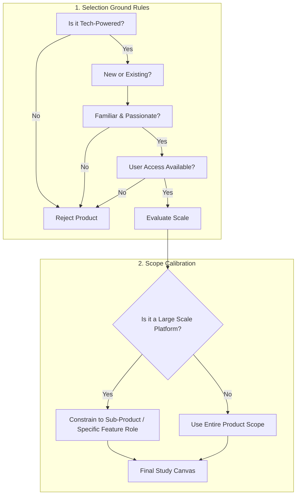

[← Previous Lecture](./07-whats-a-product.md)
·
[Section Overview](./README.md)
·
[Part Overview](../README.md)
·
[Next Lecture →](unavailable)

# Exercise #1: Choose Your Product

> **Material level:** Level 2 — Outlines the ground rules for selecting a technology-powered study product and covers the application of role scoping for large platforms using Uber Cabs (2009) as a case study.

## Lecture Overview

This lecture introduces the first practical exercise of the course: choosing a product to study and use for all subsequent exercises. By the end, you should be able to:
* Apply key criteria (ground rules) to select a suitable study product.
* Define and constrain a realistic Product Manager role for large-scale platforms.
* Structure a baseline product profile using the Uber Cabs (2009) case study from the course workbook.

## Central Argument

Selecting a viable study product requires matching it against criteria of familiarity, technology-driven value, and user access. For large-scale products, defining a narrow, realistic sub-product scope (like Facebook Newsfeed rather than all of Facebook) is critical to prevent coordination bottlenecks and maintain learning focus.

---

## 1. Ground Rules for Product Selection

To maximize the value of the course exercises, you must select a study product that fits the following four strategic ground rules:

1. **Technology-Powered**: The product must rely fundamentally on software or hardware engineering (e.g., mobile apps, B2B SaaS, or consumer devices).
2. **Existing or New**: You can choose a product you use every day, or a completely new product idea you want to validate.
3. **Familiarity & Access**: If choosing an existing product, it must be one you are passionate about, use frequently, and have direct access to.
4. **User Access**: You should be able to easily contact and interview other users of the product (e.g., friends, family, or professional colleagues).

## 2. Scoping Down Large-Scale Products

If you choose a mature, large-scale platform, you cannot effectively manage or study the entire product as a single PM. You must define a realistic, constrained sub-product or feature role:
* **Facebook**: Instead of all of Facebook, be the PM for *Facebook Newsfeed* or *Facebook Messaging*.
* **Twitter**: Instead of all of Twitter, be the PM for *Twitter Direct Messages* or *Twitter Search*.
* **Scoping Benefit**: Constraining your scope isolates specific workflows and prevents your learning exercises from becoming abstract or unmanageable.

*A structured path for selecting and scoping your PM study product.*

## 3. Case Study: Uber Cabs (2009 MVP)

In the course workbook, the instructor fills out Exercise #1 using **Uber Cabs in 2009** (when it was first conceived) as the study product. This serves as an excellent case study of a product that disrupted a mature industry by launching with a highly constrained MVP scope.

*Uber's progression from a scoped 2009 MVP to a global transport platform.*

### Uber Cabs 2009 Baseline Profile

| Dimension | Course Workbook Details |
|---|---|
| **Product Name** | Uber Cabs (2009) |
| **What does it do?** | On-demand ride-hailing service |
| **Where is it available? (In 2009)** | Mobile - iOS only (iPhone MVP) |
| **Where is it available? (Today)** | Desktop browser (m.uber.com), 3rd party integrations (Google Maps), Mobile/Tablet (iOS and Android) |

### Analysis of the Original 2009 MVP Screenshots

The original UberCab product was highly focused and simple, consisting of three primary screen states:
1. **The Map Screen (Request)**: A basic map layout with a green pin marking the user's location, an address input field, and a single prominent **"Pick me up"** call-to-action button.
2. **The Tracking Screen (Ride in Progress)**: A tracking map showing the vehicle's real-time position, a cancellation button, and a bottom card showing the driver's name (**"Ryan"**) and rating (**0 stars** for new/unrated).
3. **The Transaction Screen (Payment & Rating)**: A simple confirmation receipt stating **"$15.00 has been electronically paid"** alongside a 1-to-5 star rating selector and a **"Submit Rating"** button.

---

## Comparison: Today's Product vs. 2009 MVP

The table below contrasts the launch constraints of the original 2009 Uber Cabs MVP with the modern expanded platform:

| Feature | Uber Cabs 2009 MVP | Modern Uber Platform |
|---|---|---|
| **Client Platforms** | iOS only (iPhone). | Web browser (desktop), Android, iOS, tablet apps. |
| **Integrations** | None (standalone app). | Broad developer APIs (e.g., embedded inside Google Maps). |
| **Core Service** | Single ride-hailing vertical (black cabs). | Multiple verticals (UberX, Uber Taxi, Uber Black, Uber Eats, Uber Freight). |
| **Scope Boundary** | Constrained to local on-demand dispatch. | Global marketplace matching engine with dynamic surge pricing. |

---

## Practical Product Management Example

### Situation
A Product Manager is tasking a team with designing a new peer-to-peer tutoring marketplace app. The initial product vision includes video chat, automated scheduling, payment processing, file sharing, and interactive whiteboards.

### Decision
The PM decides to constrain the launch scope (MVP) to a web-based scheduling directory. Video chats will occur over Zoom links, payments will be processed via simple Stripe links, and file sharing will leverage Google Drive.

### Reasoning
Attempting to build video chat, interactive whiteboards, and payment infrastructure simultaneously introduces massive development risks and coordination overhead. By utilizing existing tools (Zoom, Stripe, Google Drive), the team can focus on validating the core value proposition: matching students with the right tutors.

### Consequence
The tutoring MVP launches within weeks rather than months. The team quickly gathers feedback on customer match rates and student willingness to pay before writing any complex video-streaming code.

### Transferable Lesson
PMs must separate the core value hypothesis of their product from secondary infrastructure features, launching the simplest possible platform configuration to accelerate validation.

---

## Common Misunderstandings

### "My study product must be a brand-new, unique idea to be valuable"
* **The Reality**: Studying an existing, mature product (like Slack or Netflix) is often more educational because you can analyze real-world decisions, analyze public metrics, and study how they solved complex scaling and feature prioritization problems.

### "I should pretend to own the entire product to make full strategic decisions"
* **The Reality**: In professional tech environments, PMs work on highly specific sub-products. Pretending to own all of Airbnb or Netflix leads to vague, unfeasible roadmaps. True mastery lies in understanding boundaries and API handoffs between teams.

---

## Key Concepts and Definitions

| Concept | Simple definition |
|---|---|
| **Product Scope** | The defined boundaries of a product's features, target platforms, and user workflows. |
| **Minimum Viable Product (MVP)** | The simplest version of a product that can be released to early adopters to validate a core business hypothesis. |
| **Tech Product** | A value proposition driven by software, hardware, or data engineering rather than physical manufacturing. |

---

## Key Takeaways

1. **Focus on Tech**: Choose a technology-powered product to practice product management concepts effectively.
2. **Start with Familiarity**: Choose a product you know, love, and use frequently, so you can think from the user's perspective.
3. **Ensure User Access**: You must have access to real users (friends, colleagues, or family) to conduct interviews and run validation tests.
4. **Constrain the Scope**: If you choose a massive product, narrow your role to a specific sub-product (e.g., Facebook Messenger instead of Facebook).
5. **Study the MVP**: Analyze how successful platforms started simple (like Uber's 2009 iOS-only app with only three core screens) to find product-market fit.
6. **Learn Collectively**: Share your product profiles and workbooks to spark ideas and cross-pollinate learning patterns.

---

## Visual Summary

---

## One-Minute Review

To prepare for practical PM training, you must select a technology-powered study product (existing or new) that is familiar, passionate, and has accessible users. For large platforms, you must constrain your scope to a specific sub-product or feature (such as Facebook Messaging). This approach mimics real-world PM roles and focuses your learning, as demonstrated by the original 2009 Uber Cabs MVP launch which succeeded by limiting its initial scope to an iOS-only app with three basic screen states.

---

## Recommended Visual Illustrations

### Illustration 1: Product Selection Flowchart
* **Concept**: A decision tree matching a product idea against the four ground rules.
* **Purpose**: Helps the learner visually validate their study product.
* **Suggested structure**: Flowchart starting with the core question: "Is it tech-powered?" and leading through familiarity, user access, and scale checks, with clear "Proceed" or "Constrain Scope" endpoints.

### Illustration 2: Scope Evolution Canvas (Uber Cabs)
* **Concept**: Contrasting Uber's simple 2009 MVP launch scope with its modern platform scale.
* **Purpose**: Visualizes the progression from a simple three-screen app to a multi-vertical global platform.
* **Suggested structure**: Side-by-side comparison panels. Left: "2009 MVP Scope" (iOS-only, 3 screens: Request Map, Driver Tracking, Paid Receipt). Right: "Modern Scope" (web, Android, iOS, APIs, Uber Eats, Uber Freight, Surge engine).

---

## Related Concepts

* [Product Discovery](../../GLOSSARY.md#product-discovery)
* [Product Manager (PM)](../../GLOSSARY.md#product-manager-pm)
* [Product Lifecycle](../../GLOSSARY.md#product-lifecycle)

## Visuals in This Lecture

* [Product Selection Flowchart](./visuals/10-product-selection-flowchart.png)
* [Scope Evolution Canvas (Uber Cabs)](./visuals/10-scope-evolution-uber.png)

---

## Interactive Lesson

- [Open the interactive companion](./interactive/10-choose-your-product.html)

---

## Source

- [Original lecture transcript](../../sources/01-introduction/01-introduction/10-choose-your-product-transcript.md)

---

## Continue Learning

- Previous: [What's a Product?](./07-whats-a-product.md)
- Section: [Section 1: Introduction](./README.md)
- Part: [Part 1: Introduction](../README.md)
- Next: (Unavailable)
- Course index: [Full Course Index](../../COURSE-INDEX.md)
