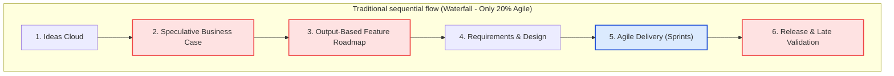

[← Previous Lecture](./10-choose-your-product.md)
·
[Section Overview](./README.md)
·
[Part Overview](../README.md)
·
[Next Lecture →](unavailable)

# Why do so many product initiatives fail?

> **Material level:** Level 2 — Outlines the traditional product-development process, analyzes the root causes of failed product efforts, and contrasts output-based roadmap planning with outcome-based planning.

## Lecture Overview

This lecture exposes the systemic flaws in the traditional product development process used by the vast majority of tech companies. By the end, you should be able to:
* Outline the traditional sequential product development flow (waterfall).
* Explain the four primary failure points of this traditional approach.
* Distinguish between output-focused (feature-based) roadmaps and outcome-focused (goal-oriented) roadmaps.
* Explain the concept of "20% Agile" and why localized agility in delivery does not prevent product failure.

## Central Argument

Agile delivery (sprints, scrum) is meaningless if it resides at the tail end of a rigid, sequential waterfall planning process. Real agility requires moving validation to the front of the product lifecycle—prioritizing outcomes over feature outputs, leveraging developers for solution ideation, and avoiding speculative, ungrounded business cases.

---

## 1. The Traditional Product Development Flow

Most tech companies, regardless of size, build products using the same basic sequential flow:

```text
Ideas ➔ Planning & Business Cases ➔ Feature Roadmap ➔ Requirements ➔ Design ➔ Development (Sprints) ➔ Release & Track
```

1. **Ideas Cloud**: Ideas are gathered from internal stakeholders (product vision) and external stakeholders (customers, partners).
2. **Planning & Business Cases**: Quarterly or annual planning sessions evaluate ideas using business cases to forecast value and costs.
3. **Feature Roadmap**: The approved ideas form a prioritized list of features to build over the next quarter or year.
4. **Requirements & Design**: The Product Manager/Owner writes detailed requirements, and designers create visual mockups.
5. **Development (Agile Sprints)**: Engineers break down requirements into sprint iterations to build and test code.
6. **Release & Tracking**: The completed feature is deployed, and usage is tracked.

Although companies refer to this process as "Agile" because of sprint iterations, the overall sequence remains fundamentally **Waterfall**.

---

## 2. The Four Primary Failure Points of the Waterfall Process

This sequential planning model introduces four systemic failure points that lead to wasted capital and failed initiatives:

### 1. Late Validation
* **The Problem**: Customer validation happens only *after* the product is released.
* **The Consequence**: By the time real user behavior is observed, the company has already spent significant time and money building the solution. If the idea was flawed, it is too late to recoup the investment.

### 2. Speculative Business Cases
* **The Problem**: Business cases require two early-stage estimates: forecasted revenue/value and development cost.
* **The Consequence**: At this early stage, these inputs are unknowable. Cost depends on the solution design (not yet defined), and revenue depends on solution efficacy. As a result, roadmaps are prioritized based on ungrounded, wild guesses.


*The Speculative Business Case Dilemma: Roadmaps are often prioritized based on cost and value estimates that are impossible to calculate early in the process.*

### 3. Output-Focused Roadmaps
* **The Problem**: Traditional roadmaps are prioritized lists of features and projects (e.g., "Add Apple Pay," "Redesign Sidebar").
* **The Consequence**: Teams focus on shipping outputs (delivering the feature on time) rather than driving outcomes (solving the underlying user or business problem).

### 4. Delayed Collaboration
* **The Problem**: Designers and developers are brought in only at the end of the planning cycle to execute pre-defined requirements.
* **The Consequence**: Developers, who understand technical constraints and possibilities best, are excluded from defining the solution space. Designers are unable to run early usability validation.

---

## 3. Output vs. Outcome Roadmaps

The core issue with traditional roadmaps is that they treat features as the final goal rather than a means to an end.


*Contrasting feature-based (output) roadmaps with goal-oriented (outcome) roadmaps.*

| Dimension | Output-Focused (Traditional) | Outcome-Focused (Modern) |
|---|---|---|
| **Core Metric** | Shipping the feature on time and within budget. | Solving a user problem or moving a business metric. |
| **Roadmap Content** | A prioritized list of specific features/projects. | A list of goals, user problems, and business outcomes. |
| **Team Focus** | "What are we building?" (Outputs). | "Why are we building this, and what does success look like?" (Outcomes). |
| **Example Item** | "Build a new Live Chat support tool." | "Reduce average customer support ticket resolution time by 20%." |

---

## Practical Product Management Example

### Situation
A health-tech startup has an output-focused roadmap item: "Build an AI-powered calorie tracking scanner" to improve user engagement. The engineering team estimates it will take 4 months to train the vision model and develop the UI.

### Decision
The PM reframes this output item to an outcome-oriented goal: "Increase weekly food logging frequency by 30%."

### Reasoning
By focusing on the outcome (logging frequency) rather than the output (AI scanner), the team realizes they don't need to build a complex AI model immediately. They can test simpler hypotheses first, such as adding a "frequently logged foods" quick-tap list or barcode scanner.

### Consequence
The team implements the "frequently logged foods" feature in 2 weeks. Weekly logging frequency increases by 35% among early adopters. The startup saves 3.5 months of engineering time and avoids the complex AI model entirely.

### Transferable Lesson
Outcome-based planning frees the product team to find the simplest, lowest-cost solution to a problem instead of locking them into building complex, unvalidated features.

---

## Common Misunderstandings

### "Since our engineering team uses 2-week sprints and Scrum, we are an Agile company."
* **The Reality**: Sprints are only a *delivery* tool. If the features in those sprints were locked into a roadmap months ago using speculative business cases, the organization is running a Waterfall process with a "20% Agile" wrapper. True agility requires agile product discovery and early validation.

### "Developers should only focus on writing code, not brainstorming product features."
* **The Reality**: Developers are often the best source of innovation because they understand what is technologically possible. When kept in a silo, they can only build what is requested, missing opportunities for technically elegant, low-cost solutions.

---

## Key Concepts and Definitions

| Concept | Simple definition |
|---|---|
| **Waterfall** | A sequential product development process where each phase (planning, design, development, testing) must be completed before the next begins. |
| **Output** | The tangible assets or features that a team builds and ships (e.g., code, mockups, button designs). |
| **Outcome** | The measurable change in user behavior or business metrics resulting from shipped features (e.g., increased conversion, higher retention). |

---

## Key Takeaways

1. **Validation Must Happen Early**: Do not wait for a full release to test your hypotheses; validate customer interest and usability upfront.
2. **Business Cases are Often Speculative**: Acknowledge that revenue and cost estimates are highly inaccurate before the solution is defined.
3. **Move from Outputs to Outcomes**: Measure team success by business goals achieved rather than features shipped.
4. **Bring Developers in Early**: Involve engineering in product discovery to leverage their technical insights for solution design.
5. **Agile Delivery is Not Enough**: A "20% Agile" process (agile for code construction only) does not prevent shipping the wrong product.

---

## Visual Summary




*The Waterfall Process: Sprints are used only for delivery, keeping the rest of the process rigid and sequential.*

---

## One-Minute Review

Traditional product development is fundamentally a Waterfall process—even when wrapped in 2-week agile sprints. It fails because it lacks early validation, relies on speculative business case guesses, locks teams into output-focused feature roadmaps, and delays developer collaboration. To build successful tech products, teams must shift from shipping outputs (features) to driving outcomes (validated user/business solutions) and collaborate cross-functionally from day one.

---

## Recommended Visual Illustrations

### Illustration 1: Output-Focused vs. Outcome-Focused Roadmaps
* **Concept**: Contrasting feature-based planning with goal-oriented planning.
* **Purpose**: Helps the learner visual-compare outputs vs. outcomes.
* **Suggested structure**: Side-by-side card layouts showing a traditional feature roadmap (columns of features to build) versus a goal-oriented roadmap (columns of business metrics to improve and user pain points to solve).

### Illustration 2: Speculative Business Case Dilemma
* **Concept**: Shows how value and cost estimations are impossible early-stage calculations.
* **Purpose**: Illustrates the ungrounded loop of prioritizing features before solution definition.
* **Suggested structure**: A split visual diagram. Top represents "Cost Estimation" (blocked because solution is not yet designed). Bottom represents "Value Estimation" (blocked because solution performance is unmeasured). Both converge into a question mark for "Roadmap Prioritization".

### Illustration 3: The Waterfall Process & 20% Agile Wrapper (Visual Summary)
* **Concept**: A flowchart showing the linear waterfall steps, highlighting that Agile sprints are only a small slice of the overall process.
* **Purpose**: Explains why "20% agile" delivery fails to solve upstream planning bottlenecks.
* **Suggested structure**: Flowchart cascading down, highlighting the "Agile Sprints" step in blue (Agile Delivery) while highlighting the upfront planning and tail-end validation blocks in red (Waterfall Bottlenecks).

---

## Related Concepts

* [Product Roadmap](../../GLOSSARY.md#product-roadmap)
* [Validation](../../GLOSSARY.md#validation)
* [Solution Space](../../GLOSSARY.md#solution-space)

## Visuals in This Lecture

* [Output-Focused vs. Outcome-Focused Roadmaps](./visuals/11-output-vs-outcome-roadmaps.png)
* [Speculative Business Case Dilemma](./visuals/11-speculative-business-case.png)
* [The Waterfall Process & 20% Agile Wrapper (Visual Summary)](./visuals/11-visual-summary.png)

---

## Interactive Lesson

- [Open the interactive companion](./interactive/11-why-product-initiatives-fail.html)

---

## Source

- [Original lecture transcript](../../sources/01-introduction/01-introduction/11-why-product-initiatives-fail-transcript.md)

---

## Continue Learning

- Previous: [Exercise #1 Choose Your Product](./10-choose-your-product.md)
- Section: [Section 1: Introduction](./README.md)
- Part: [Part 1: Introduction](../README.md)
- Next: (Unavailable)
- Course index: [Full Course Index](../../COURSE-INDEX.md)
