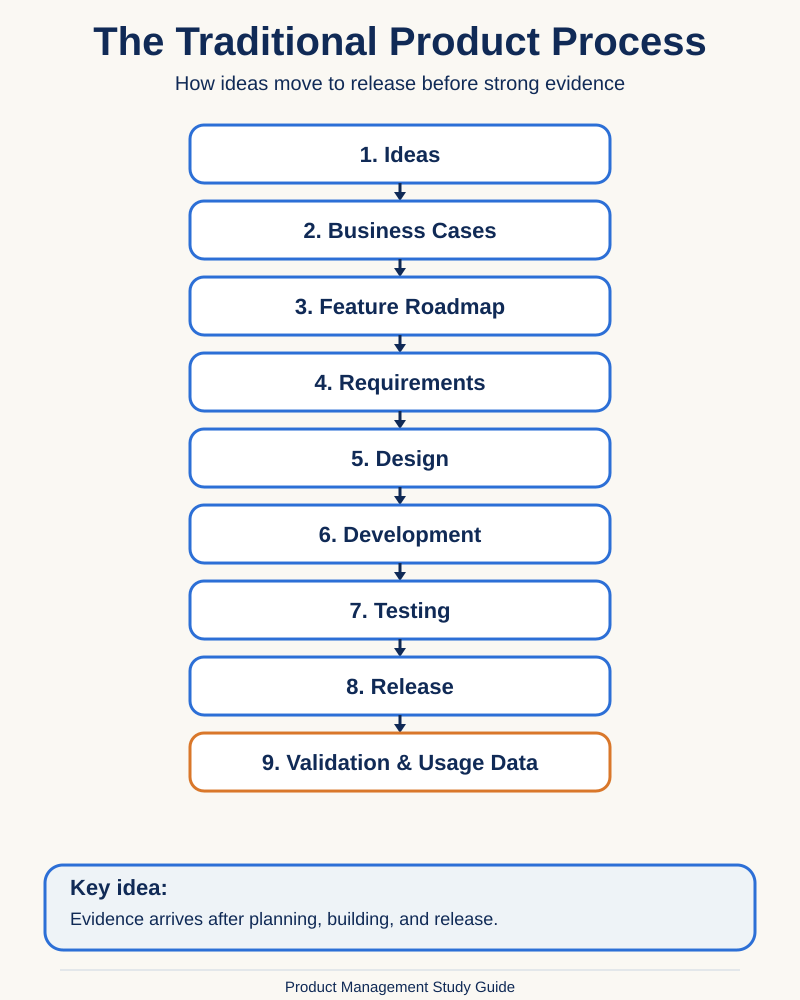
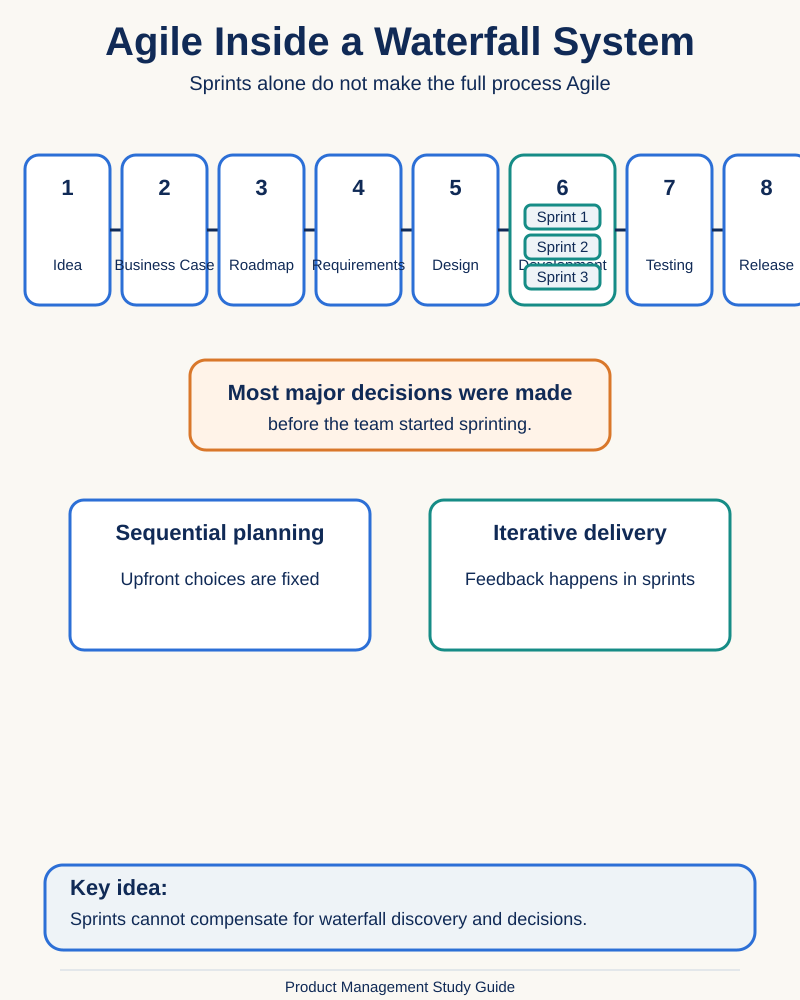
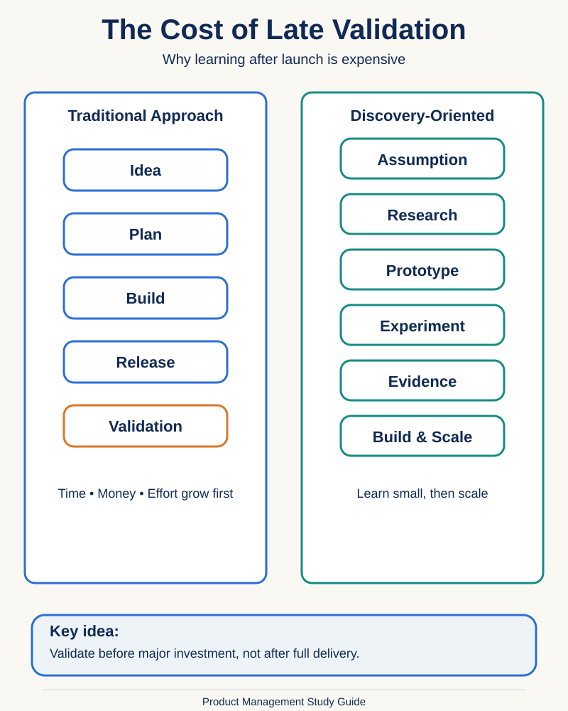
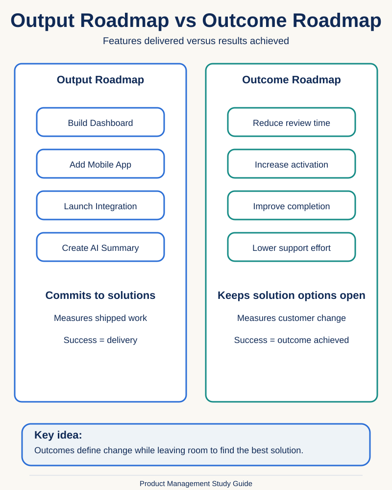
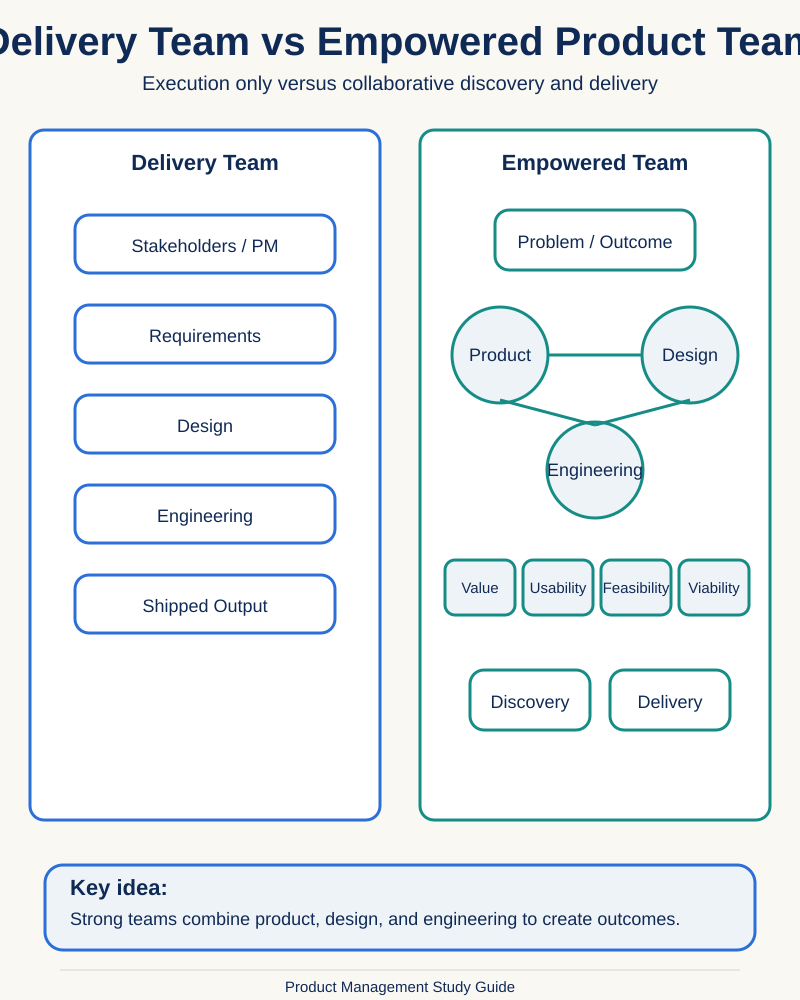
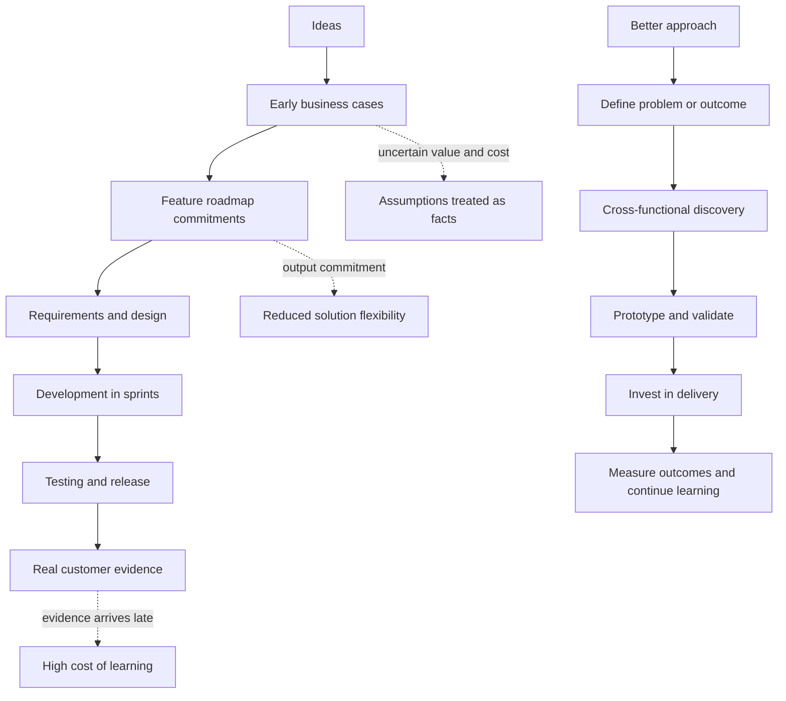

[Section Overview](./README.md) · [Part Overview](../README.md)

# Why Product Management Is Broken

> **Material level:** Level 3 — This lecture establishes a foundational critique of the traditional product-development process and introduces ideas used throughout the course: early validation, outcome-oriented roadmaps, discovery, and cross-functional product teams.

## Lecture Overview

Many technology companies describe themselves as Agile because engineering works in sprints. Yet the wider product process may still be a sequential chain: ideas become business cases, roadmap commitments, requirements, designs, and finally software.

The core risk is not slow delivery. It is committing substantial time and money before validating whether the problem, solution, and expected value are sound.

## Central Argument

**Product Management breaks down when organizations commit to ideas before they have validated them.**

A team can deliver software efficiently while still building the wrong thing. Agile delivery is not enough when strategy, prioritization, and solution selection remain fixed before meaningful learning begins.

## 1. The Traditional Product Process

Organizations usually have more ideas than capacity. Ideas may come from product vision, executives, customers, sales, partners, or market observations. They are often evaluated through business cases that estimate expected value and cost, then ranked into a quarterly or annual roadmap.

When an item reaches the top of the roadmap, requirements are defined, design work begins, development is split into sprints, quality assurance tests the result, and the feature is released. Only then does the organization receive strong evidence from real usage.

The apparent orderliness hides a major weakness: important assumptions are treated as facts before the team begins building.

## 2. Agile Delivery Inside a Waterfall System

Using sprints does not automatically make the complete product process Agile. In many organizations, the idea, expected value, roadmap commitment, requirements, and proposed solution are largely decided before engineering starts.

Engineering may deliver incrementally, but discovery and prioritization remain sequential. This creates a partially Agile organization: Agile techniques are applied to delivery while the broader product decision process remains waterfall-driven.

| Agile delivery practice | Wider waterfall behavior |
|---|---|
| Developers work in short sprints | The solution was selected before discovery |
| Software is delivered incrementally | The roadmap is treated as a commitment |
| Requirements may be refined | The fundamental problem or solution is rarely reconsidered |
| A releasable increment is created | Success is often judged by whether the feature shipped |

## 3. The Cost of Validating Too Late

Customer interviews and market research can improve understanding, but they do not automatically prove that a specific solution will work. Strong solution validation requires evidence about usability, adoption, feasibility, viability, and behavior change.

When validation happens only after launch, the company has already invested significant time, money, effort, and organizational credibility. Product work always contains uncertainty; the better approach is to reduce the most important uncertainty before making the largest investment.

## 4. Why Early Business Cases Are Unreliable

A business case usually depends on expected value and expected cost. Both are highly uncertain early in product work.

Expected value depends on a solution that has not yet been designed and on adoption that has not yet happened. Expected cost depends on architecture, integrations, data, compliance, performance, and implementation choices that are not yet defined.

Business cases can still support decisions when they expose assumptions, ranges, and risks. The problem is presenting early guesses as reliable forecasts.

## 5. Feature Roadmaps Focus on Outputs

Traditional roadmaps often become prioritized lists of features and projects. These describe **outputs**: things the team intends to build. They do not necessarily describe the customer or business change the organization wants to create.

An outcome-oriented roadmap starts with a desired result, such as reducing review time, improving activation, or increasing completion. Features remain necessary, but they are treated as possible solutions rather than the goal itself.

| Feature-based roadmap | Outcome-oriented roadmap |
|---|---|
| Commits to a proposed solution | Commits to a result or problem |
| Measures progress through delivery | Measures customer or business change |
| Reduces room for discovery | Allows teams to compare solutions |
| Makes changing direction look like failure | Treats adaptation as part of solving the problem |

## 6. Important Sources of Ideas Are Excluded

Customers and sales teams are valuable sources of evidence about needs, objections, and recurring pain points. But a request such as “we need a dashboard” is a proposed solution, not necessarily the clearest definition of the underlying problem.

Developers are also frequently brought in too late. Their knowledge of technical opportunities, constraints, integrations, data structures, and implementation risk can reveal better or simpler options during discovery.

## 7. Designers and Developers Join Too Late

When designers and developers are invited only after requirements are finalized, their role is reduced to execution. Designers can help test workflows and expose hidden assumptions. Developers can identify technical opportunities, feasibility risks, and alternative implementation paths.

Early collaboration does not mean every decision is made by committee. It means the team uses its combined expertise before commitments become expensive to reverse.

## 8. Delivery Teams Versus Empowered Product Teams

A delivery team receives requirements and is primarily responsible for execution. An empowered product team receives a problem, goal, or outcome and collaborates to discover and deliver an effective solution.

An empowered team balances four forms of risk:

- **Value:** Will customers choose or use it?
- **Usability:** Can customers understand and operate it?
- **Feasibility:** Can the organization build and support it?
- **Viability:** Does it work for the business and its constraints?

## Practical Product Management Example

Imagine a multi-tenant recruitment platform receives repeated requests for an AI-generated candidate summary. Sales expects it to help close enterprise deals, so leadership adds it to the roadmap.

A traditional process commits to the feature, writes requirements, designs the interface, integrates an LLM provider, completes compliance work, and releases it. The team may then discover that recruiters do not trust or regularly use the summaries.

A discovery-oriented approach begins with the outcome: **reduce the time recruiters spend deciding which candidates deserve deeper review without reducing trust or decision quality.** The team can investigate the current workflow, test manually generated summaries, compare highlighted evidence with recommendations, evaluate multilingual performance, and validate transparency requirements before full implementation.

The original idea is not rejected. It is treated as one hypothesis among several possible solutions.

## Common Misunderstandings

### “Customer research validates the solution”

Research can validate that a problem exists and explain its context. It does not automatically prove that a specific feature will be understood, adopted, or valued.

### “Business cases are useless”

Business cases can be useful when they expose uncertainty. The problem is treating early estimates as facts.

### “Agile means there should be no planning”

Agile product work still needs direction, priorities, constraints, and coordination. Plans should remain open to adaptation as evidence improves.

### “Developers should own the roadmap”

Developers should contribute to discovery because they understand technical possibilities and constraints. This does not mean engineering alone owns product strategy or prioritization.

## Key Concepts and Definitions

| Concept | Simple definition |
|---|---|
| Waterfall product process | A sequential process in which strong feedback often arrives after planning, design, and delivery |
| Agile delivery | Iterative practices used to build and release software incrementally |
| Product discovery | Investigating problems, assumptions, risks, and possible solutions before or alongside delivery |
| Product delivery | Building, testing, releasing, and operating a selected solution |
| Validation | Collecting evidence to determine whether an important assumption is likely to be correct |
| Business case | An evaluation of expected value, cost, benefits, and risks |
| Output | Something a team builds or releases |
| Outcome | A measurable customer, product, or business change created by product work |
| Empowered product team | A cross-functional team trusted to discover and deliver a solution for a defined problem or outcome |

## Key Takeaways

1. A company can use Scrum and still operate a waterfall product process.
2. Agile delivery starts too late when the idea and solution are already committed.
3. The greatest product risk comes from investing heavily before validating assumptions.
4. Early business cases contain substantial uncertainty about both value and cost.
5. Customer research does not automatically validate a proposed solution.
6. Feature roadmaps focus on outputs; outcome roadmaps focus on change.
7. Customer and sales requests should be treated as evidence, not unquestioned specifications.
8. Designers and developers should participate before requirements become fixed.
9. Strong product teams combine discovery and delivery.
10. The goal is not to remove uncertainty, but to reduce it before major investment.

## Visual Summary

## One-Minute Review

The traditional product process turns ideas into business cases, roadmap commitments, requirements, designs, and software before strong evidence is available. Engineering may work in sprints, but the wider process remains waterfall when most decisions are fixed before discovery.

Early business cases are uncertain because value depends on an untested solution and cost depends on technical details that are not yet known. Feature roadmaps reinforce the problem by treating outputs as goals. Outcome-oriented planning defines the change the team should create and leaves room to discover the best solution.

Designers and developers should participate early because discovery requires customer, business, usability, and technical knowledge. A strong product team does not merely deliver requirements; it discovers and delivers solutions that create meaningful outcomes.

## Visuals in This Lecture

- [The Traditional Product Process](./visuals/11-traditional-product-process.svg)
- [Agile Inside a Waterfall System](./visuals/11-agile-inside-waterfall-system.svg)
- [The Cost of Late Validation](./visuals/11-cost-of-late-validation.svg)
- [Output Roadmap vs Outcome Roadmap](./visuals/11-output-vs-outcome-roadmap.svg)
- [Delivery Team vs Empowered Product Team](./visuals/11-delivery-vs-empowered-product-team.svg)

## Related Concepts

- [Agile](../../GLOSSARY.md#agile)
- [Business Case](../../GLOSSARY.md#business-case)
- [Outcome](../../GLOSSARY.md#outcome)
- [Product Discovery](../../GLOSSARY.md#product-discovery)
- [Product Roadmap](../../GLOSSARY.md#product-roadmap)
- [Validation](../../GLOSSARY.md#validation)
- [Waterfall](../../GLOSSARY.md#waterfall)

## Source

- [Original lecture transcript](../../sources/01-introduction/01-introduction/11-why-product-management-is-broken-transcript.md)

## Continue Learning

- Section: [Introduction](./README.md)
- Part: [Introduction](../README.md)
- Course index: [Full Course Index](../../COURSE-INDEX.md)
