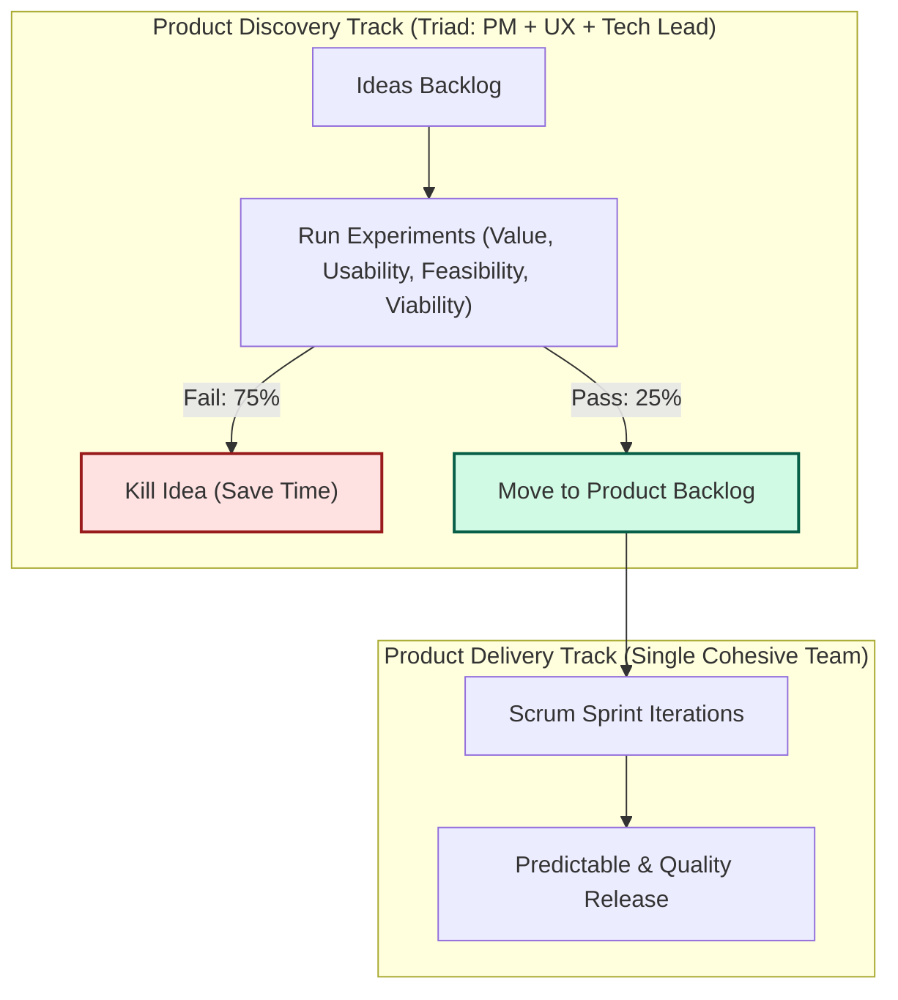

[← Previous Lecture](./11-why-product-initiatives-fail.md)
·
[Section Overview](./README.md)
·
[Part Overview](../README.md)
·
[Next Lecture →](unavailable)

# How Effective Product Teams Work

> **Material level:** Level 2 — Outlines the core operational principles of high-performing product teams, covering risk management, discovery team composition, and Dual-Track Agile.

## Lecture Overview

This lecture contrasts traditional waterfall execution with the way high-performing product teams build products. By the end, you should be able to:
* Identify and define the four core product risks that must be tackled upfront.
* Outline the structure, roles, and collaborative behavior of a Product Discovery team.
* Explain the workflow of ideas moving through the Ideas Backlog to the Product Backlog.
* Define **Dual-Track Agile** and explain how discovery and delivery tracks run concurrently within a single team.

## Central Argument

High-performing product teams operate under a single overarching principle: **risks are tackled upfront rather than at the end**. This is achieved by running product discovery continuously alongside product delivery—using a cross-functional triad (Product Owner, UX Designer, Tech Lead) to run cheap experiments and filter out the 75% of ideas that do not create value, before committing engineering resources to build them.

---

## 1. The Four Core Product Risks

Product management is fundamentally a form of **risk management**. Effective product teams identify and mitigate four critical risks before writing production code:

| Risk Type | Guiding Question | Focus Area |
|---|---|---|
| **Value Risk** | Will customers buy it or choose to use it? | Customer demand, market fit, and value proposition. |
| **Usability Risk** | Will users be able to figure out how to use it? | User experience design, navigation, and cognitive load. |
| **Feasibility Risk** | Can our engineers build it with the available time, skills, and technology? | Engineering constraints, architecture, and technology capabilities. |
| **Viability Risk** | Will this solution work for the various stakeholders in our business? | Commercial, legal, financial, compliance, and marketing constraints. |


*The Four Core Product Risks: PMs must manage value, usability, feasibility, and viability risks upfront.*

---

## 2. Product Discovery and the Discovery Team

To tackle these risks early, modern organizations separate product backlog construction from execution, utilizing a specialized **Discovery Team**.

### The Discovery Triad

Rather than relying on a single PM to write requirements in isolation, discovery is run by a collaborative triad:
1. **Product Owner (PM)**: Focuses on value and viability risks.
2. **UX Expert (Designer)**: Focuses on usability risks.
3. **Technical Lead (Engineer)**: Focuses on feasibility risks.

Together, this triad holds all the cross-functional skills necessary to validate ideas quickly without handing off documents between siloed teams.

### The Ideas Backlog Filter

Unlike traditional roadmaps where ideas are committed to delivery directly, modern teams use a multi-tiered backlog model:
* **The Ideas Backlog**: A raw collection of thoughts from stakeholders, vision, and customers. It is managed by the Discovery Team, not a single owner.
* **The 75% Kill Rate**: Effective teams know that **as many as 75% of ideas in the Ideas Backlog will fail** to address the target user problem. The Discovery Team runs cheap experiments to disprove and kill off these bad ideas early.
* **The Product Backlog**: Only ideas that pass early experiments and mitigate all four risks are moved to the Product Backlog for engineering execution.

---

## 3. Dual-Track Agile

Rather than separating discovery and delivery into sequential steps or separate departments, modern teams run them concurrently as **Dual-Track Agile**.

```text
Discovery Track (Fast Learning & Validation)  ──► [Validated Backlog Item]
       ▲                                                 │
       │ (Continuous feedback)                           ▼
Delivery Track  (Predictability & Quality)   ──► [Shipped Working Software]
```


*Dual-Track Agile Loop: Continuous discovery runs alongside delivery sprints in a single cohesive team.*

### Two Tracks, One Team

* **Product Discovery**: All about **fast learning and validation**. The mindset is experimental: weeding out bad ideas quickly with minimal code and effort. Teams may spend 40% to 50% of their time on discovery.
* **Product Delivery**: All about **predictability and quality**. The mindset is engineering rigor: delivering stable, scalable working software at a predictable cadence (e.g., sprints).
* **Concurrence**: Discovery and delivery run concurrently and continuously.
* **"Dual-Track, Not Duel-Track"**: These are *not* two separate teams. They are a single cohesive team. Team members move fluidly between discovery and delivery tasks based on project needs, ensuring no handoff silos are created.

---

## Practical Product Management Example

### Situation
A SaaS team wants to add an automated invoice-matching feature for enterprise finance users. The business case suggests high demand, but the feature requires complex ML data models that are expensive to build.

### Decision
The PM forms a discovery triad with the UX designer and tech lead. Instead of writing a PRD and scheduling it for delivery, they decide to run a discovery validation test.

### Reasoning
The tech lead flags massive feasibility risks regarding data access and latency. The UX designer flags usability risks because invoice layouts vary wildly. Building a full ML pipeline immediately introduces massive capital risk.

### Consequence
The triad runs a 1-week "Wizard of Oz" prototype experiment: finance users upload invoices on a simple frontend, and team members manually match them in the background. The tech lead checks the upload format compatibility while the UX designer interviews users during the process.

The team discovers that while users value the output, they refuse to upload files in the format required by the proposed ML model (high value, high usability risk, low feasibility/viability compatibility). The idea is killed.

### Transferable Lesson
Running cheap discovery experiments (such as wizard-of-oz or paper prototypes) allows the discovery triad to validate user value, usability, feasibility, and viability before committing a single sprint of delivery code.

---

## Common Misunderstandings

### "The Discovery Team and the Delivery Team should be separate groups of people to maintain focus."
* **The Reality**: Separating the tracks into separate teams creates a "mini-waterfall" handoff bottleneck. The engineers on the delivery team will feel no ownership over the validated solution, and the discovery team will lose touch with delivery constraints. It is a single team running two tracks concurrently ("Dual-track, not Duel-track").

### "The goal of product discovery is to produce wireframes and detailed specifications for development."
* **The Reality**: The goal of discovery is **learning and risk mitigation**, not documentation. Discovery is about disproving bad ideas as quickly as possible. The output of discovery is a *validated business and user hypothesis*, not a thick requirements document.

---

## Key Concepts and Definitions

| Concept | Simple definition |
|---|---|
| **Value Risk** | The likelihood that customers will choose not to buy or use the proposed solution. |
| **Usability Risk** | The likelihood that users will struggle to understand how to operate the product. |
| **Feasibility Risk** | The likelihood that the solution cannot be built within the constraints of skills, technology, and time. |
| **Viability Risk** | The likelihood that the solution will conflict with business stakeholders, legal compliance, or financial models. |
| **Dual-Track Agile** | A product development methodology where product discovery (learning) and product delivery (building) run concurrently within a single team. |

---

## Key Takeaways

1. **Tackle Risk Upfront**: Identify and resolve value, usability, feasibility, and viability risks before building.
2. **Form a Collaborative Triad**: Discovery must be run by PM, UX, and Tech Leads working together, not in silos.
3. **Embrace a High Kill Rate**: Expect to reject up to 75% of backlog ideas through cheap experiments.
4. **Discovery is About Learning**: Focus discovery on reducing uncertainty, and delivery on shipping quality code.
5. **Run Concurrent Tracks**: Discovery and delivery must run continuously and concurrently within a single team ("Dual-track, not Duel-track").

---

## Visual Summary




*Product Backlog Gating Flowchart: Discovery filters out 75% of speculative ideas, passing only validated backlog items to delivery.*

---

## One-Minute Review

High-performing product teams succeed by tackling value, usability, feasibility, and viability risks upfront. Instead of executing fixed feature roadmaps, a discovery triad (PM, UX, Tech Lead) continuously filters ideas from the Ideas Backlog, killing up to 75% of them through cheap experiments. Validated ideas then move to the Product Backlog for delivery. This concurrent workflow of discovery (learning) and delivery (execution) is called Dual-Track Agile, and it runs continuously within a single cohesive team.

---

## Recommended Visual Illustrations

### Illustration 1: The Four Product Risks Matrix
* **Concept**: A 2x2 grid representing Value, Usability, Feasibility, and Viability risks.
* **Purpose**: Helps the learner quickly memorize the four risks and their primary focus questions.
* **Suggested structure**: Four quadrant panels, each with an icon (demand tag, user outline, coding bracket, business briefcase) and the core risk question.

### Illustration 2: Dual-Track Agile Loop
* **Concept**: Contrasting the concurrent Discovery (validation) and Delivery (execution) pipelines.
* **Purpose**: Visualizes how the tracks interact continuously within the same team.
* **Suggested structure**: Parallel horizontal pipeline tracks. Top track (Discovery) loops through ideas and experiments, feeding validated items down to the bottom track (Delivery) which runs sprints to release working code.

### Illustration 3: Product Backlog Gating Flowchart (Visual Summary)
* **Concept**: Flowchart depicting the Ideas Backlog filtering process.
* **Purpose**: Explains how experiments filter out 75% of bad ideas, passing only 25% of validated features to delivery.
* **Suggested structure**: Flowchart tracing ideas from Ideas Backlog, through value/usability/feasibility/viability checks, showing a 75% kill endpoint vs. a 25% validated product backlog endpoint.

---

## Related Concepts

* [Product Discovery](../../GLOSSARY.md#product-discovery)
* [Product Delivery](../../GLOSSARY.md#product-delivery)
* [Validation](../../GLOSSARY.md#validation)

## Visuals in This Lecture

* [The Four Product Risks Matrix](./visuals/12-four-product-risks.png)
* [Dual-Track Agile Loop](./visuals/12-dual-track-agile.png)
* [Product Backlog Gating Flowchart (Visual Summary)](./visuals/12-visual-summary.png)

---

## Interactive Lesson

- [Open the interactive companion](./interactive/12-how-effective-product-teams-work.html)

---

## Source

- [Original lecture transcript](../../sources/01-introduction/01-introduction/12-how-effective-product-teams-work-transcript.md)

---

## Continue Learning

- Previous: [Why do so many product initiatives fail?](./11-why-product-initiatives-fail.md)
- Section: [Section 1: Introduction](./README.md)
- Part: [Part 1: Introduction](../README.md)
- Next: (Unavailable)
- Course index: [Full Course Index](../../COURSE-INDEX.md)
