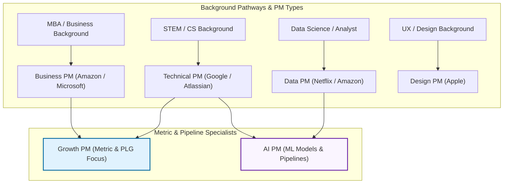

[← Previous Lecture](./12-how-effective-product-teams-work.md)
·
[Section Overview](./README.md)
·
[Part Overview](../README.md)
·
[Next Lecture →](unavailable)

# How the PM Role Varies

> **Material level:** Level 2 — Outlines the six distinct profiles of the Product Manager role based on background and focus, and details the three operational modes that dictate a PM's daily context switching.

## Lecture Overview

Product management is a vast domain that cannot be encapsulated by a single job description. Because PMs come from diverse educational and professional pathways, their actual day-to-day responsibilities vary significantly. By the end of this lecture, you should be able to:
* Compare and contrast the six primary types of Product Managers.
* Identify typical strengths, pitfalls, target employers, and iconic leaders for each PM type.
* Describe the three operational modes (Firefighting, Short-Term, Long-Term) and explain how to manage context-switching bottlenecks.
* Differentiate the scope and life cycle of a Data PM from that of a specialized AI PM.

## Central Argument

There is no single path or single definition for a Product Manager. The PM role varies dynamically based on the candidate's background, the company's business model (e.g., Product-Led Growth), and technology domains (e.g., Data/AI). Successful PMs leverage their specific backgrounds while actively working to bridge skill gaps—such as non-technical PMs building developer credibility or technical PMs avoiding the pitfall of micromanaging execution.

---

## 1. The Six PM Personas

The table below breaks down the six primary product manager roles based on background, core traits, common pitfalls, target employers, and exemplary industry leaders:

| PM Persona | Typical Background | Core Strengths | Key Pitfall / Weakness | Target Companies | Iconic Leader |
|---|---|---|---|---|---|
| **Business PM** | MBA, Sales, Marketing, Consulting | Strong problem-solving, communications, and strategic vision | Struggling with tech/design bounds; developer credibility issues | Amazon, Microsoft | **Ken Norton** (Google Ventures) |
| **Tech PM** | STEM degree, software engineering | Hands-on engineering support, high technical credibility | Acts as engineering manager; struggles with monetization/GTM | Google, Atlassian | **Elon Musk** (Tesla/SpaceX) |
| **Data PM** | Data science, analytics, SQL | Personalization at scale, analytical, queries databases | Gets caught in details; loses sight of the big picture | Netflix, Amazon, Google | **Sebastian Thrun** (Udacity) |
| **Design PM** | UX/UI design, frontend HTML/CSS | Deep user empathy, customer research, layout design | Struggles with massive context-switching and firefighting | Apple | **Steve Jobs** (Apple) |
| **Growth PM** | Data analysis, marketing experiments | Optimizing specific business metrics (funnels, freemium) | Narrow short-term focus; does not own entire product life cycle | Product-Led Growth (PLG) firms | **Chamath Palihapitiya** (Facebook Growth) |
| **AI PM** | Data science, machine learning | Specialized technical skills in classification/regression | High project failure rates (85% fail); long build loops | Google (over 4,000 ML projects) | **Anthony Goldbloom** (Kaggle) |

*The Six PM Personas: Backgrounds, core strengths, primary pitfalls, and iconic leaders.*

---

## 2. The Three Operational Modes (Context Switching)

Product Managers must constantly toggle between three distinct time horizons and execution modes. This context-switching is a primary source of cognitive load:

1. **Firefighting Mode (Immediate / Daily)**: Resolving unexpected blocks, fixing production bugs, or addressing immediate client escalation.
2. **Short-Term Mode (Weekly / Sprint)**: Planning upcoming sprints, writing immediate user stories, grooming the backlog, and aligning with developers/designers.
3. **Long-Term Mode (Quarterly / Annual)**: Building and communicating the product roadmap, defining OKRs, and aligning on product strategy.

### Design PMs and Context-Switching

Design-background PMs are particularly susceptible to context-switching bottlenecks because design work typically demands long blocks of uninterrupted focus. When moving into a PM role, they must actively mitigate this stress by:
* **Prioritizing**: Running ruthless triage on immediate requests.
* **Automating**: Setting up automated reporting and metrics tracking dashboards.
* **Delegating**: Empowering tech leads or delivery teams to run execution checks independently.

*The PM Operational Modes: Context switching between daily Firefighting, weekly Sprints, and strategic Long-Term roadmapping.*

---

## 3. Data PM vs. AI PM: The Specialized Data Pipelines

While closely related, Data PMs and AI PMs own different lifecycle stages and pipeline structures:

* **Data Product Manager**:
  * Focuses on data collection, database querying (SQL), statistical analysis, and basic personalization engines (e.g., Netflix recommendations).
  * Measures progress by dashboard availability, query performance, and user segmentation accuracy.
* **AI Product Manager**:
  * Focuses specifically on Machine Learning (ML) initiatives, which account for over 99% of modern AI projects.
  * Manages complex pipelines: Ideation ➔ Feature Development ➔ Data Management ➔ Experimentation ➔ Modeling.
  * Must navigate **high failure rates** (only 15% of AI initiatives make it to production) and highly volatile, non-linear development timelines.

---

## Practical Product Management Example

### Situation
A mobile-based subscription streaming app wants to increase its checkout conversion rate. The company employs both a core Video Player PM (a Tech/Design PM) and a Growth PM.

### Decision
The **Video Player PM** focuses on the core product experience (reducing video load times, optimizing playback quality, redesigning subtitles).
The **Growth PM** does not own the player. Instead, they own the *Checkout Conversion Rate* metric. The Growth PM runs a series of micro-experiments: testing a 7-day free trial pop-up, changing the layout of the billing page, and running email reminders for abandoned carts.

### Reasoning
The Video Player PM requires deep uninterrupted design and engineering focus to deliver platform quality. The Growth PM operates on short-term micro-level cycles, running quick validation experiments to optimize the acquisition funnel without modifying core product infrastructure.

### Consequence
While the core PM successfully delivers a 10% improvement in playback performance, the Growth PM increases the payment rate by 8% using checkout UI test variations.

### Transferable Lesson
Growth PMs focus on rapid conversion and metric loops rather than core product features, working side-by-side with traditional PMs to accelerate business returns.

---

## Common Misunderstandings

### "Technical PMs should decide how the software is architected and write code alongside engineers."
* **The Reality**: Tech PMs who write code or dictate technical solutions are micromanaging. A PM's job is to define the "what" and "why" (problems and business goals), leaving the "how" (technical design, architecture, coding) to the Tech Lead and engineering team.

### "Growth PMs own the long-term vision and lifecycle of the core product."
* **The Reality**: Growth PMs own metrics (e.g., retention rate, sign-ups), not products. They run short-term experiments on micro-funnels. A core product PM still owns the long-term product roadmap and value proposition.

---

## Key Concepts and Definitions

| Concept | Simple definition |
|---|---|
| **Product-Led Growth (PLG)** | A business strategy that relies on self-serve product experience (freemium/trials) to drive user acquisition, activation, and retention. |
| **Context Switching** | The process of shifting cognitive focus between unrelated tasks or time horizons (e.g., switching from sprint planning to strategic roadmapping). |
| **Machine Learning (ML)** | A subfield of AI that uses algorithms to parse data, learn patterns, and make predictions (regression, classification, clustering). |
| **AI Product Pipeline** | The development loop of AI products: Ideation ➔ Feature Development ➔ Data Management ➔ Experimentation ➔ Modeling. |

---

## Key Takeaways

1. **Leverage Your Background**: Whether coming from MBA, engineering, or UX, utilize your native skills while identifying gap areas.
2. **Avoid Micromanagement**: Tech PMs must define problems, not implement code or step on the Engineering Manager's toes.
3. **Protect Your Focus**: Manage the three operational modes (Firefighting, Short-Term, Long-Term) by automating and prioritizing.
4. **Growth PMs Focus on Metrics**: Growth PMs own metric optimization loops rather than feature suites or product life cycles.
5. **AI Projects Have High Fail Rates**: AI PMs must manage long, non-linear pipelines where 85% of projects fail to reach production.

---

## Visual Summary

*PM Career Transition Map: Tracing candidate backgrounds to target PM roles, skill gaps, and employer profiles.*

---

## One-Minute Review

Product management roles adapt to personal backgrounds and technical scopes. Business PMs excel at strategic communication, Tech PMs at developer alignment, Data PMs at metrics, Design PMs at user empathy, Growth PMs at funnel optimization, and AI PMs at ML model pipelines. To survive, PMs must balance three operational modes: immediate Firefighting, weekly Short-Term planning, and strategic Long-Term roadmapping. Managing context-switching and respecting role boundaries (like Tech PMs not micromanaging code) separates average teams from high-performing ones.

---

## Recommended Visual Illustrations

### Illustration 1: The Six PM Personas Comparison Matrix
* **Concept**: A comparison grid cards displaying the six PM variations (Business, Tech, Data, Design, Growth, AI).
* **Purpose**: Helps the learner quickly evaluate the differences in skills, weaknesses, and companies.
* **Suggested structure**: 6-card grid, each highlighting Background, Core Strength, Main Pitfall, and representative icons.

### Illustration 2: The PM Operational Modes (Context Switching)
* **Concept**: Visualizing the three horizons: Firefighting (Daily), Short-Term (Weekly), and Long-Term (Strategic).
* **Purpose**: Teaches the learner how to balance daily triage with strategic foresight.
* **Suggested structure**: Three horizontal blocks representing the timeframes, with split cognitive load paths and "Prioritize, Automate, Delegate" action checklist tags.

### Illustration 3: Career Mapping Flowchart (Visual Summary)
* **Concept**: Tracing candidates' raw career backgrounds to the corresponding PM profiles and target companies.
* **Purpose**: Career development roadmap for transitioning professionals.
* **Suggested structure**: Input background tracks (CS, MBA, UX, DS) routing to target PM roles and highlighting target corporate archetypes (Google, Amazon, Apple).

---

## Related Concepts

* [Product Manager (PM)](../../GLOSSARY.md#product-manager-pm)
* [Digital Product](../../GLOSSARY.md#digital-product)
* [Product Discovery](../../GLOSSARY.md#product-discovery)

## Visuals in This Lecture

* [The Six PM Personas Comparison Matrix](./visuals/13-six-pm-personas.png)
* [The PM Operational Modes (Context Switching)](./visuals/13-pm-operational-modes.png)
* [PM Career Transition Map (Visual Summary)](./visuals/13-visual-summary.png)

---

## Interactive Lesson

- [Open the interactive companion](./interactive/13-how-the-pm-role-varies.html)

---

## Source

- [Original lecture transcript](../../sources/01-introduction/01-introduction/13-how-the-pm-role-varies-transcript.md)

---

## Continue Learning

- Previous: [How Effective Product Teams Work](./12-how-effective-product-teams-work.md)
- Section: [Section 1: Introduction](./README.md)
- Part: [Part 1: Introduction](../README.md)
- Next: (Unavailable)
- Course index: [Full Course Index](../../COURSE-INDEX.md)
