[← Previous Lecture](./13-how-the-pm-role-varies.md)
·
[Section Overview](./README.md)
·
[Part Overview](../README.md)
·
[Next Lecture →](unavailable)

# Empowered Product Teams

> **Material level:** Level 2 — Outlines team organizational structures, defining the roles, responsibilities, and authority boundaries that separate feature delivery teams from empowered product teams.

## Lecture Overview

To successfully build products, a Product Manager must become intimately familiar with three pillars: their team, their customers, and their business. This lecture focuses on the first pillar—the product team. By the end of this lecture, you should be able to:
* Explain why the PM role is a peer-level, non-hierarchical position rather than a people manager.
* Define the core roles of the product triad (Product Manager, Product Designer, Tech Lead) and their respective risk responsibilities.
* Contrast the characteristics of Delivery Teams (backlog administrators) with Empowered Product Teams (problem solvers).
* Differentiate output-focused feature roadmaps from outcome-focused problem briefs.

## Central Argument

A Product Manager is not a true manager in the hierarchical sense; they do not manage people, but rather lead peers through collaborative influence. Product teams lie on a spectrum: the majority operate as **Delivery Teams** (where a Product Owner acts as a backlog administrator shipping fixed features), while the most successful operate as **Empowered Product Teams** (where a cross-functional triad is given business problems to solve and is measured by customer and business outcomes).

---

## 1. The Non-Hierarchical Product Triad

A common misconception is that the Product Manager is the "boss" of the product team. In high-performing organizations, the PM is a peer, not a supervisor:
* **No Direct Reports**: No one on the product team reports to the PM. Developers report to Engineering Managers, and Designers report to Design Directors.
* **Fearless Collaboration**: This peer-level dynamic is intentional. If team members feared hierarchical repercussions, they would hesitate to share bad news, flag feasibility blocks, or challenge unviable hypotheses.
* **Hands-on & Tactical**: PM is a hands-on, highly tactical role. PMs do not have the operational capacity or time to manage people, write performance reviews, or handle HR tasks.

---

## 2. Responsibilities within the Triad

The core product team is structured as a collaborative triad where responsibilities are clear but tightly integrated:

| Role | Primary Responsibility | Focus Risks |
|---|---|---|
| **Product Manager (PM)** | Ensures the solution is valuable and viable | **Value Risk** (Will they use/buy it?) & **Viability Risk** (Does it fit business bounds?) |
| **Product Designer (UX)** | Ensures the solution is usable | **Usability Risk** (Can users figure out how to navigate it?) |
| **Technical Lead (Engineering)** | Ensures the solution is feasible | **Feasibility Risk** (Can we build it given time, skills, and code constraints?) |

High-performing teams discover solutions at the intersection of these three domains, running an intense collaborative "tug of war" to balance usability, feasibility, and viability.

*The Product Triad: Designing products that are usable, feasible, and viable.*

---

## 3. Delivery Teams vs. Empowered Product Teams

Product teams operate on a broad organizational spectrum:

### Delivery Teams (Feature Factories)
* **Backlog Administration**: The Product Owner (PO) acts as a backlog administrator. They receive a prioritized list of features from executives or stakeholders and focus on execution.
* **Output Focus**: The team is measured by *what* they ship (features, points, velocity) rather than *how* it impacts the business.
* **Risk Hand-off**: Business viability and user value risks are assumed by the stakeholder who requested the feature. The team assumes no accountability for whether the feature actually succeeds in the market.

### Empowered Product Teams
* **Outcome Focus**: The team is measured by *outcomes* (problems solved, business metrics moved). They are not given a list of features to build, but rather a strategic goal or problem to solve.
* **Cross-functional & Embedded**: Designers, UX researchers, and engineers are fully embedded in the team, collaborating continuously from discovery through delivery.
* **Ownership of the "How"**: The business defines the "what" and "why" (problems and opportunities), but the team is fully empowered to discover and design the "how" (the solution).

*Delivery vs. Empowered Team Spectrum: Shifting organizational focus from shipping features to solving problems.*

---

## Practical Product Management Example

### Situation
An e-commerce company notices a 30% drop-off in user completion at the checkout stage. 

### Decision
* **The Delivery Team Approach**: The executive requests: "Build a PayPal payment integration by Q3." The Product Owner adds "PayPal integration" to the backlog, grooms the tickets, and the developers write the code. They launch on time, but checkout drop-off remains unchanged because the actual problem was confusing form inputs, not payment options.
* **The Empowered Team Approach**: The executive briefs the team: "Reduce cart abandonment during the payment step by 15%." The triad collaborates:
  1. UX Designer reviews screen recordings and flags usability risks in checkout input fields.
  2. Tech Lead suggests pre-filling addresses using browser autofill APIs (feasibility check).
  3. PM checks that address pre-filling complies with GDPR regulations (viability check).

### Reasoning
Empowering the team to investigate the root cause instead of prescribing a feature isolates the true bottleneck (usability load rather than payment options) and saves engineering resources.

### Consequence
The team launches a revised billing form that reduces form fields by half, successfully decreasing cart abandonment by 18% in three weeks.

### Transferable Lesson
Empowered teams achieve business outcomes faster because they are given problem statements to solve collaboratively, rather than feature checklists to implement blindly.

---

## Common Misunderstandings

### "The PM is the CEO of the product and has authority over the designer and lead engineer."
* **The Reality**: The PM has zero authority over the team members. PM leadership is driven by **influence, evidence, and clear communication of business context**. Dictating solutions destroys the collaborative triad.

### "Empowered teams can build whatever features they want without aligning with corporate goals."
* **The Reality**: Empowered teams do not operate in a vacuum. They are constrained by business viability (compliance, budgets, legal) and are given specific strategic outcomes by business leaders. They are empowered to solve the business's problems, not play in a sandbox.

---

## Key Concepts and Definitions

| Concept | Simple definition |
|---|---|
| **Delivery Team** | A software team that focuses on shipping output (pre-defined features) rather than resolving user problems. |
| **Empowered Product Team** | A cross-functional team given business problems to solve and measured by outcomes rather than features shipped. |
| **Product Triad** | The core collaboration group (PM, Designer, Tech Lead) responsible for balancing value, usability, feasibility, and viability. |
| **Output vs. Outcome** | Output is what you build (a feature); Outcome is the measurable business or customer change resulting from what you build. |

---

## Key Takeaways

1. **PM is a Peer, Not a Boss**: Leadership is driven by influence and evidence, not hierarchy.
2. **Triad Owns Risk**: PM (value/viability), UX (usability), and Tech Lead (feasibility) must collaborate continuously.
3. **Move to Outcomes**: Empowered teams are measured by metric improvements, not feature lists.
4. **Given Problems, Not Features**: Empowered teams are briefed on target opportunities and discover the solution themselves.
5. **Backlog Admin is Not Product Management**: Real PMs discover viable business solutions, whereas backlog administrators simply manage execution velocity.

---

## Visual Summary

```mermaid
flowchart TD
    subgraph Delivery["Delivery Team (Output Focus)"]
        Exec["Exec / Stakeholder"] -->|Prescribes Features| Roadmap["Fixed Feature Roadmap"]
        Roadmap -->|Administered by PO| Backlog["Scrum Backlog (Tickets)"]
        Backlog -->|Devs Build| Ship["Ship Features (Output)"]
    end
    subgraph Empowered["Empowered Team (Outcome Focus)"]
        Exec2["Exec / Business Strategy"] -->|Assigns Problems / Goals| Outcomes["Target Business Outcomes"]
        Outcomes -->|Discovered by Triad| Triad["Triad: PM + UX + Tech Lead"]
        Triad -->|Runs Experiments| Validated["Validated Backlog"]
        Validated -->|Cohesive Delivery| Solve["Solve User Problem (Outcome)"]
    end
    style Ship fill:#fee2e2,stroke:#991b1b,stroke-width:1px;
    style Solve fill:#d1fae5,stroke:#065f46,stroke-width:2px;
```

*Organizational Flow Comparison: Side-by-side comparison of delivery team routing vs. empowered team outcome discovery loops.*

---

## One-Minute Review

High-performing product organizations succeed by shifting from delivery teams to empowered product teams. Instead of treating the PM as a hierarchical manager or backlog administrator shipping prescribed features, they form a collaborative peer triad (PM, Designer, Tech Lead) that tackles risks upfront. These teams are not handed a feature roadmap; they are given target business problems and goals. By running continuous discovery experiments, they design solutions that sit at the intersection of usability, feasibility, value, and viability, ensuring the company invests in outcomes rather than empty outputs.

---

## Recommended Visual Illustrations

### Illustration 1: The Product Triad Venn Diagram
* **Concept**: A 3-circle Venn diagram depicting Usability (Designer), Feasibility (Tech Lead), and Value/Viability (PM).
* **Purpose**: Helps the learner understand the intersection where a successful product solution lies.
* **Suggested structure**: Intersecting circles labeled with responsibilities, focus areas, and the core PM risks.

### Illustration 2: Delivery vs. Empowered Team Spectrum
* **Concept**: A visual comparison layout contrasting feature delivery constraints with empowered team ownership.
* **Purpose**: Clarifies the difference in measurements, roles, and strategy.
* **Suggested structure**: Side-by-side comparison tables/cards focusing on Output vs. Outcome, Backlog Admin vs. Triad, and Prescribed Features vs. Problem Statements.

### Illustration 3: Organizational Flow Comparison (Visual Summary)
* **Concept**: Side-by-side flowcharts tracing how requirements translate into final releases in both models.
* **Purpose**: Contrasts sequential feature routing with discovery-led outcome loops.
* **Suggested structure**: Two parallel vertical flowcharts illustrating output push vs. outcome pull.

---

## Related Concepts

* [Product Manager (PM)](../../GLOSSARY.md#product-manager-pm)
* [Product Discovery](../../GLOSSARY.md#product-discovery)
* [Value Risk](../../GLOSSARY.md#value-risk)

## Visuals in This Lecture

* [The Product Triad Venn Diagram](./visuals/15-product-triad.png)
* [Delivery vs. Empowered Team Spectrum](./visuals/15-team-spectrum.png)
* [Organizational Flow Comparison (Visual Summary)](./visuals/15-visual-summary.png)

---

## Interactive Lesson

- [Open the interactive companion](./interactive/15-empowered-product-teams.html)

---

## Source

- [Original lecture transcript](../../sources/01-introduction/01-introduction/15-empowered-product-teams-transcript.md)

---

## Continue Learning

- Previous: [How the PM Role Varies](./13-how-the-pm-role-varies.md)
- Section: [Section 1: Introduction](./README.md)
- Part: [Part 1: Introduction](../README.md)
- Next: (Unavailable)
- Course index: [Full Course Index](../../COURSE-INDEX.md)
