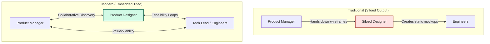

[← Previous Lecture](./15-empowered-product-teams.md)
·
[Section Overview](./README.md)
·
[Part Overview](../README.md)
·
[Next Lecture →](unavailable)

# The Modern Product Designer

> **Material level:** Level 2 — Outlines the strategic role of product designers, comparing traditional execution pipelines with modern embedded triad partnerships, and analyzing the components of holistic user experience design.

## Lecture Overview

In modern product teams, the designer is not a service provider who colors wireframes, but a full partner in discovery and delivery. By the end of this lecture, you should be able to:
* Compare the traditional and modern models of product design alignment and measurement.
* Define holistic user experience (UX) and contrast it with user interface (UI) design.
* Differentiate between interaction design and visual design.
* Diagnose the three standard anti-patterns that occur when a product team operates without a trained designer.
* Apply best practices for collaboration between Product Managers and Product Designers.

## Central Argument

A modern Product Designer is an embedded member of the product triad, collaborating from discovery through delivery and measured by product success rather than design output. Their scope spans the holistic customer journey—encompassing all digital and offline touchpoints—ensuring that usability and value are co-created with feasibility and business viability constraints in mind.

---

## 1. Traditional vs. Modern Product Design

The role of the designer has undergone a fundamental shift:

| Attribute | Old Model (Traditional Graphic Designer) | New Model (Modern Product Designer) |
|---|---|---|
| **Relationship** | Requirements receiver | Continuous partner and discovery collaborator |
| **Seating & Org** | Siloed with other designers in a design department | Sat side-by-side with the PM and engineering team |
| **Measurement** | Output of design artifacts (mockups, wireframes, style guides) | Success of the product in the market (outcomes) |
| **Focus Scope** | User Interface (UI) look and feel | Holistic customer value and business constraints |

*Designer Collaboration: Traditional hand-offs vs. modern continuous triad loops.*

---

## 2. Holistic User Experience (UX)

User experience is much broader than the user interface (UI). It represents any touchpoint through which a customer realizes the value of the product over time.

### Elements of Holistic UX
* **Digital Touchpoints**: Application interfaces, automated email notifications, onboarding flows, marketing campaigns, and customer support channels.
* **Offline Touchpoints**: The real-world experiences enabled by digital platforms, such as riding in an Uber or staying in an Airbnb.
* **Temporal Customer Journey**: Designing how the experience evolves over time (e.g., first-time setup vs. one-year retention).

*The Holistic UX Iceberg: UI is only the visible presentation layer; UX is the submerged journey.*

### Core Questions Modern Designers Ask:
1. **Discovery & Onboarding**: How do users learn about the product? How do we reveal new functionality?
2. **Context of Use**: How do users interact with the product at different times of the day? What external triggers compete for their attention?
3. **Loyalty Curve**: How do needs differ for a one-month-old user compared to a one-year-old user?
4. **Delight & Sharing**: How do we create moments of gratification? How do users share their experiences?

---

## 3. Interaction Design vs. Visual Design

A trained designer balances two distinct but connected disciplines:

### Interaction Design
* **Goal**: Focuses on usability, ensuring the product is intuitive, learnable, consistent, and predictable.
* **Concern**: How the application behaves and responds when a user interacts with it (navigation loops, transitions, response cues).

### Visual Design
* **Goal**: Focuses on aesthetics and visual ergonomics.
* **Concern**: Layout, typography, visual hierarchy, contrast, color theory, and spatial white space.

Modern designers face the continuous challenge of crafting an **omnichannel experience**, maintaining cohesion across smartphones, laptops, smartwatches, and smart speakers.

---

## 4. The Risks of Designing Without a Designer

Building user-facing software without a trained product designer leads to three classic organizational anti-patterns:

### Anti-Pattern 1: The PM Designs (The "Amateur Layout" Trap)
* **Plausibility**: The PM feels pressured to keep engineers busy and has access to wireframing tools.
* **Defect**: PMs are not trained in cognitive load, typography, or interaction patterns, resulting in cluttered interfaces that overwhelm users.

### Anti-Pattern 2: No Designs Provided (The "Engineer's Choice" Trap)
* **Plausibility**: The PM writes high-level user stories and tells the developers to "start coding."
* **Defect**: Engineers are forced to make layout decisions on the fly. Because they lack design training, they optimize for database structures rather than human intuition.

### Anti-Pattern 3: Visual Outsourcing (The "Siloed Agency" Trap)
* **Plausibility**: The PM wireframes the interactions, then hires a graphic design agency to "make it look pretty."
* **Defect**: Separating interaction design from visual design creates a disjointed user experience, as the external agency lacks deep context on user behavior and business constraints.

> **B2B Warning**: Enterprise products often suffer from poor design because buyers (executives) are not the actual end users (employees). However, modern design is a critical success factor that can determine whether a product succeeds or fails in the market.

---

## Practical Product Management Example

### Situation
A SaaS logistics dashboard helps warehouse managers dispatch drivers. Users report that dispatching takes too long, leading to errors and delays.

### Decision
* **The Traditional / Siloed Approach**: The PM creates a detailed wireframe of a multi-tab sidebar with 15 input fields and sends it to a freelance agency. The agency makes it look modern with brand colors and returns it. The developers code the tabs. However, dispatch errors remain high because the PM did not notice that managers have to switch tabs repeatedly to compare driver statuses.
* **The Modern / Collaborative Approach**: The PM shares the dashboard analytics and error rates with the embedded Product Designer. The PM does not prescribe wireframes. The designer:
  1. Conducts field observations at the warehouse.
  2. Identifies that managers use a secondary paper list of drivers because they cannot see driver status and map locations simultaneously.
  3. Iterates through three low-fidelity paper prototypes.
  4. Designs a unified screen displaying a map with drag-and-drop driver assignments.

### Reasoning
By sharing the customer problem rather than a wireframe solution, the PM leverages the designer's training in information hierarchy and spatial organization to solve the root issue.

### Consequence
The drag-and-drop design reduces dispatch time by 60% and eliminates assignment errors.

### Transferable Lesson
Product Managers must present designers with user problems and business constraints rather than layout sketches, giving them space to design appropriate customer journeys.

---

## Common Misunderstandings

### "User experience (UX) is just user interface (UI) design."
* **The Reality**: UI is only the visual presentation layer. UX is the holistic customer journey, spanning every touchpoint (emails, customer support, and offline actions).

### "The PM should sketch wireframes to save the designer time."
* **The Reality**: Sketching wireframes restricts the designer's creative problem-solving space. The PM should define the business rules, user needs, and success metrics, and let the designer explore alternative solutions.

---

## Key Concepts and Definitions

| Concept | Simple definition |
|---|---|
| **Holistic UX** | The sum of all interactions and touchpoints a user has with a company and its product over time, both online and offline. |
| **Interaction Design** | The design of how a user navigates and interacts with a product, focusing on predictability and usability. |
| **Visual Design** | The aesthetics and visual hierarchy of a product, focusing on color, layout, typography, and spacing. |
| **Omnichannel Experience** | A cohesive product experience maintained across multiple devices (e.g., mobile, desktop, smartwatch). |

---

## Key Takeaways

1. **Embed the Designer**: Designers must sit within the product team as peers, not external services.
2. **Involve in Discovery**: Designers help discover the right product, rather than just designing the final solution.
3. **Give Design Room**: Do not prescribe layouts; provide the designer with problems and constraints.
4. **Encourage Early Iteration**: Do not critique details in low-fidelity prototypes; allow exploration of alternative solutions.
5. **Measure on Success**: Modern designers are measured by business outcomes, not feature outputs.

---

## Visual Summary

*Design Iteration Flow: Visual roadmap tracing customer problem analysis, low-fidelity sketching, and high-fidelity validation.*

---

## One-Minute Review

Modern Product Designers are collaborative partners in the product triad rather than downstream executors of PM wireframes. Sitting side-by-side with PMs and engineers, they participate in both discovery and delivery, measured by product outcomes. Their focus is holistic user experience, mapping the entire customer journey across digital and offline touchpoints. Product Managers work best with designers by presenting clear customer problems and business constraints, avoiding wireframe prescriptions, involving them early in discovery, and encouraging low-fidelity prototype exploration.

---

## Recommended Visual Illustrations

### Illustration 1: Old vs. New Collaboration Structure
* **Concept**: Contrasts the waterfall hand-off model with the modern embedded triad collaboration.
* **Purpose**: Helps the learner visualize the seating and interaction differences.
* **Suggested structure**: Side-by-side flowcharts depicting the PM-to-designer hand-off vs. the circular triad loop.

### Illustration 2: The Holistic UX Iceberg
* **Concept**: Depicts UI as the visible tip, and UX as the massive base below the waterline.
* **Purpose**: Clarifies the scope of UX beyond visual design.
* **Suggested structure**: An iceberg graphic labeled with Visual Design at the tip, Interaction Design in the middle, and Customer Journey/Omnichannel/Offline touchpoints at the submerged base.

### Illustration 3: Product PM-Designer Iteration Flow (Visual Summary)
* **Concept**: The iterative design loop from customer problem to high-fidelity validation.
* **Purpose**: Shows when to run non-nitpicky low-fidelity design sprints.
* **Suggested structure**: A flow path running from customer research through low-fidelity sketches, mid-fidelity prototypes, and validated high-fidelity designs.

---

## Related Concepts

* [Product Manager (PM)](../../GLOSSARY.md#product-manager-pm)
* [Product Discovery](../../GLOSSARY.md#product-discovery)
* [Usability Risk](../../GLOSSARY.md#usability-risk)

## Visuals in This Lecture

* [Old vs. New Collaboration Structure](./visuals/16-designer-collaboration.png)
* [The Holistic UX Iceberg](./visuals/16-holistic-ux-iceberg.png)
* [Product PM-Designer Iteration Flow (Visual Summary)](./visuals/16-visual-summary.png)

---

## Interactive Lesson

- [Open the interactive companion](./interactive/16-the-modern-product-designer.html)

---

## Source

- [Original lecture transcript](../../sources/01-introduction/01-introduction/16-the-modern-product-designer-transcript.md)

---

## Continue Learning

- Previous: [Empowered Product Teams](./15-empowered-product-teams.md)
- Section: [Section 1: Introduction](./README.md)
- Part: [Part 1: Introduction](../README.md)
- Next: (Unavailable)
- Course index: [Full Course Index](../../COURSE-INDEX.md)
