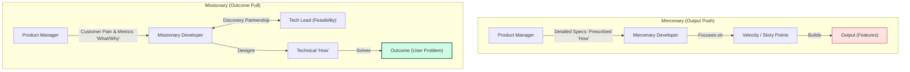

[← Previous Lecture](./16-the-modern-product-designer.md)
·
[Section Overview](./README.md)
·
[Part Overview](../README.md)
·
[Next Lecture →](./18-product-market-fit-vs-product-vision.md)

# The Modern Product Developer

> **Material level:** Level 2 — Analyzes the engineering roles in a modern product team, contrasts mercenary and missionary mindsets, and details collaboration boundaries and Tech Lead alignment.

## Lecture Overview

A Product Manager's relationship with the engineering team is the single most critical operational partnership for product success. By the end of this lecture, you should be able to:
* Contrast the focus areas and tooling of the six core developer roles (Front-end, Back-end, Full-stack, QA, DevOps, Security).
* Differentiate between "missionary" and "mercenary" developer mindsets and explain how to foster the former.
* Apply collaboration best practices, respecting the boundary between "what/why" and "how".
* Structure daily interaction loops with the Technical Lead.

## Central Argument

Successful products require a partnership of mutual respect between the PM and developers. Fostering this alignment requires the PM to share customer pain transparently—moving developers from mercenaries to missionaries—and to respect the boundary of owning the "what" and "why" while leaving the "how" to the engineers. Direct, daily alignment with the Tech Lead bridges discovery feasibility and delivery execution.

---

## 1. The Six Core Engineering Roles

While all developers work towards providing a seamless user experience, they specialize in different architectural layers:

| Role | Focus Area | Common Tooling/Languages | PM Interface |
|---|---|---|---|
| **Front-end Engineer** | Layer closest to the user; builds the visual interface, layouts, and cross-device aesthetics. | HTML, CSS, JavaScript, React, Angular. | Works closely with the UX Designer to translate wireframes into code. |
| **Back-end Engineer** | Core application logic, database integration, server scalability, and performance. | Python, Java, Node.js, databases, APIs. | Consults on data structures, API limitations, and backend integrations. |
| **Full-stack Engineer** | Capable of handling both front-end and back-end tasks. | HTML/JS + Python/Java/Node.js. | High versatility; commonly found in resource-constrained startups. |
| **QA (Quality) Engineer** | Writing software to validate the quality, security, and behavior of the application. | Selenium, automated tests, Postman. | Defines test coverage, reviews regression issues, and verifies bug fixes. |
| **DevOps Engineer** | Bridges development and operations; builds deployment pipelines and maintains system uptime. | Jenkins, Docker, CI/CD pipelines. | Coordinates release velocities, deployment stability, and build hooks. |
| **Security Engineer** | Penetration testing, threat modeling, and resolving system vulnerabilities. | Argus, NMAP, ethical hacking tools. | Evaluates security compliance, GDPR, and data protection bounds. |

*The What/Why vs. How Boundary: Clear scope boundaries prevent micromanagement.*

---

## 2. Missionary vs. Mercenary Developers

Modern product management rejects the traditional approach of keeping developers isolated in a "build-only sandbox."

### Mercenary Developers
* **Mindset**: "Just tell me what to build." They behave as hired guns.
* **Collaboration**: Isolated from customer contact; receive detailed feature specifications and focus on velocity or story-point output.
* **Outcome**: Lack empathy for the customer; build exact specifications even if the solution fails to solve the user's actual problem.

### Missionary Developers
* **Mindset**: "Let's solve this customer problem together." They behave as partners.
* **Collaboration**: Fully exposed to customer context and pain; understand *why* they are building a feature and participate in discovery.
* **Outcome**: Highly motivated to find creative technical solutions; assume shared ownership for business and customer success.

*Missionary vs. Mercenary Developers: Shift focus from velocity tickets to solving user problems.*

---

## 3. PM-Developer Collaboration Best Practices

Building credibility with smart, naturally skeptical engineers requires adhering to four operational guidelines:

1. **Don't Fake It**: If you do not understand a technical concept (e.g., APIs, containerization), admit it. Engineers respect honesty and will explain it; they do not respect bluffing.
2. **Appreciate Engineering Complexity**: Do not underestimate the difficulty of refactoring, scaling, or technical debt. PMs are encouraged to learn basic programming concepts to facilitate technical empathy.
3. **Maintain Absolute Transparency**: Share customer feedback, user analytics, and business goals. Let developers engage directly with customers or view raw session recordings.
4. **Respect the What/Why vs. How Boundary**: The PM owns the **What** (business constraints, target metrics) and the **Why** (user pain, strategic alignment). The engineers own the **How** (database schemas, software architecture, technical implementation). Specifying details of the "how" destroys developer ownership.

---

## 4. The Tech Lead Partnership

The Tech Lead (or Lead Engineer) is a senior developer with broad architecture knowledge who leads the engineering team and shares explicit discovery accountability:

### Tech Lead Discovery Role
The Tech Lead is a key partner in the product triad (with the PM and Designer), responsible for evaluating **Feasibility Risk** early in discovery before coding starts.

### Daily Interaction Loops
A successful PM interacts with the engineering team daily in two separate paths:

1. **Discovery Loop (Soliciting Ideas)**: PM gathers engineering feedback, evaluates feasibility, and brainstorms technical opportunities for upcoming ideas.
2. **Delivery Loop (Clarifying Tickets)**: PM answers developer questions, resolves requirements blocks, and refines edge cases for current development tasks.

---

## Practical Product Management Example

### Situation
A SaaS system dispatch search button has a 3-second delay, causing warehouse managers to double-click and generate duplicate entries.

### Decision
* **The Mercenary / Command Approach**: The PM writes a detailed ticket: "Add a database index to table `dispatch_records` and disable double-clicking." The engineers write the code, but search remains slow because the bottleneck was actually a redundant API search loop executing on every keystroke rather than a database index.
* **The Missionary / Collaborative Approach**: The PM shares a video recording of the warehouse manager's screen with the Tech Lead, explaining the business impact: dispatch delays are causing late shipments. The Tech Lead investigates the API traffic (how) and notices the redundant request loop.

### Reasoning
By sharing the user pain and business impact ("what" and "why") rather than prescribing a technical layout, the PM allows the Tech Lead to identify the true root cause.

### Consequence
The Tech Lead implements debouncing and local client caching. Dispatches become instantaneous, and errors drop to zero in half a day.

### Transferable Lesson
PMs must communicate customer pain and business metrics rather than specifying code implementations, giving developers room to design the correct technical solution.

---

## Common Misunderstandings

### "The PM should write technical user stories detailing database schemas."
* **The Reality**: The PM should focus on user needs and business rules. The Tech Lead and developers design the database schema. PMs who write technical tickets micromanage the "how" and strip engineers of ownership.

### "Developers should be shielded from customers to protect build time."
* **The Reality**: Shielding developers turns them into mercenaries. Sharing customer context and letting them see real user pain increases empathy, leading to better technical architecture and innovative solutions.

---

## Key Concepts and Definitions

| Concept | Simple definition |
|---|---|
| **Missionary Developer** | An engineer who understands customer context and collaborates to solve user problems, rather than just coding feature checklists. |
| **Mercenary Developer** | An engineer focused solely on building features from specifications without understanding the customer context. |
| **Technical Lead** | A senior engineer responsible for leading the dev team and partnering with the PM and Designer to resolve feasibility risks. |
| **What/Why vs. How** | The boundary separating product definitions (What/Why owned by PM) from technical architecture (How owned by Engineering). |

---

## Key Takeaways

1. **Don't Bluff**: Admit technical gaps honestly; engineers value transparency.
2. **Build Missionaries**: Share customer pain and analytics directly with developers.
3. **Own the What/Why**: Let developers own the "how" (architecture, database schemas, code layout).
4. **Partner with the Tech Lead**: Align on technical feasibility early during discovery.
5. **Engage Daily**: Run daily discovery loops for future ideas and delivery loops for active sprints.

---

## Visual Summary

*Daily Interaction Loops: Side-by-side loops showing the discovery alignment loop (feasibility inputs) and delivery clarification loop (ticket edge cases).*

---

## One-Minute Review

Product success hinges on a relationship of trust and collaboration with developers. Rather than treating engineers as mercenaries who build feature lists, PMs should share customer pain transparently to build missionary developers. PMs must respect the operational boundary of owning the "what" and "why" while leaving the technical "how" to the engineers. Engaging daily with the Tech Lead ensures that feasibility risks are addressed early in discovery, leading to scalable, outcome-driven solutions that solve real user problems.

---

## Recommended Visual Illustrations

### Illustration 1: The What/Why vs. How Boundary
* **Concept**: Visualizes the division of labor between PM (What/Why) and Engineers (How), with the Tech Lead bridging the gap.
* **Purpose**: Clarifies scope boundaries to prevent PM micromanagement.
* **Suggested structure**: Two distinct columns with a bridging node representing the Tech Lead discovery partnership.

### Illustration 2: Missionary vs. Mercenary Developers
* **Concept**: Contrasts command-and-control task routing with direct problem ownership.
* **Purpose**: Helps the learner understand the impact of transparency on developer motivation.
* **Suggested structure**: Side-by-side card layouts comparing the input, execution, and outcome of both mindsets.

### Illustration 3: Daily Interaction Loops (Visual Summary)
* **Concept**: The dual daily interaction loops between PM and Tech Lead.
* **Purpose**: Maps how discovery queries and delivery clarifications flow concurrently.
* **Suggested structure**: A dual-loop diagram showing the discovery loop (ideas/feasibility) and delivery loop (questions/edge cases).

---

## Related Concepts

* [Product Manager (PM)](../../GLOSSARY.md#product-manager-pm)
* [Technical Lead (Tech Lead)](../../GLOSSARY.md#technical-lead-tech-lead)
* [Feasibility Risk](../../GLOSSARY.md#feasibility-risk)

## Visuals in This Lecture

* [The What/Why vs. How Boundary](./visuals/17-collaboration-boundary.png)
* [Missionary vs. Mercenary Developers](./visuals/17-missionary-vs-mercenary.png)
* [Daily Interaction Loops (Visual Summary)](./visuals/17-visual-summary.png)

---

## Interactive Lesson

- [Open the interactive companion](./interactive/17-the-modern-product-developer.html)

---

## Source

- [Original lecture transcript](../../sources/01-introduction/01-introduction/17-the-modern-product-developer-transcript.md)

---

## Continue Learning

- Previous: [The Modern Product Designer](./16-the-modern-product-designer.md)
- Section: [Section 1: Introduction](./README.md)
- Part: [Part 1: Introduction](../README.md)
- Next: [Product-Market Fit vs. Product Vision](./18-product-market-fit-vs-product-vision.md)
- Course index: [Full Course Index](../../COURSE-INDEX.md)
