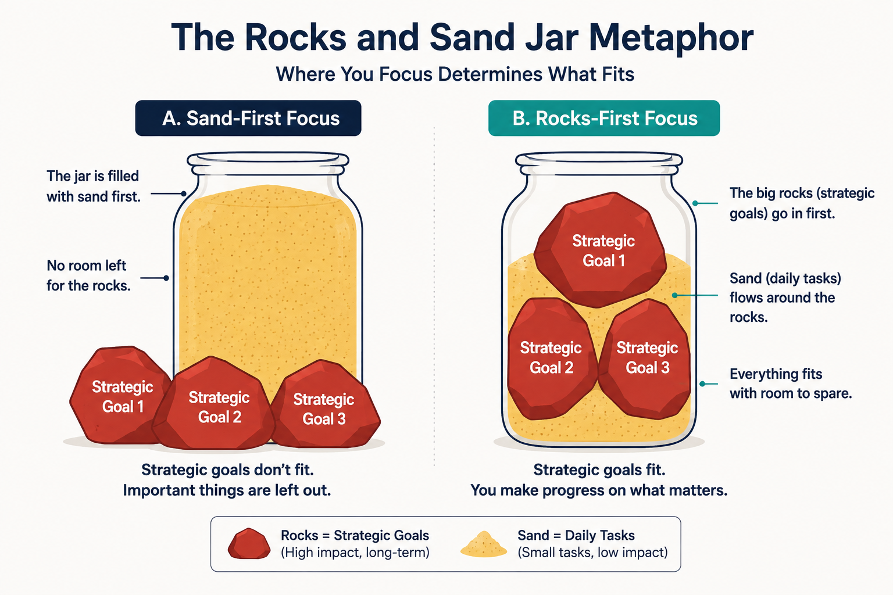
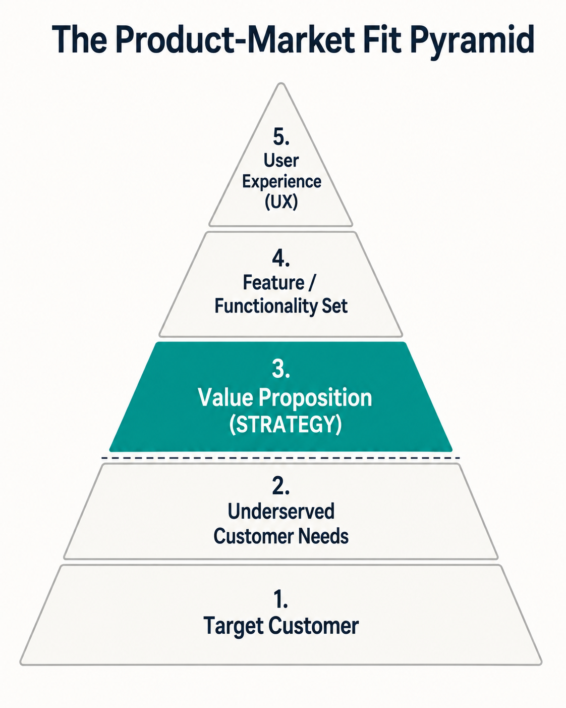
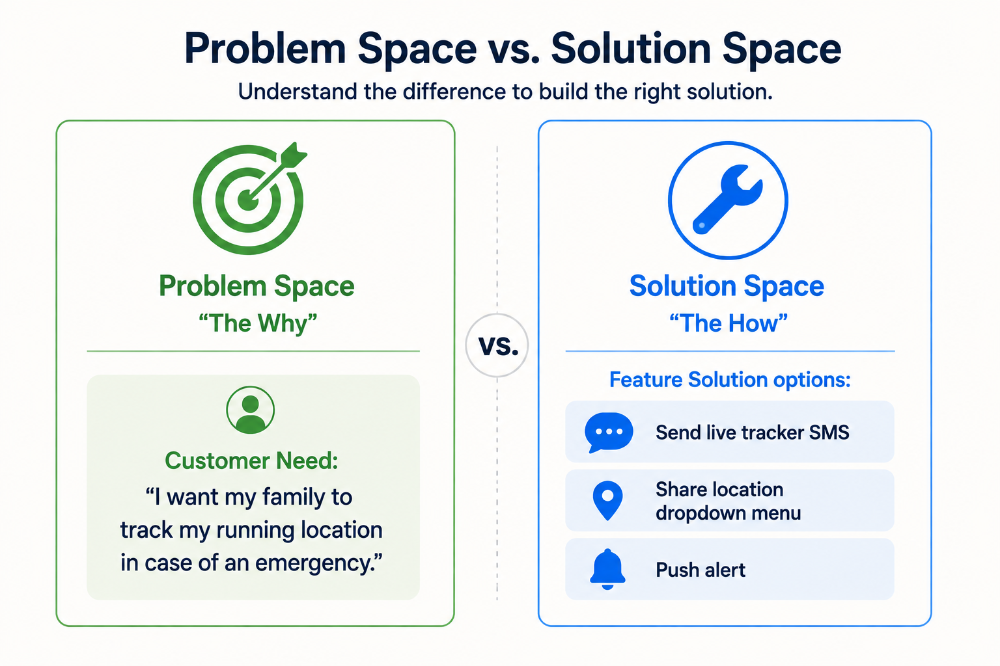
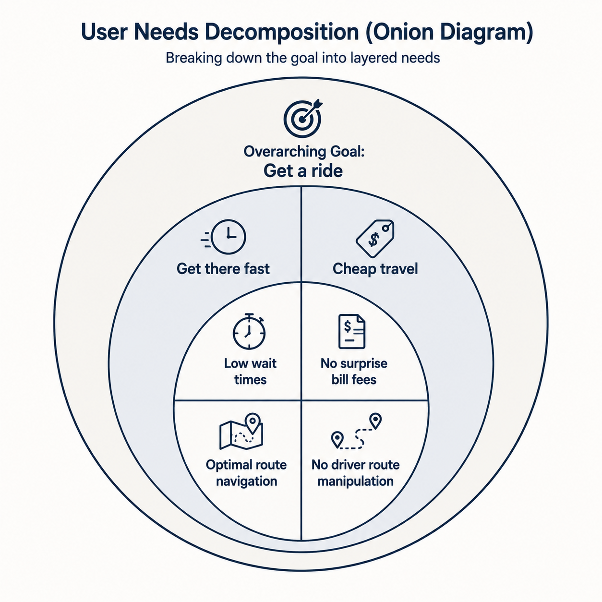
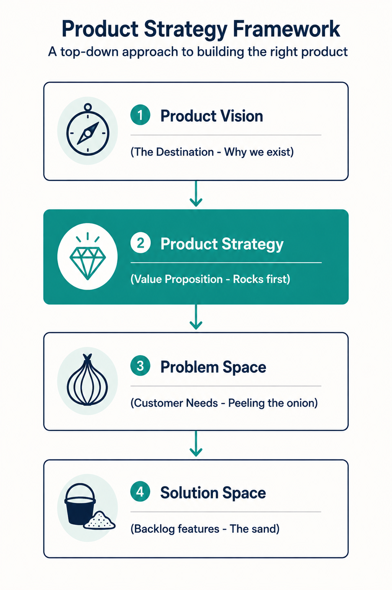

[← Previous Lecture](../../01-introduction/01-introduction/21-the-feature-audit.md)
·
[Section Overview](./README.md)
·
[Part Overview](../README.md)
·
[Next Lecture →](unavailable)

# What is Product Strategy?

> **Material level:** Level 2 — Core lecture defining Product Strategy, the Big Rocks vs. Sand metaphor, the Product-Market Fit Pyramid layers, the Problem vs. Solution Space boundary, and "peeling the onion" problem definition.

## Lecture Overview

A great product vision is meaningless without a concrete plan to execute it. This lecture introduces **Product Strategy** as the plan that turns a high-level vision into reality. By the end of this lecture, you should be able to:
* Define Product Strategy and explain its role as a bridge between vision and daily delivery.
* Apply the **Big Rocks vs. Sand** metaphor to balance long-term strategy with short-term agile delivery.
* Map where Product Strategy sits within the **Product-Market Fit (PMF) Pyramid**.
* Differentiate between the **Problem Space** and the **Solution Space** when defining user stories.
* Utilize the **"Peeling the Onion"** technique to decompose complex customer needs.

## Central Argument

Many companies fail to build effective product strategies because they focus on short-term agile outputs (the "sand") and lack structured frameworks to formulate long-term goals. A successful Product Manager must define strategy in terms of customer benefits (the problem space) rather than features (the solution space). By prioritizing the strategic "big rocks" first and decomposing customer needs through structured problem-space mapping, PMs ensure that daily development work drives actual business and user value.

---

## 1. What is Product Strategy?

Product strategy is the plan for making your product vision a reality. It acts as the critical bridge connecting your long-term, high-level product vision with the short-term, day-to-day features your development team builds.

### Why Strategic Planning Fails in Product Teams
Many organizations struggle to establish a viable product strategy for two main reasons:

1.  **Short-Term Velocity Focus:** Companies focus heavily on the immediate future (the next week, sprint, or quarter) at the expense of long-term planning. In Agile environments, the Product Owner (PO) is often consumed by sprint backlog administration, leaving little time or administrative support to focus on the bigger picture.
2.  **Lack of Frameworks:** Product strategy is complex, and there are very few structured, repeatable frameworks available to guide teams through its formulation.

---

## 2. Metaphor: Big Rocks vs. Sand

To balance strategy with agile execution, product managers can apply the classic prioritization metaphor of **Big Rocks vs. Sand**:

*   **The Container Jar:** If you fill a jar with sand first, followed by pebbles, and finally big rocks, the big rocks will overflow and fail to fit. However, if you place the big rocks in first, followed by the pebbles and sand, everything fits perfectly.
*   **The Metaphorical Meanings:**
    *   **The Sand:** Represents small, high-frequency daily items (emails, meetings, immediate bugs, ad-hoc customer requests).
    *   **The Big Rocks:** Represents long-term, structural strategic initiatives (validating new customer segments, refactoring core services, opening new markets).
*   **The Strategic Lesson:** Unless you make space for the "big rocks" first, the "sand" will overwhelm your calendar and product backlog.


*Prioritizing strategic "big rocks" first ensures daily ad-hoc "sand" does not overwhelm product direction.*

In Agile development, the focus on continuous delivery naturally prioritizes the "sand" (backlog stories and points velocity). It is the responsibility of product leadership (such as the Chief Product Officer) and the Product Manager to define and protect the "big rocks" first, letting the rocks guide where the sand goes.

---

## 3. Product Strategy and the PMF Pyramid

To understand where strategy resides, we look at the **Product-Market Fit Pyramid** (designed by Dan Olsen), which divides a product lifecycle into a Market segment and a Product segment:


*Product-Market Fit Pyramid mapping the split between market segments and product execution tiers.*

### Market Segment (Layers 1 & 2 - Outside Your Control)
1.  **Target Customer:** The specific audience segment you intend to serve.
2.  **Underserved Customer Needs:** The painful, unsolved requirements of that target audience.
*   *Strategic Rule:* You cannot directly control or modify your market's needs, but you have complete control over *which* target customer and needs you choose to pursue.

### Product Segment (Layers 3, 4, & 5 - Under Your Control)
3.  **Value Proposition (The Strategy):** The specific customer benefits and value you choose to deliver. **Product strategy lives at this layer.**
4.  **Feature / Functionality Set:** The specific technical capabilities you build to deliver the proposed value.
5.  **User Experience (UX):** The interface and workflows that bring the functionality to life.

*Key Takeaway:* Product strategy is defined by the **value proposition (benefits)**, not by the features or functionality. Mapping strategy to features is a major failure pattern.

---

## 4. Problem Space vs. Solution Space

A core discipline of product strategy is separating the problem space from the solution space. Humans possess a natural psychological bias toward "closing the loop," causing teams to jump to the first technical solution they think of instead of fully defining the problem.

### Defining the Boundaries
*   **The Problem Space:** Describes the unmet user need, pain point, or desired benefit that the product should address. (Focuses on the **Why** and **Who**).
*   **The Solution Space:** Represents a specific design, technical implementation, or feature built to address that need. (Focuses on the **How** and **What**).

### Comparing Problem vs. Solution Space Statements

| Problem Space (Benefit / The "Why") | Solution Space (Feature / The "How") |
|---|---|
| "I want to be notified when my order is shipped." | "Send me an SMS text message alert." |
| "I want to let a family member know my running location in case of an emergency." | "Add a share-location dropdown menu to the screen." |
| "I want to prevent taxi drivers from overcharging me on trips." | "Implement automatic credit card billing in the app." |


*Differentiating customer needs (Problem Space) from specific software implementation features (Solution Space).*

---

## 5. Decomposing Needs: Peeling the Onion

To discover critical business problems and flesh out the problem space, PMs must use a technique called **"peeling the onion."** This involves getting in front of potential users through interviews and observations, and repeatedly asking "Why" to peel back superficial requirements and expose underlying needs.

### Case Study: Uber Cabs (2009) Problem Space
If we peel the problem space of a professional passenger in 2009, we uncover multiple nested layers of customer needs:

```text
Level 1 (Overarching Goal): Get a ride.
   |
   +--> Level 2 (Speed Need): Get there fast.
   |       |
   |       +--> Level 3: Do not wait too long for a taxi.
   |       +--> Level 3: Take the best route to save time.
   |
   +--> Level 2 (Cost Need): Cheap travel.
           |
           +--> Level 3: Avoid surprise fees when the bill arrives.
           +--> Level 3: Prevent driver from taking longer routes to overcharge.
```


*Decomposing high-level user goals down into underlying cost and speed requirements.*

By peeling these layers, the PM uncovers different perspectives and opportunities, ensuring the engineering team builds features that solve the *actual* problems (e.g., real-time driver tracking) rather than building ad-hoc, unvalidated solutions.

---

## Practical Product Management Example

### Situation
A PM at a **fitness tracking app** receives a high-priority feature request from stakeholders: *"We need to add a dropdown menu of pre-written messaging status templates to our running tracker."* The engineering team has already started writing database migrations to store template strings.

### Decision
The PM halts the development work to validate the problem space. They apply the **"Five Whys" analysis** to peel the request:
1.  *Why do users need messaging templates?* To share their location quickly.
2.  *Why do they need to share their location quickly?* To let family members know where they are while jogging.
3.  *Why do they need family members to know?* In case they get injured or run into trouble on isolated trails.

The PM realizes the core benefit is **personal safety tracking**. The PM re-writes the backlog requirement in the problem space: *"As an outdoor runner, I want my emergency contacts to monitor my live route so that they can assist me if I get injured."*

### Reasoning
The dropdown menu is a solution-space guess. By focusing on the problem space (safety tracking), the PM opens up superior solutions. Instead of complex template dropdowns, the engineering team proposes a simple **one-click "Send Live Track" button** that integrates with the phone's native GPS and SMS apps.

### Consequence
The development team avoids writing custom template storage code, saving 2 weeks of sprint time. The "Send Live Track" feature launches quickly and achieves 78% daily active use among early adopters. User feedback indicates that safety tracking (the problem space) was the primary reason joggers recommended the app to friends.

### Transferable Lesson
Never let feature requests bypass problem-space validation. Peel the onion by asking "Why" to isolate the core customer benefit before writing code. This avoids bloating the product with unnecessary UI features.

---

## Common Misunderstandings

### "Product strategy is our product roadmap of features"
**Correction:** A list of features is not a strategy. Features live in the solution space. Product strategy lives in the **value proposition layer** of the PMF Pyramid and defines the customer benefits you choose to deliver. Roadmaps should be structured around outcomes and user benefits, not delivery dates for code.

### "Agile development automatically builds good product strategy"
**Correction:** Agile is a delivery methodology optimized for shipping continuous increments of code (the "sand"). It does not generate product strategy. Without strong leadership protecting the "big rocks" first, agile teams naturally fall into the "feature factory" trap—shipping code fast without verifying if it solves strategic user problems.

### "We must solve the entire problem space at once"
**Correction:** The problem space can be massive (like the Uber cab onion layers). A PM must prioritize which specific underserved needs to tackle first. Attempting to solve all layers of the onion on day one leads to scope creep and delayed launches.

---

## Key Concepts and Definitions

| Concept | Simple definition |
|---|---|
| **Product Strategy** | The plan for making a product vision a reality, living at the value proposition layer of the PMF Pyramid. |
| **Big Rocks vs. Sand** | A prioritization metaphor where "rocks" represent long-term strategic goals and "sand" represents short-term daily tasks. |
| **Problem Space** | The set of customer needs, pain points, and desired benefits that a product is designed to solve. |
| **Solution Space** | The specific features, software designs, and technical implementations built to solve problem-space needs. |
| **PMF Pyramid** | A 5-layer framework mapping Target Customer and Needs (Market) to Value Proposition, Features, and UX (Product). |

---

## Key Takeaways

1. **Strategy is the plan to realize your vision,** bridging the gap between high-level purpose and daily backlog delivery.
2. **The "Big Rocks vs. Sand" metaphor** dictates that you must schedule long-term strategic work first, or daily tasks will overwhelm your team.
3. **Agile focus on continuous output** naturally prioritizes the "sand," making strong product leadership essential to protect the "rocks."
4. **Product Strategy lives at the Value Proposition layer** of the Product-Market Fit Pyramid, not in features or UX.
5. **You cannot control your market** (customer needs), but you control which market segment your product strategy targets.
6. **Separate the problem space (Why/Who) from the solution space (How/What)** to avoid building unvalidated, complex features.
7. **Peel the onion** by asking "Why" during user research to decompose high-level goals into detailed layers of underserved needs.
8. **Uber Cabs (2009) decomposed needs** from "get a ride" down to speed (low wait times) and cost trust (no surprise fees).

---

## Visual Summary


*Visual Summary: Process flowchart mapping the relationship between Product Vision, Product Strategy (Value Proposition), Problem Space Decomposition, and Solution Space Execution.*

---

## One-Minute Review

*   **Define Strategy First:** Product strategy is your value proposition—the specific customer benefits you choose to deliver to realize your vision.
*   **Prioritize Big Rocks:** Put the rocks (strategy) in first. If you focus on the sand (daily agile delivery), your product will lack long-term direction.
*   **Focus on the Problem:** Keep your backlog in the problem space (needs). Ask "Why" to peel back feature requests and uncover the real user problems.

---

## Recommended Visual Illustrations

### Illustration 1: Big Rocks vs. Sand Metaphor
*   **Concept:** Priority mapping using rocks and sand jars.
*   **Purpose:** Illustrates the danger of letting daily tasks overwhelm strategic focus.
*   **Suggested structure:** Side-by-side jars:
    *   Jar A ("Sand-First / Agile Output Focus"): Filled to the top with yellow sand ("Daily meetings, emails, minor requests"). Three large red rocks labeled "Strategy: Customer Discovery, Market Entry, Refactoring" sit outside, overflowing.
    *   Jar B ("Rocks-First / Strategy Focus"): Jar filled with the three large red rocks first, with yellow sand filling the gaps. Everything fits cleanly.

### Illustration 2: The Product-Market Fit Pyramid & Strategy Layer
*   **Concept:** Olsen's PMF Pyramid highlighting the strategy layer.
*   **Purpose:** Displays where strategy lives in relation to market needs vs. product execution.
*   **Suggested structure:** A 5-tier pyramid:
    *   Tier 5: "User Experience (UX)" [Product Segment]
    *   Tier 4: "Feature / Functionality Set" [Product Segment]
    *   Tier 3 [Highlighted in Teal]: "Value Proposition (STRATEGY)" [Product Segment - Product Strategy Lives Here]
    *   --- Pyramid Split (Boundary line) ---
    *   Tier 2: "Underserved Customer Needs" [Market Segment - Outside Direct Control]
    *   Tier 1: "Target Customer" [Market Segment - Outside Direct Control]

### Illustration 3: Problem Space vs. Solution Space Mapping
*   **Concept:** Separating problem-space benefits from solution-space features.
*   **Purpose:** Helps developers avoid jumping straight to coding before validating needs.
*   **Suggested structure:** A split comparative infographic:
    *   Left side (Problem Space - "The Why"): Labeled with a green target. Labeled "Customer Need: I want my family to track my running location in case of an emergency."
    *   Right side (Solution Space - "The How"): Labeled with a blue wrench. Labeled "Feature Solution options: Send live tracker SMS, Share location dropdown menu, Push alert".

### Illustration 4: Problem Decomposition: Peeling the Onion (Uber Cabs 2009)
*   **Concept:** Decomposing user needs into granular problem layers.
*   **Purpose:** Demonstrates how to run problem-space analysis.
*   **Suggested structure:** Concentric rings of an onion:
    *   Outer Ring: "Overarching Goal: Get a ride"
    *   Middle Ring: Splits into two segments: "Get there fast" and "Cheap travel"
    *   Inner Ring (under Fast): "Low wait times", "Optimal route navigation"
    *   Inner Ring (under Cheap): "No surprise bill fees", "No driver route manipulation"

### Illustration 5: The Product Strategy Framework (Visual Summary)
*   **Concept:** The strategic flow from high-level direction to tactical execution.
*   **Purpose:** Summarizes the entire strategy alignment lifecycle.
*   **Suggested structure:** A top-down flowchart:
    *   Box 1: "Product Vision (The Destination - Why we exist)"
    *   Box 2 [Teal]: "Product Strategy (Value Proposition - Rocks first)"
    *   Box 3: "Problem Space (Customer Needs - Peeling the onion)"
    *   Box 4: "Solution Space (Backlog features - The sand)"

---

## Related Concepts

* [Product-Market Fit vs. Product Vision](../../01-introduction/01-introduction/18-product-market-fit-vs-product-vision.md)
* [Exercise #3: Create a Product Vision Board](../../01-introduction/01-introduction/19-create-a-product-vision-board.md)

## Visuals in This Lecture

* [Big Rocks vs. Sand Metaphor](./visuals/22-rocks-vs-sand.png)
* [The Product-Market Fit Pyramid & Strategy Layer](./visuals/22-pmf-pyramid.png)
* [Problem Space vs. Solution Space Mapping](./visuals/22-problem-vs-solution.png)
* [Problem Decomposition: Peeling the Onion (Uber Cabs 2009)](./visuals/22-peeling-onion.png)
* [The Product Strategy Framework (Visual Summary)](./visuals/22-visual-summary.png)

## Interactive Lesson

* [Open the interactive companion](./interactive/22-what-is-product-strategy.html)

## Source

* [Original lecture transcript](../../sources/02-strategy/02-strategy/22-what-is-product-strategy-transcript.md)

## Continue Learning

* Previous: [Exercise #4: The Feature Audit](../../01-introduction/01-introduction/21-the-feature-audit.md)
* Section: [Strategy](./README.md)
* Part: [Strategy](../README.md)
* Next: [Next Lecture](unavailable)
* Course index: [Full Course Index](../../COURSE-INDEX.md)
