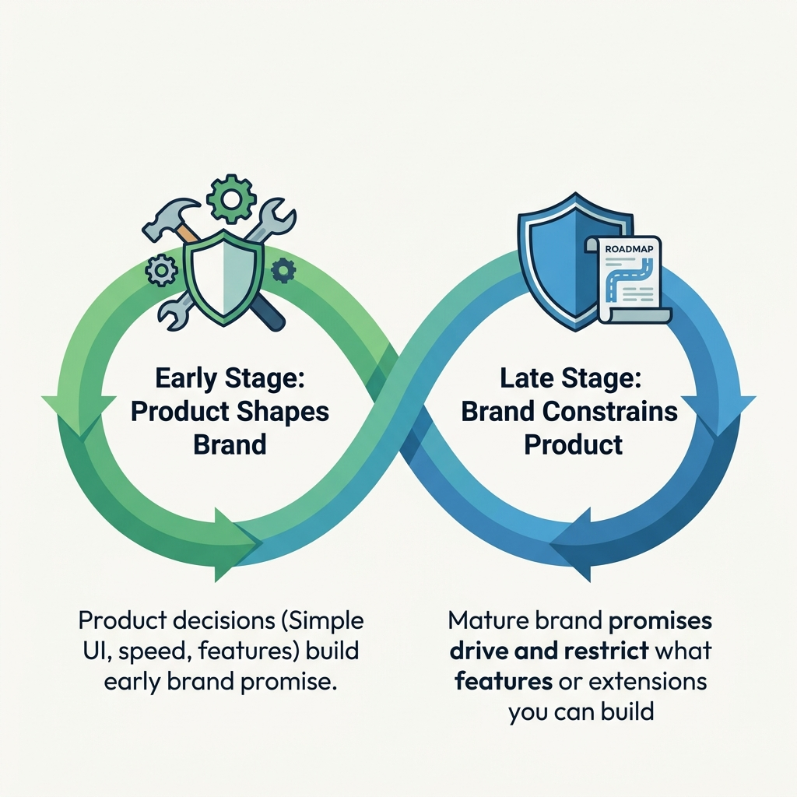
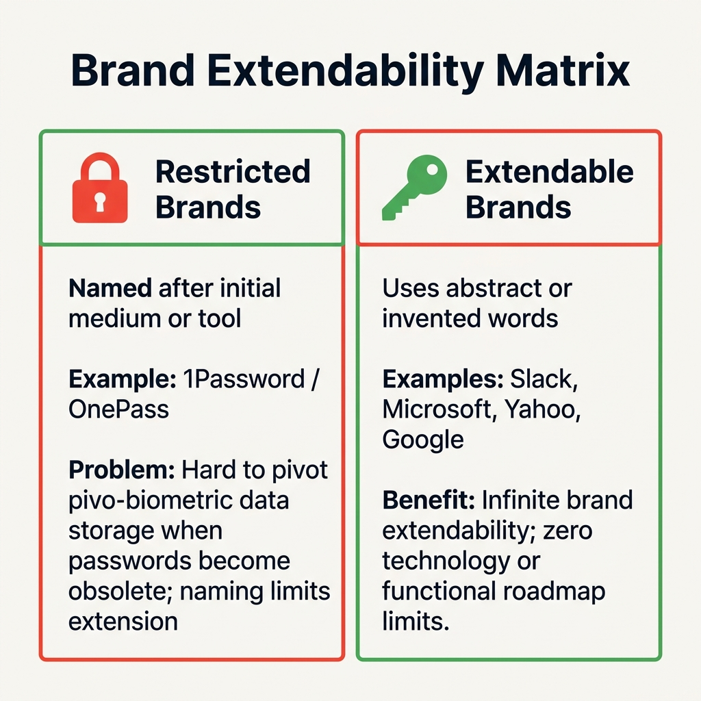

[← Previous Lecture](./31-growing-market-exercise.md)
·
[Section Overview](./README.md)
·
[Part Overview](../README.md)
·
[Next Lecture →](unavailable)

# The Extendable Brand

> **Material level:** Level 2 — Core lecture focusing on the definition of branding in technology companies, the Product-Brand Lifecycle Loop, and the strategic importance of choosing extendable, abstract names for long-term pivoting and scale.

## Lecture Overview

Branding is one of the most overlooked elements in technology startups. Yet, in an early-stage company, every product feature, UI layout, and onboarding choice represents a brand promise. By the end of this lecture, you should be able to:
* Define what a brand represents in technology-driven companies.
* Describe the shifting relationship between products and brands over their lifecycle.
* Explain the concept of brand extendability and its impact on strategic pivots.
* Analyze why abstract or invented names are preferred for high-growth tech ventures.

---

## 1. What is a Brand?

In the technology space, **your brand represents the promises that you make to your customers.** It is not just a logo, a color palette, or a marketing slogan. 

In early-stage companies:
$$\text{Brand} = \text{Product} = \text{Company} = \text{Founders}$$

Your initial product decisions (e.g., whether your interface is simple, developer-friendly, social, fast, or connection-oriented) are what build your brand's reputation.

---

## 2. The Product-Brand Lifecycle Loop

The relationship between product and brand changes as a company matures.


*The shifting dynamic: product choices shape brand perception in early stages, while brand promises drive product options in mature stages.*

```text
       Early Stage: Product Shapes Brand
[Product Decisions] ===(Shape)===> [Brand Perception]
(e.g., Simple UI, Fast Speed, Dev-Friendly)

       Late Stage: Brand Constrains Product
[Brand Promises] ===(Drive & Constrain)===> [Product Options]
(e.g., Google Messenger vs. Facebook Messenger)
```

### Mature Brand Associations (Examples)

*   **Google Maps:** Associated with data accuracy, search speed, and utility. Users expect it to find any location correctly.
*   **Apple Maps:** Associated with visual excellence, aesthetic design, but historically carrying the perception of lower navigation reliability.
*   **Facebook Messenger:** Associated with social connections, marketplace access, and advertising.
*   **Google Messenger (Hypothetical):** Causes customer confusion because Google is not associated with social networks. The Google brand does not carry a "social network promise," constraining Google's product extensions.

---

## 3. Brand Extendability and Strategic Pivots

A critical question for product strategy is: **Can your brand name extend to match your long-term business ambition?**

When companies name themselves after their initial delivery medium, they create a **brand constraint** that restricts future pivots.


*The brand extendability comparison matrix: restricted technology-specific names vs. extendable invented names.*

### The Pivot Challenge: 1Password (OnePass)
*   **Initial Product:** A password manager vault.
*   **Future Shift:** Suppose passwords become obsolete in five years, and the company must pivot to store biometric datasets (fingerprints, face hashes, iris prints).
*   **Brand Constraint:** The name "OnePass" or "1Password" contains the word "pass/password," which implies traditional keyboard passwords. The name does not extend easily to biometric security, forcing the company to choose between:
    1.  Sticking to an outdated, restrictive name.
    2.  Executing a rebranding campaign, which is expensive and destroys accumulated brand equity.

---

## 4. The Power of Invented Words

To maximize brand extendability, modern high-growth tech companies prefer using **invented, abstract words**:

$$\text{Slack, Microsoft, Yahoo, Bing, Google, Apple}$$

### Advantages of Abstract Names:
1.  **Memorable:** Unique word configurations stand out in saturated search indexes.
2.  **Unrestricted:** They carry zero technology or vendor locks. If Slack pivots from team chat to document creation, the brand name "Slack" does not constrain the transition.

---

## Practical B2B Brand Pivot Example

### Situation
A PM is building a startup called **"ExcelConnector"**, which imports data from Excel files into databases.

### Problem
After 2 years, customers stop using Excel and shift entirely to Google Sheets and Airtable.

### Rebranding Risk
If the company keeps the name "ExcelConnector," they cannot acquire Google Sheets users. If they rebrand to **"SyncMage"** (an abstract name), they lose all their SEO rankings, historical reviews, and domain authority.

### Lesson
Choose an extendable, abstract brand name from Day 1, even when starting with a single technology-specific feature.

---

## Common Misunderstandings

### "Branding is just a task for the marketing team"
**Correction:** Marketing controls the advertisements, but the product controls the customer experience. If a PM designs a complex, hard-to-use checkout flow for a product that promises "Simple and fast," the product decision breaks the brand promise. Product managers own the core brand value.

### "Descriptive names are better because they explain what we do immediately"
**Correction:** Descriptive names (e.g., "OnlineFaxService") help with early search engine traffic but represent a massive liability if the product needs to pivot or expand to related areas (e.g., cloud file sharing).

---

## Key Concepts and Definitions

| Concept | Simple definition |
|---|---|
| **Brand Promise** | The explicit and implicit expectations set by a product's behavior, design, and marketing. |
| **Brand Extendability** | The capacity of a brand name to support pivots, product expansions, and new target industries without losing brand equity. |
| **Invented Word Branding** | Naming a company with abstract, created terms to avoid technology dependencies and functional constraints. |

---

## One-Minute Review

*   **Own the Promise:** Remember that early product choices establish the initial customer trust and brand values (e.g., speed, simplicity).
*   **Design for Pivots:** Avoid name locks to technical mediums (e.g., passwords, fax, Excel). Use abstract coined words (e.g., Slack) to safeguard pivot options.
*   **Audit Roadmap Alignment:** Check whether new features support or clash with established mature brand promises to maintain brand equity.

---

## Recommended Visual Illustrations

### Illustration 1: The Product-Brand Lifecycle Loop
*   **Concept:** Lifecycle dynamic shift infographic.
*   **Suggested structure:** Infinity loop showing early shaping vs. late constraint.

### Illustration 2: Brand Extendability Matrix
*   **Concept:** Naming category grid.
*   **Suggested structure:** Side-by-side card detailing restricted (locked names) vs. extendable (coined words).

### Illustration 3: PM Brand Strategy Steps (Visual Summary)
*   **Concept:** Actionable checklist flow.
*   **Suggested structure:** Sequential flowchart starting from defining promises through roadmap audits.

---

## Related Concepts

* [Exercise #8: Timeless Problem Statements](./29-timeless-problem-statements.md)
* [Exercise #9: Are you in a Growing Market?](./31-growing-market-exercise.md)

## Visuals in This Lecture

* [The Product-Brand Lifecycle Loop](./visuals/32-brand-relationship.png)
* [Brand Extendability Matrix](./visuals/32-extendability-examples.png)
* [PM Brand Strategy steps flowchart](./visuals/32-visual-summary.png)

## Interactive Lesson

* [Open the interactive companion](./interactive/32-extendable-brand.html)

## Source

* [Original lecture transcript](../../sources/02-strategy/03-the-problem-space/32-extendable-brand-transcript.md)

## Continue Learning

* Previous: [Exercise #9: Are you in a Growing Market?](./31-growing-market-exercise.md)
* Section: [The Problem Space](./README.md)
* Part: [Strategy](../README.md)
* Next: [Next Section Overview](../04-goal-setting/README.md) *(Section 4: Goal Setting)*
* Course index: [Full Course Index](../../COURSE-INDEX.md)
