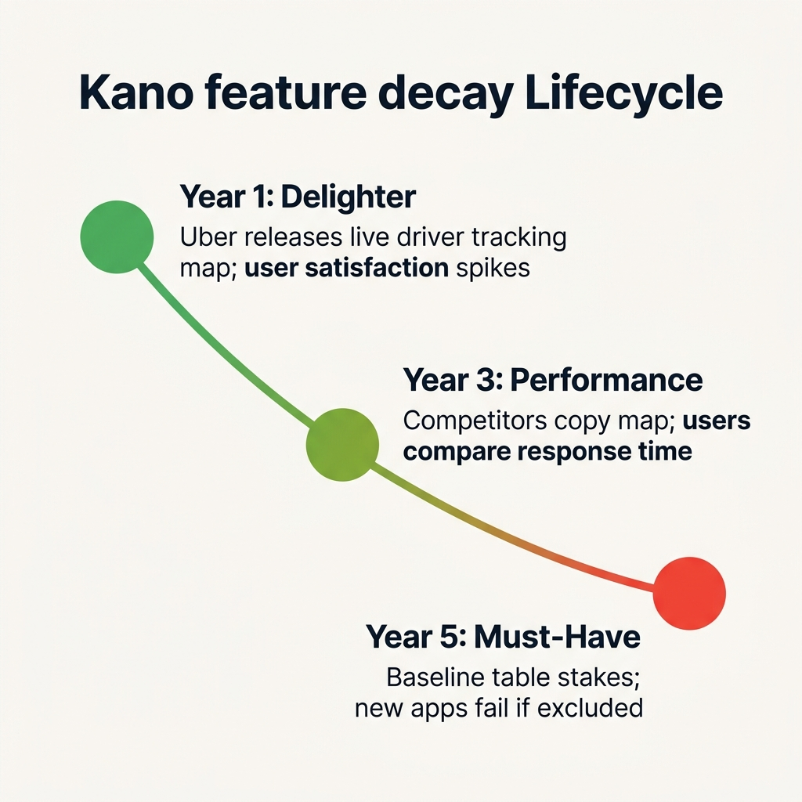
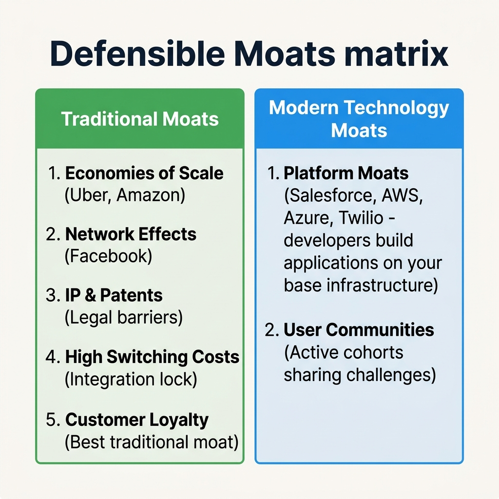
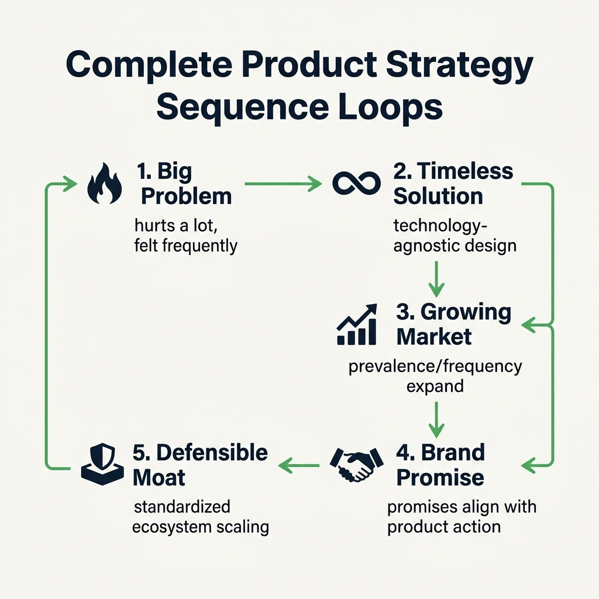

[← Previous Lecture](./32-extendable-brand.md)
·
[Section Overview](./README.md)
·
[Part Overview](../README.md)
·
[Next Lecture →](unavailable)

# The Defensible Moat

> **Material level:** Level 2 — Core lecture focusing on the reality of feature copying in tech, the mechanism of Kano Feature Decay, and classifications of traditional vs. modern defensible moats (platforms and communities).

## Lecture Overview

To survive in the long run, your product must build defensible barriers to block competitors. In the technology industry, successful features are copied rapidly, causing them to decay from customer delighters to baseline expectations. By the end of this lecture, you should be able to:
* Explain why technology features undergo decay under the Kano Model.
* Differentiate between the five traditional business moats.
* Contrast traditional barriers with modern technology moats (Platforms and Communities).
* Summarize the complete Section 3 strategic roadmap for product scaling.

---

## 1. Feature Copying and Kano Decay

The reality of the technology sector is that **almost every successful feature is copied by competitors.** This copying drives **Kano Feature Decay**, where a feature shifts categories over time:

$$\text{Delighter Feature (Wow factor)} \xrightarrow{\text{Copied by competitors}} \text{Performance Feature} \xrightarrow{\text{Industry standard}} \text{Must-Have Feature (Table stakes)}$$


*Kano feature decay curve timeline: showing how delighters decay into performance features and must-haves as competitors copy them.*

### Real-World Example: Uber Live Driver Tracking
*   **Launch Era (Delighter):** Uber was one of the first ride-sharing platforms to display driver locations in real-time. It was a delighter that generated massive customer satisfaction.
*   **Decay Era (Must-Have):** Competitors copied the tracking map. Today, every ride-sharing service must offer live tracking. If a new player enters the market without this feature, they cannot compete. It is now a non-negotiable must-have.

---

## 2. Five Traditional Defensible Moats

When features are copied, product managers must look beyond functional capabilities to build structural barriers:


*Structural barrier classifications: comparing five traditional moats with platform and user community moats.*

1.  **Economies of Scale:** Being larger than competitors, allowing you to absorb smaller profit margins, lower customer acquisition costs, or offer lower pricing (e.g., Amazon, Uber).
2.  **Network Effects:** The product's value increases proportionally with the number of active users. Users stay because "everyone else is there" (e.g., Facebook).
3.  **IP and Patents:** Using legal structures, patents, and copyright laws to prevent competitors from copying key technical logic.
4.  **High Switching Costs:** Locking in customers via the high complexity or financial cost of transferring data and workflows.
    *   *Warning:* High switching costs (especially in B2B enterprise software with deep customizations and integrations) can lead to **customer resentment** if they feel held hostage, which damages the brand promise.
5.  **Customer Loyalty (The Best Traditional Moat):** Crafting a product experience and brand identity that customers genuinely love, making them resistant to leaving even when competitors lower prices.

---

## 3. Modern Technology Moats

Technology ecosystems have produced two highly defensible modern barriers:

### A. Building a Platform
In technology, a **platform** is a suite of software or infrastructure used as a base upon which third-party developers build their own applications and integrations.

*   **Examples:** Salesforce.com, Amazon Web Services (AWS), Microsoft Azure, Twilio.
*   **Ecosystem Mechanism:** By letting developers construct tools on top of your architecture, you create an ecosystem. Third-party applications and businesses become dependent on your platform to survive, locking them in as highly loyal, recurring customers.

### B. Creating a Community of Users
Instead of treating users as isolated customers, modern tech organizations build interactive user networks.

*   **Mechanism:** Users communicate directly with each other, sharing challenges, templates, and best practices.
*   **Result:** The community generates a sense of belonging and collective knowledge, creating a psychological and operational moat that competitors cannot easily duplicate.

---

## Section 3 Strategic Summary: Product Growth Loop

To build a high-growth product, a product manager must run this sequential strategic loop:


*The complete Section 3 strategic roadmap: how timeless problem solving and growing markets connect to brand resonance and defensibility loops.*

```text
  1. BIG PROBLEM        -> Hurts a lot, felt frequently, high price/cost margin.
  2. TIMELESS SOLUTION  -> Tech-agnostic design, safe from tool transitions.
  3. GROWING MARKET     -> Prevalence/frequency expansion, stream of new entrants.
  4. BRAND RESONANCE    -> Clear brand promise aligned with product behavior.
  5. DEFENSIBLE MOAT     -> Standardized platform, scaling loops, or loyalty.
```

---

## One-Minute Review

*   **Anticipate Copying:** Plan for competitor copycatting by expecting delighters to decay into baseline table stakes (Kano Decay).
*   **Leverage Ecosystems:** Go beyond feature checklists by building modern platform integrations (e.g., Salesforce, AWS) or active user networks to lock in defensibility.
*   **Align the Strategic Chain:** Ensure timeless problem definitions, brand promises, and defensive barriers remain aligned in a scaling sequence.

---

## Recommended Visual Illustrations

### Illustration 1: Kano Feature Decay Curve
*   **Concept:** Feature decay timeline infographic.
*   **Suggested structure:** Downward sloping line showing Delighter, Performance, and Must-Have categories over time.

### Illustration 2: Traditional vs. Modern Moats
*   **Concept:** Structural defensibility matrix.
*   **Suggested structure:** Split-column card contrasting scale/network effects/switching costs with platform/community architectures.

### Illustration 3: Complete Product Strategy Sequence (Visual Summary)
*   **Concept:** Infographic summarizing the Section 3 roadmap.
*   **Suggested structure:** Step-by-step circular flowchart chaining problem, timeless solution, growing market, brand promise, and defensible moats.

---

## Related Concepts

* [The Kano Model](./24-the-kano-model.md)
* [Getting Product Strategy Right](./26-getting-product-strategy-right.md)
* [Exercise #7: Problem Type Analysis](./27-problem-type-analysis.md)

## Visuals in This Lecture

* [Kano Feature Decay Curve](./visuals/33-feature-decay.png)
* [Traditional vs Modern Moats](./visuals/33-moat-classifications.png)
* [Section 3 Product Strategy Sequence flowchart](./visuals/33-visual-summary.png)

## Interactive Lesson

* [Open the interactive companion](./interactive/33-defensible-moat.html)

## Source

* [Original lecture transcript](../../sources/02-strategy/03-the-problem-space/33-defensible-moat-transcript.md)

## Continue Learning

* Previous: [The Extendable Brand](./32-extendable-brand.md)
* Section: [The Problem Space](./README.md)
* Part: [Strategy](../README.md)
* Next: [Next Section Overview](../04-goal-setting/README.md) *(Section 4: Goal Setting)*
* Course index: [Full Course Index](../../COURSE-INDEX.md)
