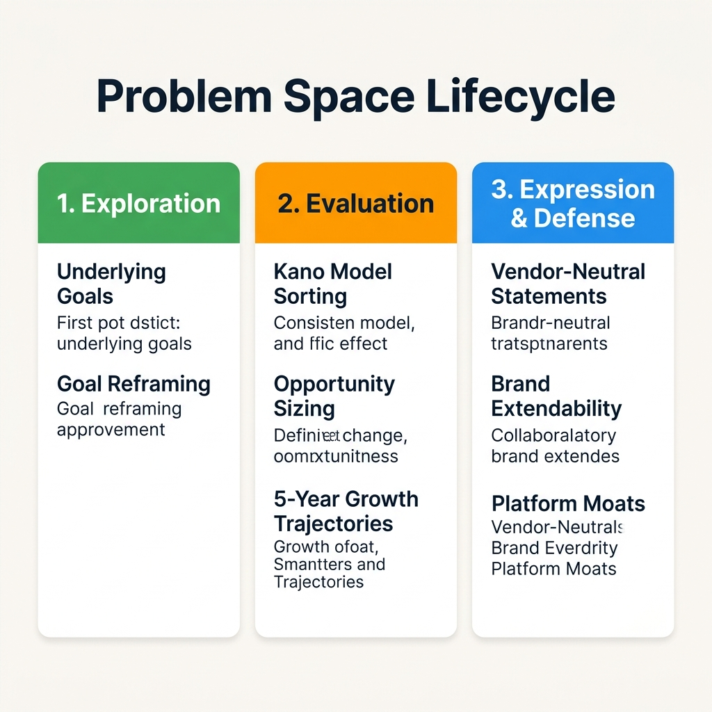
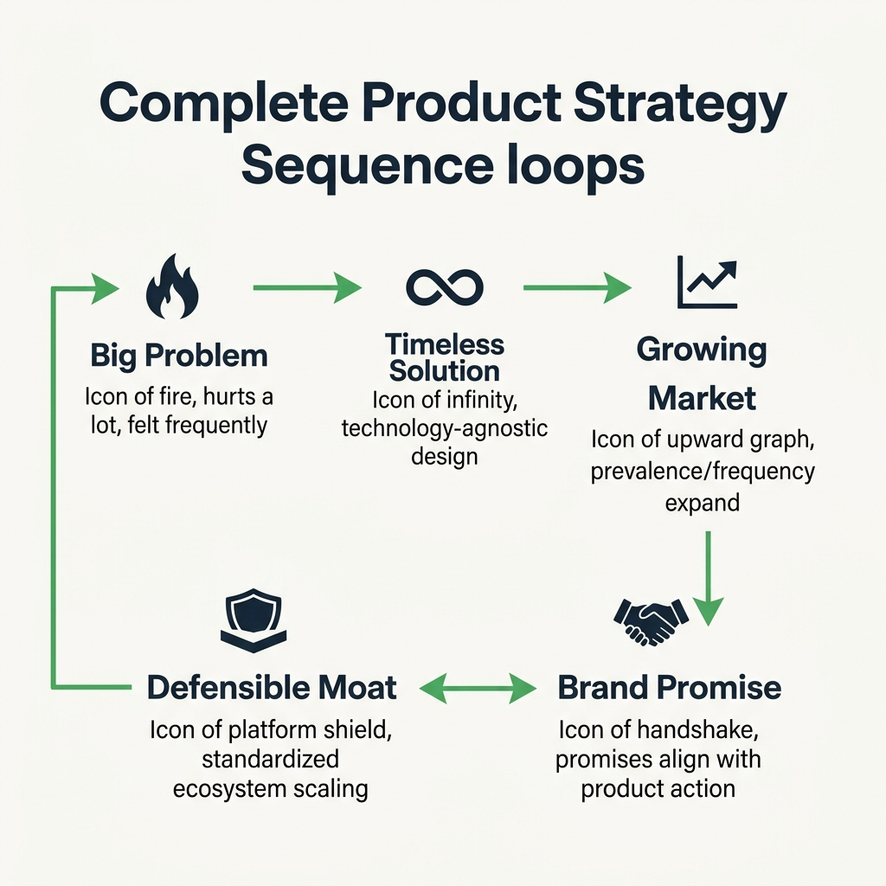
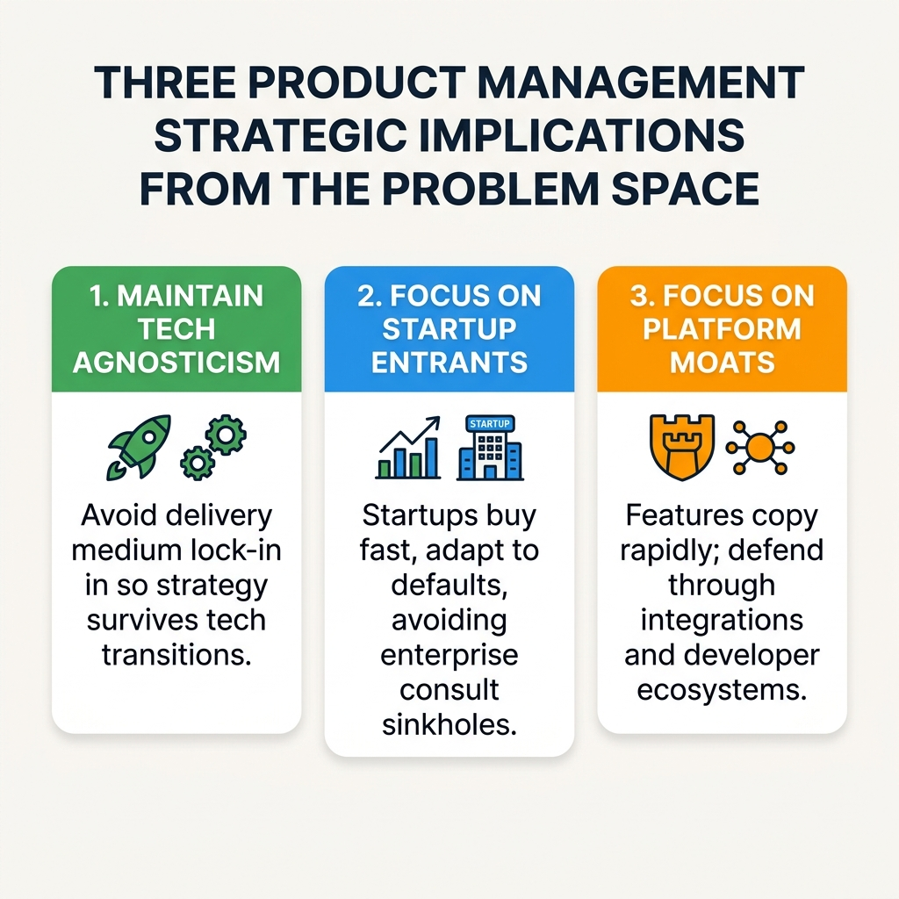

[← Previous Lecture](./33-defensible-moat.md)
·
[Section Overview](./README.md)
·
[Section Summary](./section-summary.md)
·
[Part Overview](../README.md)
·
[Next Section Overview →](../04-goal-setting/README.md)

# Problem Space Summary

> **Material level:** Level 2 — Core summary lecture recapping the complete Section 3 strategic roadmap (Exploration, Evaluation, Prioritization, Expression) and transitioning to the Solution Space (Business Needs & Goal Management Frameworks).

## Lecture Overview

This lecture recaps the key methodologies covered in Section 3 and provides a conceptual bridge from the **Problem Space** to the **Solution Space**. By the end of this lecture, you should be able to:
* Outline the three phases of diagnosing a problem space: Exploration, Evaluation, and Prioritization.
* Explain the strategic risks of technology-dependent problem statements on product team decisions.
* Describe the transition from understanding user problems to defining solutions.
* Identify the focus of Section 4: establishing a Business Goal Management Framework.

---

## 1. Recapping the Problem Space Roadmap

Section 3 focused entirely on diagnosing, evaluating, and expressing customer problems. The journey progressed through three major phases:


*The Problem Space Lifecycle: detailing exploration of customer motivations, evaluation of opportunities, and strategic expression/defense.*

### A. Exploration (Exploring Motivation)
*   **Action:** Deconstructing high-level, generic problem statements (e.g., Uber's *"take me where I want to go"*) into actionable, lower-level user goals (e.g., *"book with one click,"* *"take the best route"*).
*   **Method:** Goal Reframing to reveal emotional or operational drivers.

### B. Evaluation (Sizing & Trajectory)
*   **Action:** Evaluating whether the identified problems represent a viable business opportunity.
*   **Metrics:** Sizing the problem (Size vs. Frequency), analyzing commercial viability (Price vs. Cost-to-Serve), and forecasting 5-year market trajectories (Prevalence, Frequency, Severity).
*   **Categorization:** Mapping user goals under the Kano Model (Must-Haves, Performance Features, Delighters).

### C. Prioritization & Timeless Expression
*   **Action:** Selecting which problems to solve (compete grid) and expressing them in a technology-agnostic and vendor-neutral way.
*   **Implication:** Avoiding tech-dependent locks ensures the company retains continuity, even if initial delivery mediums fail or become obsolete.


*The complete strategic sequence: linking problem exploration, Kano sorting, timeless expression, brand extendability, and defensible platforms/communities.*

---

## 2. The Risk of Descriptive, Locked Statements

Many product managers treat problem statements as simple administrative files that can be updated easily. In reality:

$$\text{Timeless Problem Statements} \xrightarrow{\text{Set Product Strategy}} \text{Product Teams Build Architectures} \xrightarrow{\text{Deep Technology Commitments}}$$

If a problem statement is locked to a specific technology (e.g., *"I want to swap phone numbers via Bluetooth"*), product teams will commit capital, engineering hours, and database architectures to Bluetooth. If Bluetooth is suppplanted by another standard, the company suffers massive transition costs and write-offs. A timeless expression (*"I want to share contact cards instantly nearby"*) keeps the team focused on the value, allowing them to shift technologies seamlessly.


*Three Product Management strategic implications: mapping the rules of agnosticism, buyer targeting, and platform/community moats.*

---

## 3. Transitioning to the Solution Space

Once the customer problem space is defined and validated, product strategy shifts focus to the **Solution Space**. Designing a successful solution requires balancing two competing forces:

1.  **Business Needs:** The company's goals, viability metrics, margins, and operational capacity.
2.  **Customer Needs:** The user's pain points, usability requirements, and value hooks.

```text
                  The Solution Space Balance
              +--------------------------------+
              |         SOLUTION SPACE         |
              +---------------+----------------+
                              |
              +---------------+---------------+
              |                               |
     +--------v-------+               +-------v--------+
     | BUSINESS NEEDS |               | CUSTOMER NEEDS |
     | (Section 4 Focus)              | (User Usability)|
     +----------------+               +----------------+
```

---

## 4. Next Steps: Goal Management Frameworks

To address the **Business Needs layer** of the Solution Space, Section 4 (Goal Setting) will explore how companies establish a **Goal Management Framework**.

This framework:
* Coordinates the actions of all employees and cross-functional teams.
* Chains daily feature development to the overarching corporate vision.
* Ensures that business viability metrics (margins, cost-to-serve) are tracked alongside customer outcomes.

---

## Common Misunderstandings

### "The solution space replaces the problem space"
**Correction:** The solution space does not replace the problem space. Product teams must continuously keep one foot in the problem space (user research, validation) and one in the solution space (prototyping, testing feasibility) to ensure product-market fit.

### "Goal management frameworks are only for executive management"
**Correction:** Standard frameworks (like OKRs) are critical for product managers. They provide the quantitative parameters that justify prioritization decisions. Without a business goal framework, a PM cannot align stakeholders on which user problems to solve first.

---

## Key Concepts and Definitions

| Concept | Simple definition |
|---|---|
| **Problem Space** | The customer goals, needs, and pain points that a product team seeks to understand and validate. |
| **Solution Space** | The technical features, business configurations, and designs created to address validated problems. |
| **Goal Management Framework** | A system (e.g., OKRs) used to align individual team targets with corporate strategic goals. |

---

## Recommended Visual Illustrations

### Illustration 1: The Problem Space Lifecycle
*   **Concept:** Overview of Section 3 methodologies.
*   **Suggested structure:** Side-by-side columns summarizing Exploration, Evaluation, and Expression & Defense stages.

### Illustration 2: PM Strategic Implications
*   **Concept:** Primary PM action rules derived from the problem space.
*   **Suggested structure:** Diagram detailing rules for agnosticism, buyer targeting, and ecosystem defensibility.

### Illustration 3: Section 3 Complete Strategic Sequence
*   **Concept:** Flow loop summarizing the complete problem-to-moat strategy.
*   **Suggested structure:** High-level sequence diagram loops connecting the five stages of Section 3.

---

## Related Concepts

* [Getting Product Strategy Right](./26-getting-product-strategy-right.md)
* [Exercise #8: Timeless Problem Statements](./29-timeless-problem-statements.md)
* [The Defensible Moat](./33-defensible-moat.md)

## Visuals in This Lecture

* [The Problem Space Lifecycle](./visuals/34-problem-space-framework.png)
* [Section 3 Complete Strategic Sequence](./visuals/34-visual-summary.png)
* [PM Strategic Implications](./visuals/34-problem-space-implications.png)

## Interactive Lesson

* [Open the interactive companion](./interactive/34-problem-space-summary.html)

## Source

* [Original lecture transcript](../../sources/02-strategy/03-the-problem-space/34-problem-space-summary-transcript.md)

## Continue Learning

* Previous: [The Defensible Moat](./33-defensible-moat.md)
* Section: [The Problem Space](./README.md)
* Part: [Strategy](../README.md)
* Next: [Next Section Overview](../04-goal-setting/README.md) *(Section 4: Goal Setting)*
* Course index: [Full Course Index](../../COURSE-INDEX.md)
