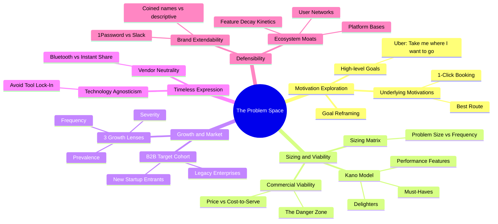

[Section Overview](./README.md)
·
[Section Summary](./section-summary.md)
·
[Part Overview](../README.md)

# Section Mind Map: The Problem Space

## Conceptual Map



## Key Relationships

### Relationship 1: Underlying Motivation to Sizing Viability
Product managers must explore customer motivations before pricing a product. If a PM builds a tool without deconstructing raw statements, they cannot estimate size and frequency. Uncovering underlying motivations is a prerequisite to sizing and avoiding the **Danger Zone** (high operational touch with low ticket prices).

### Relationship 2: Timeless Expression to Brand Extendability
Expressing user problems technology-agnostically keeps the product roadmap flexible. Naming the company with abstract, invented terms ensures the brand can extend to cover strategic pivots when old delivery mediums become obsolete. Both principles prevent tech lock-in.

### Relationship 3: Feature Decay to Ecosystem Moats
Every functional feature will eventually get copied by competitors, decaying from a delighter into a must-have (e.g., Uber live tracking). To secure defensibility, product managers must look beyond features to build platform architectures (APIs, developer ecosystems) or active user networks.

## Core Learning Path

```text
Explore Motivation
        ↓
Audit Size & Viability
        ↓
Express Timelessly
        ↓
Align Brand Promises
        ↓
Secure Ecosystem Moats
```

---

## Lectures Represented

1. [Exercise #5: Problem Space Definition](./23-problem-space-definition.md)
2. [The Kano Model](./24-the-kano-model.md)
3. [Exercise #6: The Strategy Grid](./25-the-strategy-grid.md)
4. [Getting Product Strategy Right](./26-getting-product-strategy-right.md)
5. [Exercise #7: Problem Type Analysis](./27-problem-type-analysis.md)
6. [Expressing the Problem Space](./28-expressing-the-problem-space.md)
7. [Exercise #8: Timeless Problem Statements](./29-timeless-problem-statements.md)
8. [Growing Market = New Companies](./30-growing-market-new-companies.md)
9. [Exercise #9: Are you in a Growing Market?](./31-growing-market-exercise.md)
10. [The Extendable Brand](./32-extendable-brand.md)
11. [The Defensible Moat](./33-defensible-moat.md)
12. [Problem Space Summary](./34-problem-space-summary.md)

---

## Continue Learning

* Section overview: [The Problem Space](./README.md)
* Section summary: [Section Summary](./section-summary.md)
* Part overview: [Strategy](../README.md)
* Next section: [Goal Setting](../04-goal-setting/README.md)
* Course index: [Full Course Index](../../COURSE-INDEX.md)
