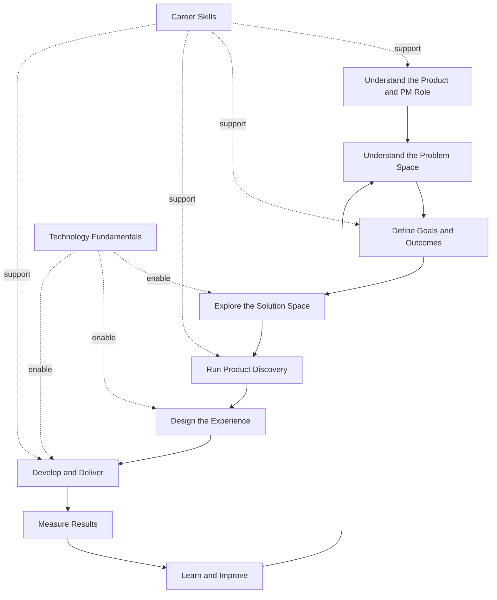
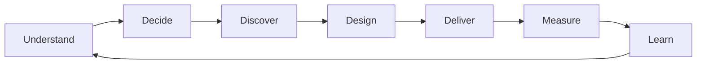

# Product Management Course Concept Map

This map shows how the major domains of the course connect.

It is intentionally high-level. Detailed relationships belong in section and
part mind maps.

## Course Learning Journey


## Product Management Learning System



## How the Parts Connect

### Part 1: Introduction

Establishes:

- What a product is
- What Product Managers do
- How product teams work
- Why traditional product-development models often fail

### Part 2: Strategy

Explains how teams move from:

```text
Understanding the problem
        ↓
Defining the desired outcome
        ↓
Exploring possible solutions
```

### Part 3: Discovery

Explains how teams reduce uncertainty by:

- Investigating customer problems
- Identifying assumptions
- Testing possible solutions
- Gathering evidence before major investment

### Part 4: Design

Explains how product ideas become understandable and usable experiences.

### Part 5: Development

Explains how teams organize and deliver working software, including Scrum and
iterative development practices.

### Part 6: Measurement

Explains how teams evaluate product performance, customer behavior, and
outcomes.

Measurement feeds learning back into strategy and discovery.

### Part 7: Career

Develops the professional capabilities required to operate effectively as a
Product Manager.

These capabilities support every other course part.

### Part 8: Technology

Provides the technical foundations needed to collaborate with engineering and
make better product decisions.

Technology enables solution design, delivery, integration, and feasibility
assessment.

## Core Product Loop



## Concept Map Maintenance Rules

Update this file only when:

- A major course domain is introduced
- The relationship between major parts becomes clearer
- A completed part changes the overall learning model
- A new course-wide feedback loop or dependency is identified

Do not update this map for every individual lecture.

Detailed lecture relationships should instead be added to:

- Lecture related-concept links
- Section mind maps
- Part mind maps
- The glossary

## Main Navigation

- [Repository Overview](./README.md)
- [Course Index](./COURSE-INDEX.md)
- [Product Management Glossary](./GLOSSARY.md)
- [Visual Index](./VISUAL-INDEX.md)