# Product Management Visual Index

This index collects the visual illustrations created across the study guide.

The main purpose of each visual is to support learning and quick review.

Visuals remain embedded inside their source lecture notes near the concepts they
explain. This file provides an additional visual browsing and navigation layer.

## How to Use This Index

Use this page to:

- Review important Product Management concepts visually
- Find illustrations by course part or section
- Open the source lecture for the full explanation
- Compare related frameworks and mental models
- Revisit key concepts without reading every lecture in full

## Visual Index Structure

Visuals are organized using the original course hierarchy:

```text
Part
  └── Section
        └── Lecture
              └── Visuals

Each visual entry should contain:

Visual title
Source lecture
One-sentence purpose
Embedded image

Do not add a visual before:

The image file exists
The source lecture exists
The image is embedded inside the lecture
The image filename and path are final
Part 1: Introduction
Section 1: Introduction

#### The What & Why vs. How Boundary

**Source lecture:**  
[What Does a PM Do?](./01-introduction/01-introduction/03-what-does-a-pm-do.md)

**Purpose:** Compares the ownership areas of Product Management (What & Why) vs Design and Engineering (How).

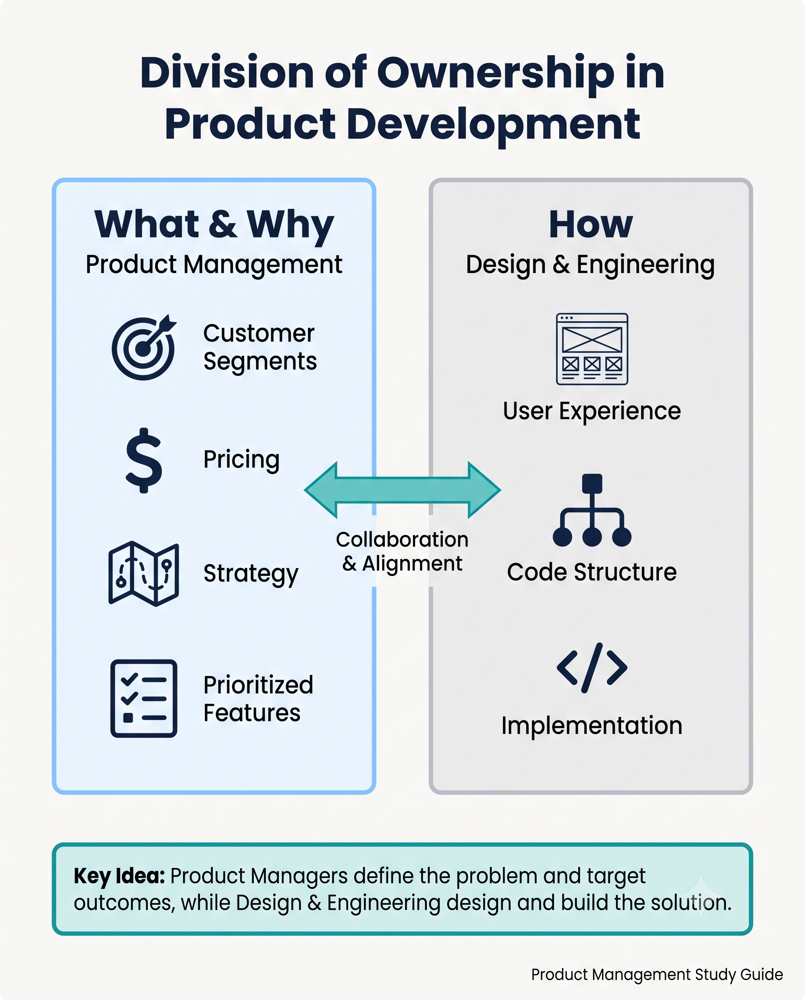


#### Unifying Cross-Functional Teams for Product-Market Fit

**Source lecture:**  
[What Does a PM Do?](./01-introduction/01-introduction/03-what-does-a-pm-do.md)

**Purpose:** Shows the PM coordinating Design, Engineering, Data Science, and Marketing under a single vision.

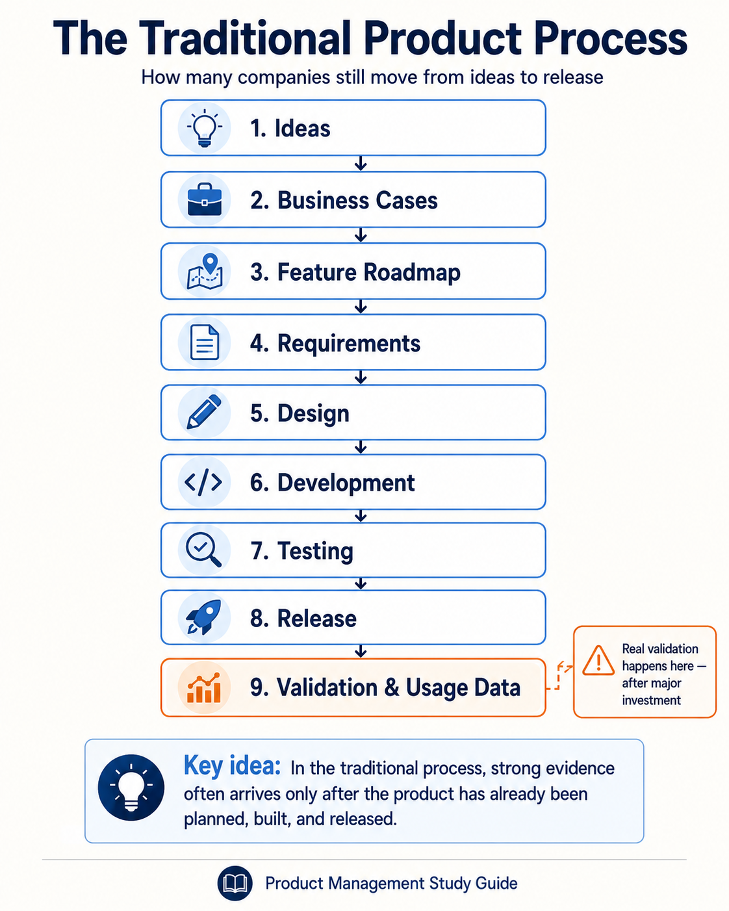

#### Product Lifecycle Curve and PM Extension

**Source lecture:**  
[What Does a PM Do?](./01-introduction/01-introduction/03-what-does-a-pm-do.md)

**Purpose:** Visualizes how active Product Management decisions keep a product relevant and prevent decline.

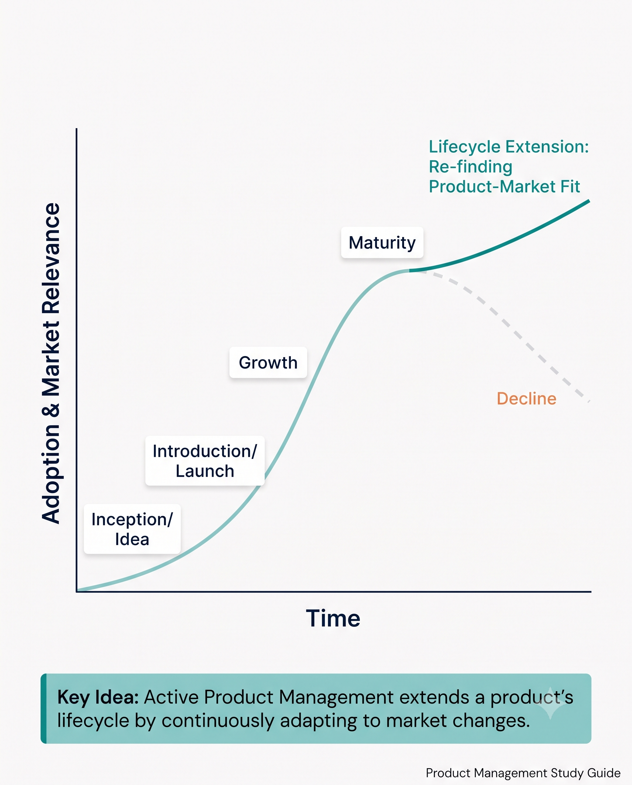

#### The Product-Market Fit (PMF) Sweet Spot

**Source lecture:**  
[What Does a PM Do?](./01-introduction/01-introduction/03-what-does-a-pm-do.md)

**Purpose:** Shows the sweet spot where customer needs and commercial willingness align.

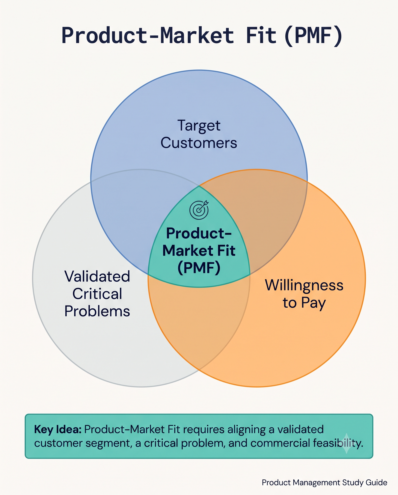

#### The Product Journey Flowchart (Visual Summary)

**Source lecture:**  
[What Does a PM Do?](./01-introduction/01-introduction/03-what-does-a-pm-do.md)

**Purpose:** Shows the product journey flow and feedback loops between PM, design, engineering, and product-market fit.

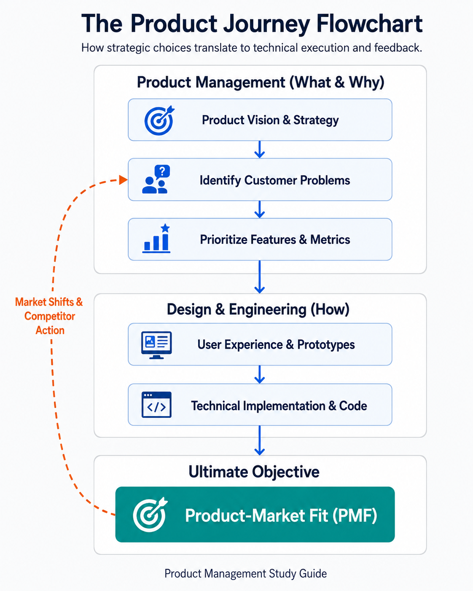

#### The Monolith Illusion (User View vs. Modular Reality)

**Source lecture:**  
[What's a Product?](./01-introduction/01-introduction/07-whats-a-product.md)

**Purpose:** Shows how a single seamless user experience hides a complex system of multiple smaller product components and teams.

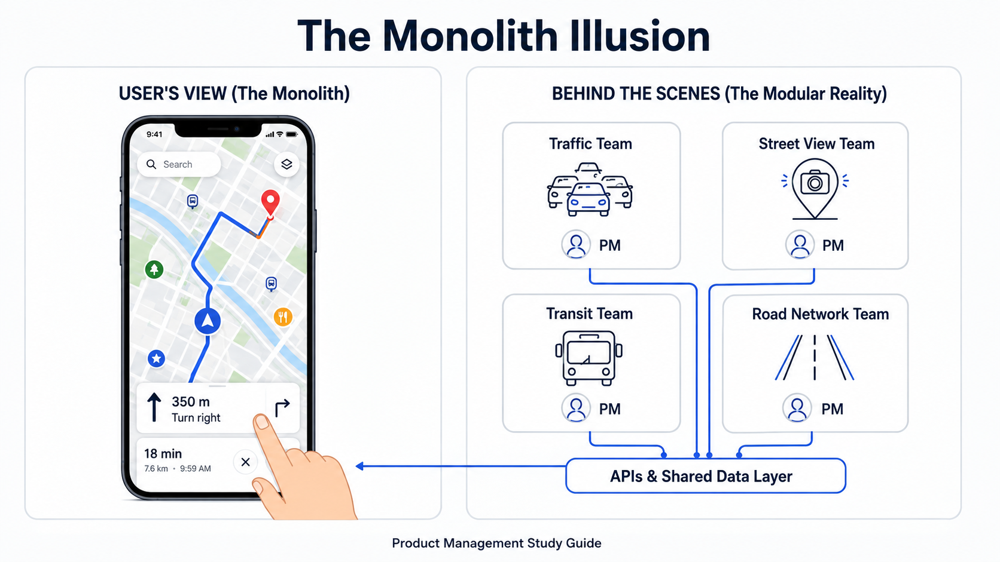

#### Google Maps Modular Pipeline

**Source lecture:**  
[What's a Product?](./01-introduction/01-introduction/07-whats-a-product.md)

**Purpose:** Visualizes how independent teams feed data layers into processing engines to generate real-time features.

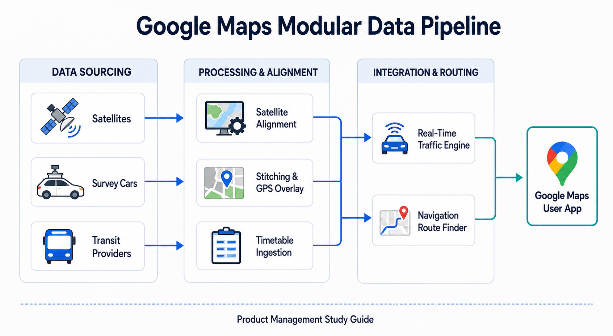

#### Google Maps Modular Product Architecture (Visual Summary)

**Source lecture:**  
[What's a Product?](./01-introduction/01-introduction/07-whats-a-product.md)

**Purpose:** Traces the pipeline of data sourcing, core processing, and routing integrations inside Google Maps.

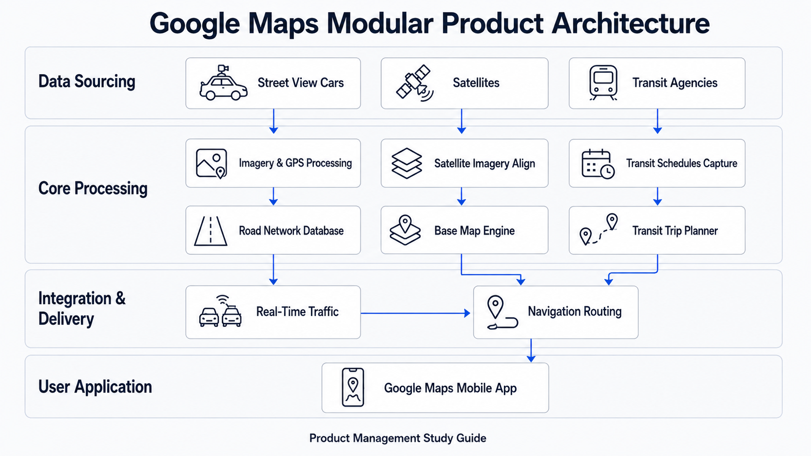

#### Product Selection Flowchart

**Source lecture:**  
[Exercise #1 Choose Your Product](./01-introduction/01-introduction/10-choose-your-product.md)

**Purpose:** Helps the learner visually validate their study product.

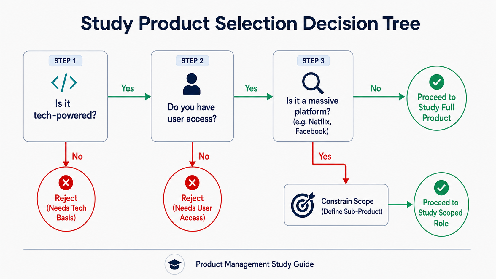

#### Scope Evolution Canvas (Uber Cabs)

**Source lecture:**  
[Exercise #1 Choose Your Product](./01-introduction/01-introduction/10-choose-your-product.md)

**Purpose:** Contrasting Uber's simple 2009 MVP launch scope with its modern platform scale.

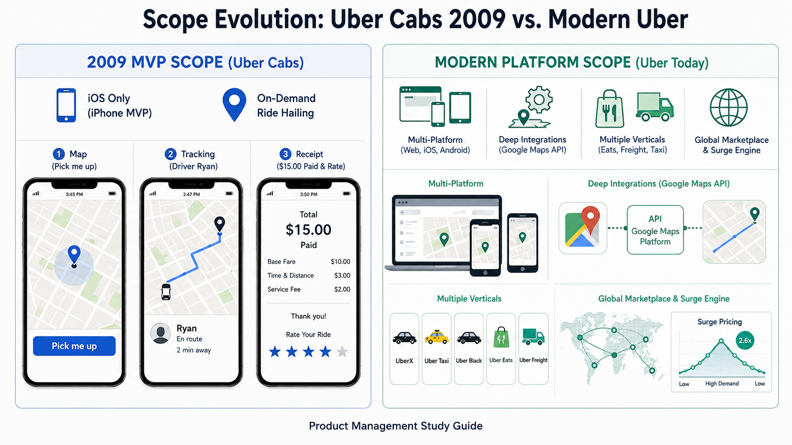

#### Product Selection & Scoping Flowchart (Visual Summary)

**Source lecture:**  
[Exercise #1 Choose Your Product](./01-introduction/01-introduction/10-choose-your-product.md)

**Purpose:** Traces the workflow of checking ground rules and calibrating study product scale.

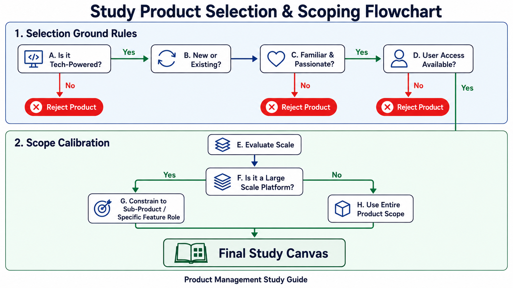

#### Output-Focused vs. Outcome-Focused Roadmaps

**Source lecture:**  
[Why do so many product initiatives fail?](./01-introduction/01-introduction/11-why-product-initiatives-fail.md)

**Purpose:** Contrasting feature-based (output) roadmaps with goal-oriented (outcome) roadmaps.

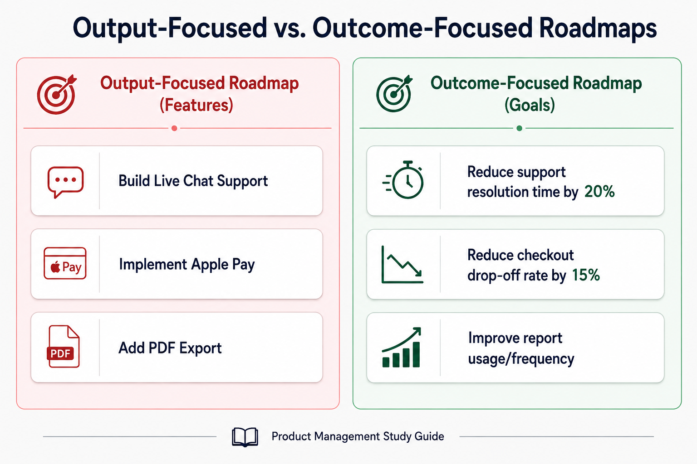

#### Speculative Business Case Dilemma

**Source lecture:**  
[Why do so many product initiatives fail?](./01-introduction/01-introduction/11-why-product-initiatives-fail.md)

**Purpose:** Shows how value and cost estimations are impossible early-stage calculations.

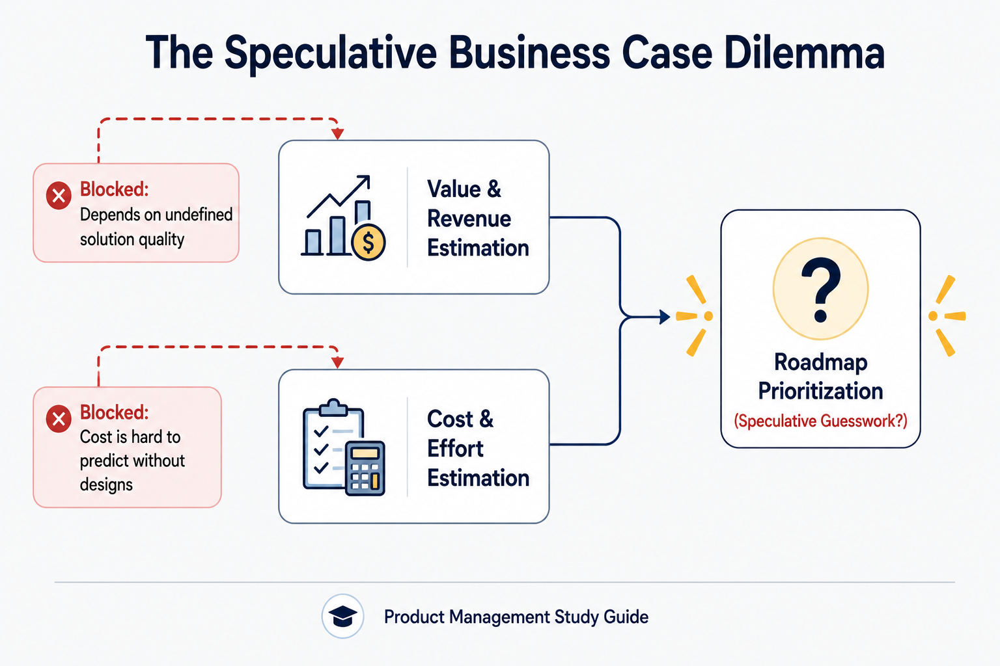

#### The Waterfall Process & 20% Agile Wrapper (Visual Summary)

**Source lecture:**  
[Why do so many product initiatives fail?](./01-introduction/01-introduction/11-why-product-initiatives-fail.md)

**Purpose:** Flowchart illustrating the sequential waterfall process highlighting agile sprints at the end.

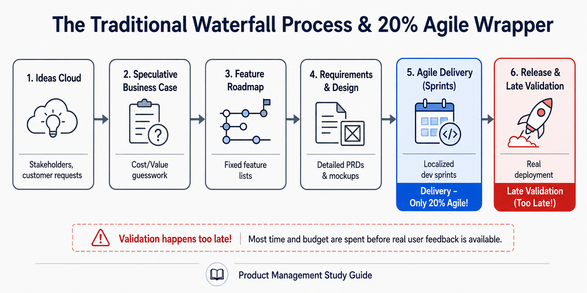

#### The Four Product Risks Matrix

**Source lecture:**  
[How Effective Product Teams Work](./01-introduction/01-introduction/12-how-effective-product-teams-work.md)

**Purpose:** Helps the learner quickly memorize the four risks (Value, Usability, Feasibility, Viability) and their primary focus questions.

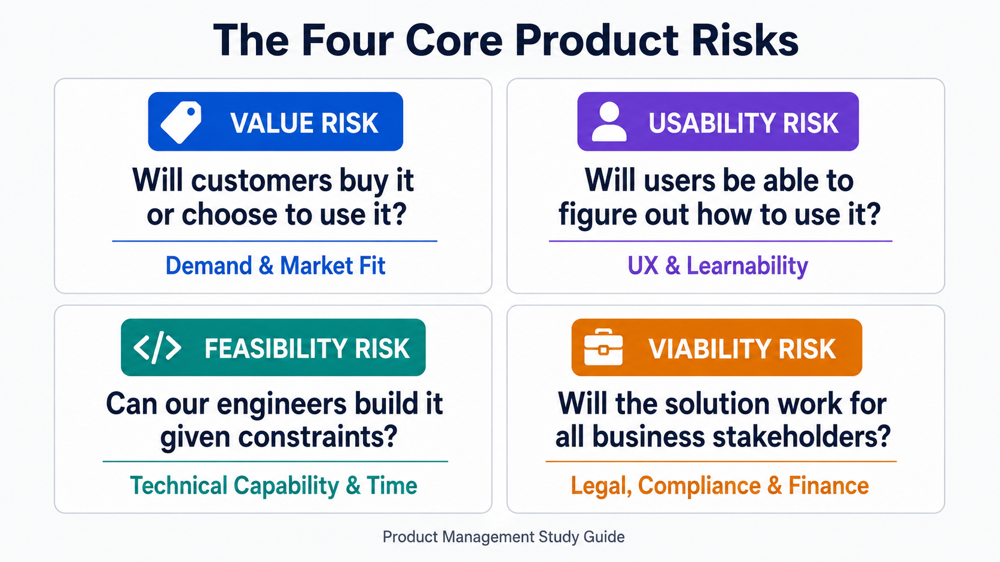

#### Dual-Track Agile Loop

**Source lecture:**  
[How Effective Product Teams Work](./01-introduction/01-introduction/12-how-effective-product-teams-work.md)

**Purpose:** Visualizes how Discovery and Delivery loops interact concurrently within a single team.

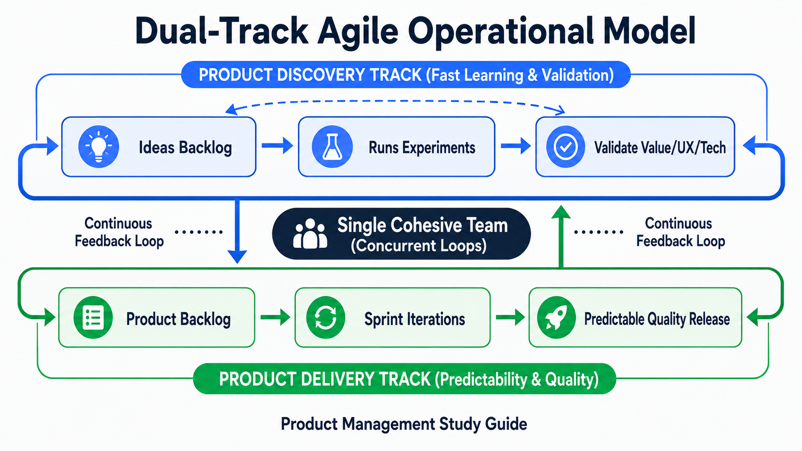

#### Product Backlog Gating Flowchart (Visual Summary)

**Source lecture:**  
[How Effective Product Teams Work](./01-introduction/01-introduction/12-how-effective-product-teams-work.md)

**Purpose:** Flowchart illustrating the gating funnel where discovery experiments filter ideas.

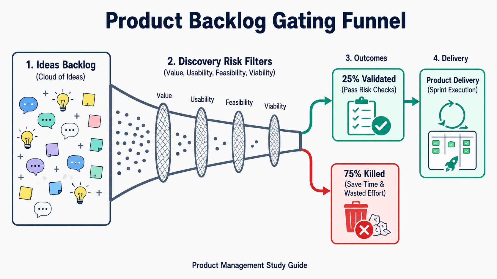

#### The Six PM Personas Comparison Matrix

**Source lecture:**  
[How the PM Role Varies](./01-introduction/01-introduction/13-how-the-pm-role-varies.md)

**Purpose:** Matrix detailing Background, Core Strength, and Pitfalls for the six PM role variations.

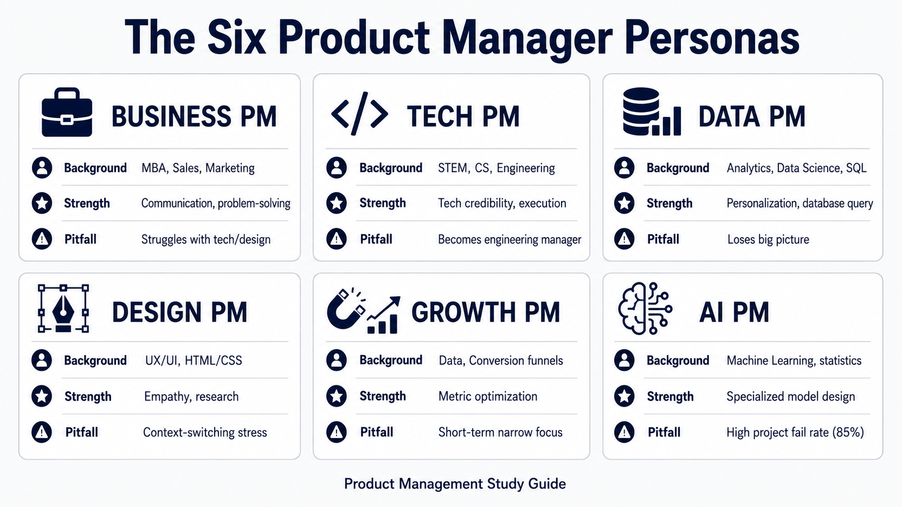

#### The PM Operational Modes (Context Switching)

**Source lecture:**  
[How the PM Role Varies](./01-introduction/01-introduction/13-how-the-pm-role-varies.md)

**Purpose:** Visualizes context switching between daily Firefighting, weekly Sprints, and strategic Long-Term roadmapping.

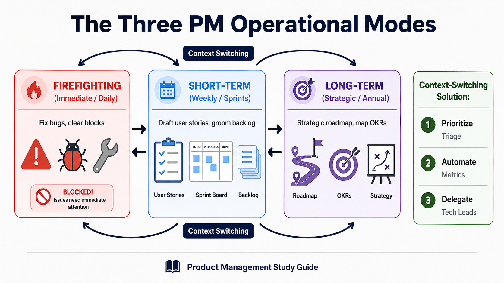

#### PM Career Transition Map (Visual Summary)

**Source lecture:**  
[How the PM Role Varies](./01-introduction/01-introduction/13-how-the-pm-role-varies.md)

**Purpose:** Career transition roadmap mapping backgrounds to target PM roles and key skill gaps.

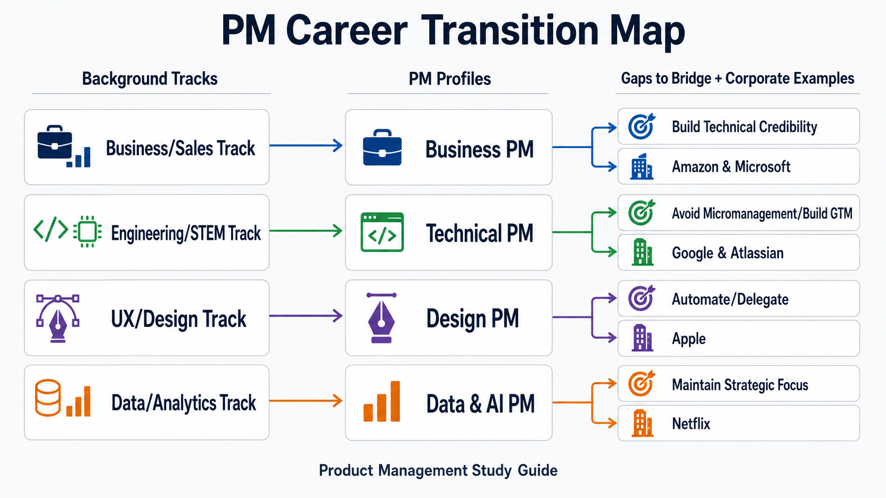

#### The Product Triad Venn Diagram

**Source lecture:**  
[Empowered Product Teams](./01-introduction/01-introduction/15-empowered-product-teams.md)

**Purpose:** 3-circle Venn diagram depicting Usability (Designer), Feasibility (Tech Lead), and Value/Viability (PM).

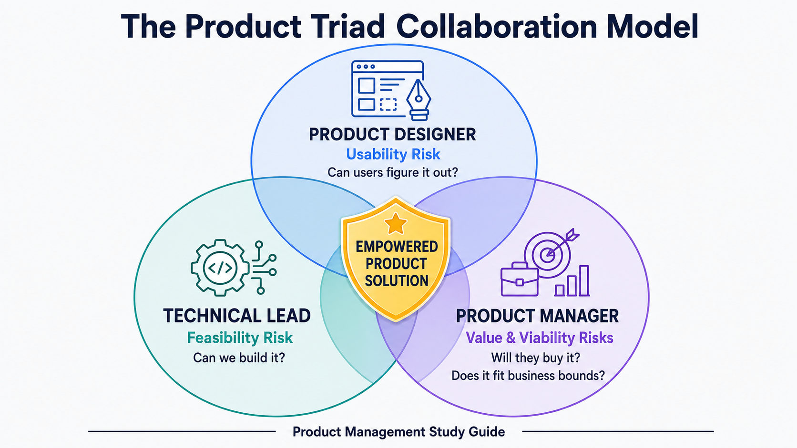

#### Delivery vs. Empowered Team Spectrum

**Source lecture:**  
[Empowered Product Teams](./01-introduction/01-introduction/15-empowered-product-teams.md)

**Purpose:** Visual comparison spectrum contrasting feature delivery constraints with empowered team ownership.

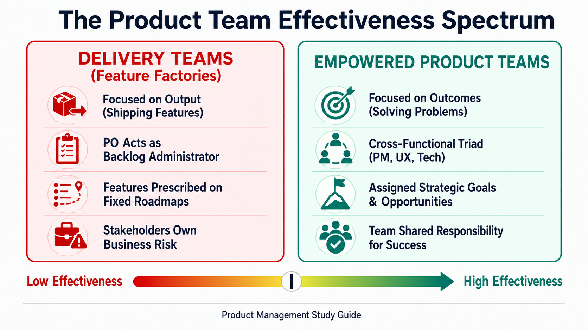

#### Organizational Flow Comparison (Visual Summary)

**Source lecture:**  
[Empowered Product Teams](./01-introduction/01-introduction/15-empowered-product-teams.md)

**Purpose:** Flowcharts tracing how requirements translate into final releases in both Delivery and Empowered models.

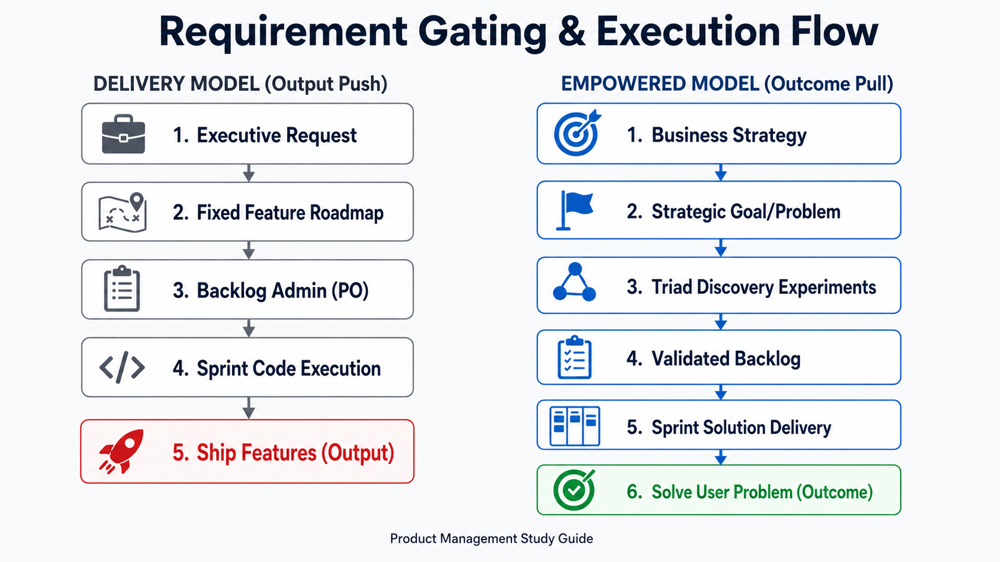

#### Old vs. New Collaboration Structure

**Source lecture:**  
[The Modern Product Designer](./01-introduction/01-introduction/16-the-modern-product-designer.md)

**Purpose:** Diagram contrasting the traditional sequential requirements hand-off model with the modern embedded triad continuous collaboration model.

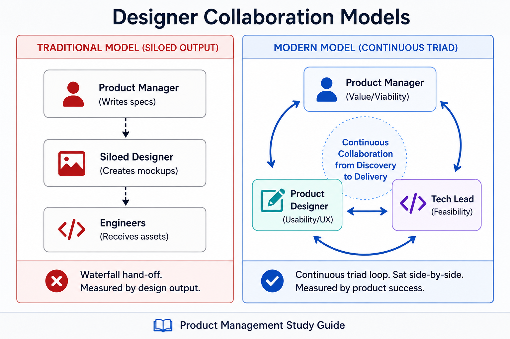

#### The Holistic UX Iceberg

**Source lecture:**  
[The Modern Product Designer](./01-introduction/01-introduction/16-the-modern-product-designer.md)

**Purpose:** Iceberg graphic showing that the User Interface (UI) is the visible tip, while the submerged base spans interaction design, onboarding, and offline services.

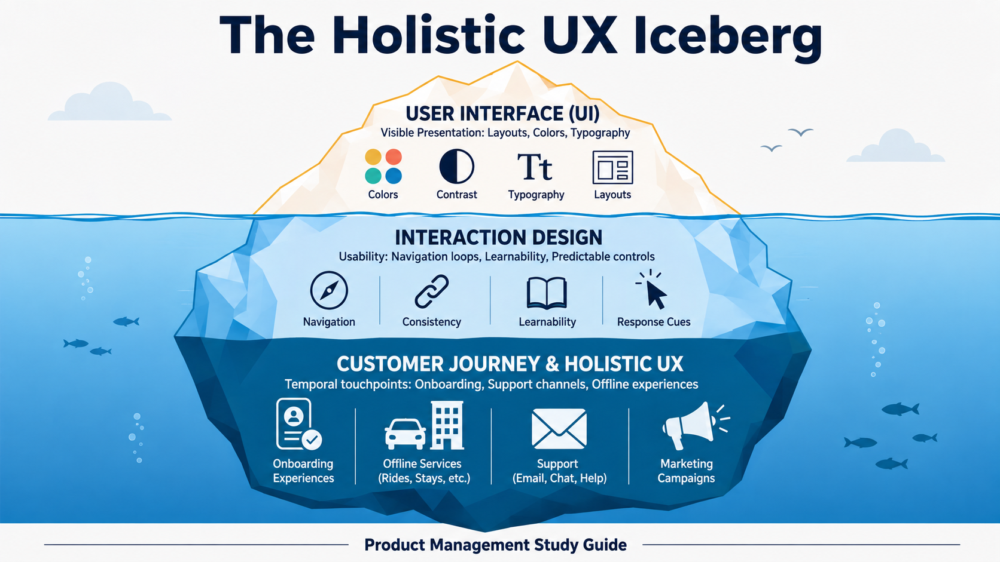

#### Modern Design Iteration Flow (Visual Summary)

**Source lecture:**  
[The Modern Product Designer](./01-introduction/01-introduction/16-the-modern-product-designer.md)

**Purpose:** Flowchart tracking design iteration cycles from customer problem to low-fidelity sketching, usability/feasibility validation, and high-fidelity mockups.

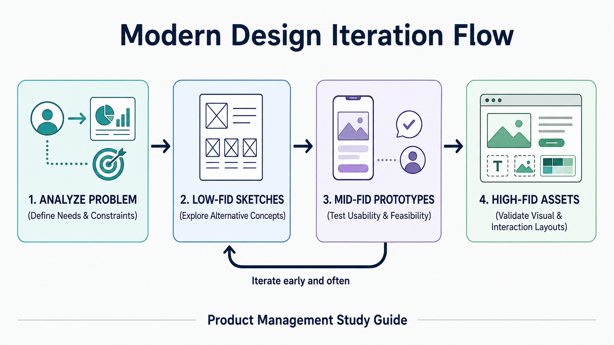

#### The What/Why vs. How Collaboration Boundary

**Source lecture:**  
[The Modern Product Developer](./01-introduction/01-introduction/17-the-modern-product-developer.md)

**Purpose:** Diagram visualizing the split of product ownership (What/Why for PM, How for Devs) and the Tech Lead discovery bridge.

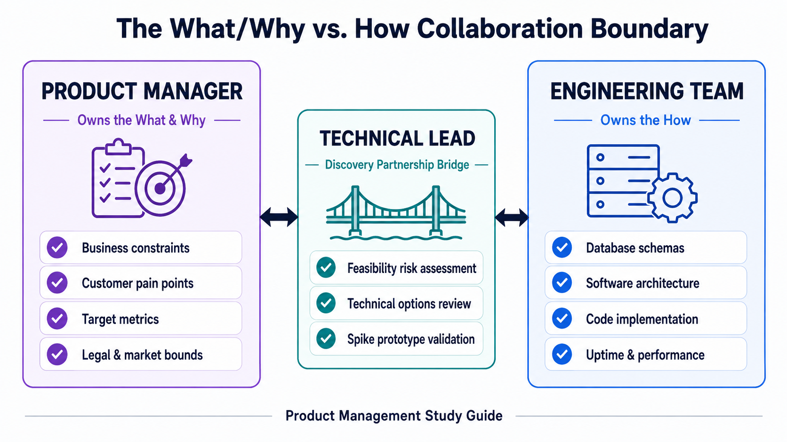

#### Developer Mindset Alignment (Missionary vs. Mercenary)

**Source lecture:**  
[The Modern Product Developer](./01-introduction/01-introduction/17-the-modern-product-developer.md)

**Purpose:** Side-by-side card layouts contrasting command-and-control task routing with customer context transparency.

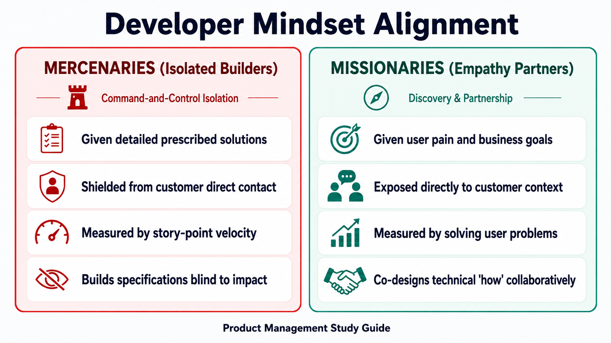

#### Daily Tech Lead Interaction Loops (Visual Summary)

**Source lecture:**  
[The Modern Product Developer](./01-introduction/01-introduction/17-the-modern-product-developer.md)

**Purpose:** Loop diagrams mapping the concurrent daily discovery input flow and the delivery sprint clarification flow.

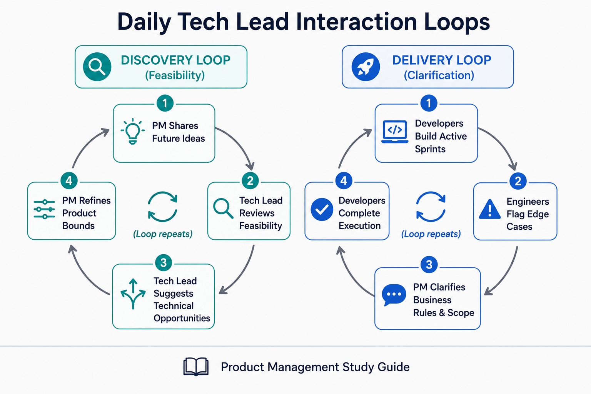

#### The Product Journey: Vision vs. PMF

**Source lecture:**  
[Product-Market Fit vs. Product Vision](./01-introduction/01-introduction/18-product-market-fit-vs-product-vision.md)

**Purpose:** Contrasts a 2-5 year destination guess (Product Vision) with short-term early adopter validation (PMF).

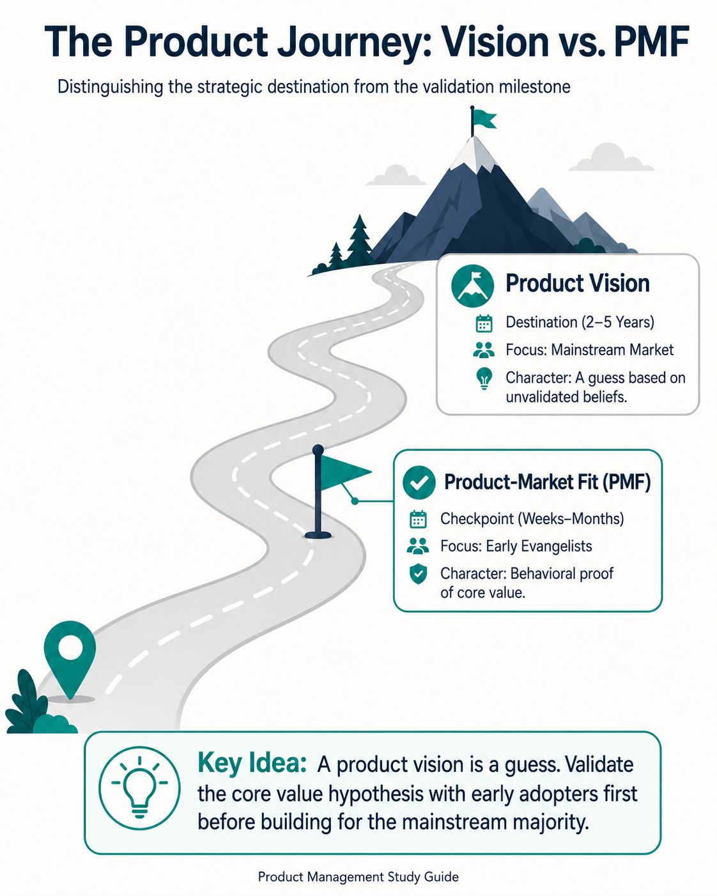

#### Technology Adoption Curve for Product Managers

**Source lecture:**  
[Product-Market Fit vs. Product Vision](./01-introduction/01-introduction/18-product-market-fit-vs-product-vision.md)

**Purpose:** Displays the Technology Adoption Curve segments and highlights the target focus for early validation.

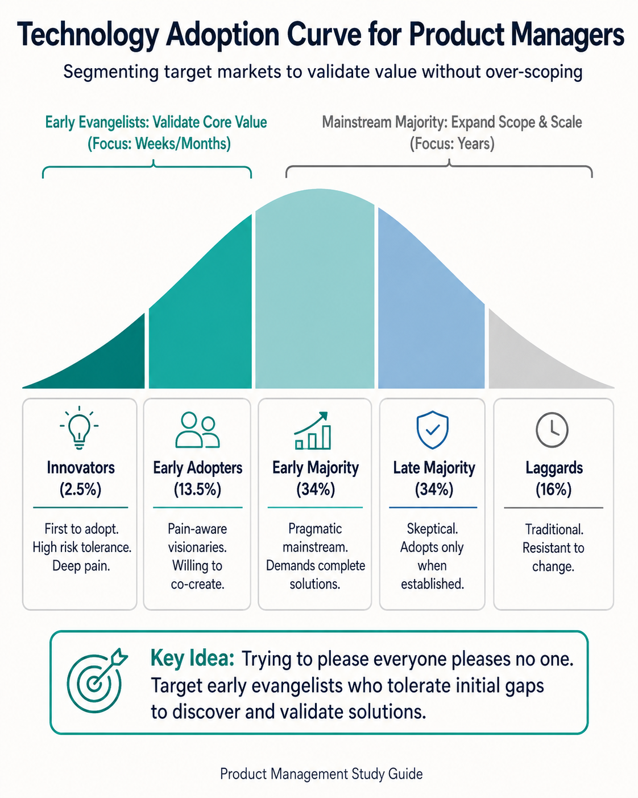

#### Case Study: The Original iPhone Evolution

**Source lecture:**  
[Product-Market Fit vs. Product Vision](./01-introduction/01-introduction/18-product-market-fit-vs-product-vision.md)

**Purpose:** Timeline showing how the original limited iPhone found early PMF and iterated to fulfill the mainstream vision.

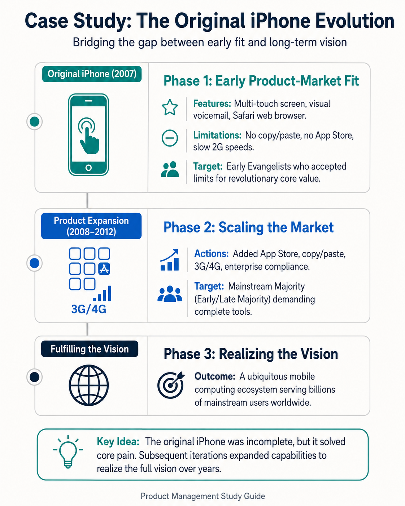

#### PMF vs. Product Vision Visual Summary

**Source lecture:**  
[Product-Market Fit vs. Product Vision](./01-introduction/01-introduction/18-product-market-fit-vs-product-vision.md)

**Purpose:** Process flowchart mapping the transition from early adopter PMF validation to mainstream majority scaling.

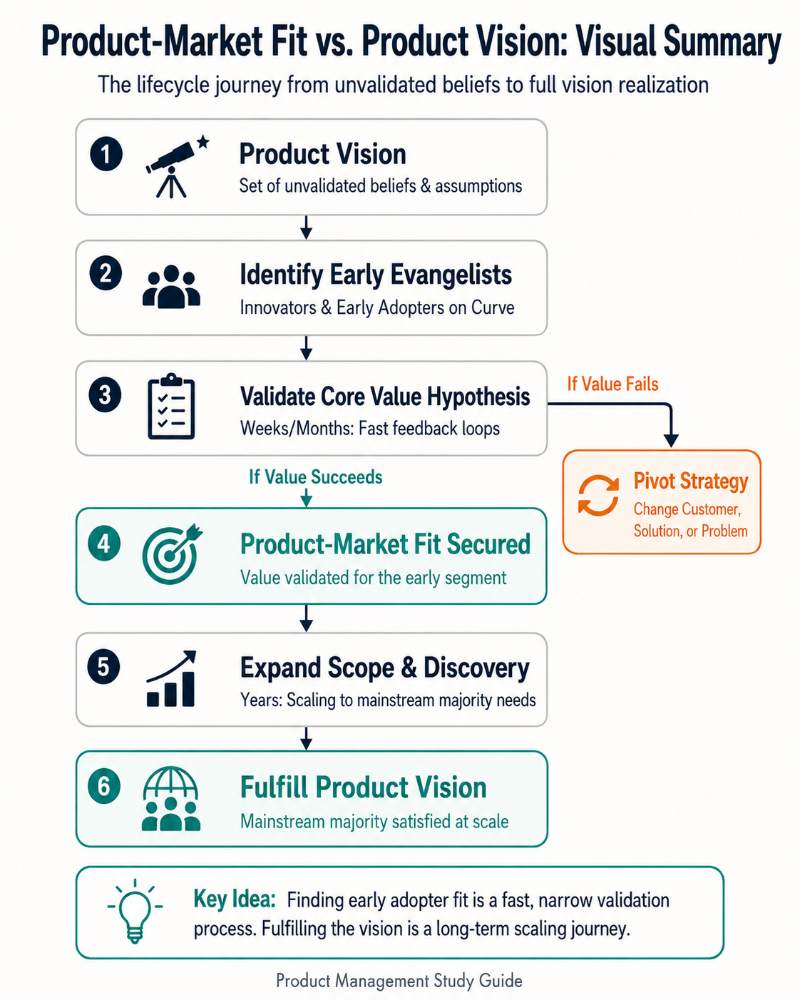

#### Vision vs. Strategy: The Dance School Pivot

**Source lecture:**  
[Exercise #3: Create a Product Vision Board](./01-introduction/01-introduction/19-create-a-product-vision-board.md)

**Purpose:** Concept map illustrating how a fixed broad vision remains stable while the underlying execution strategy pivots during disruptions.

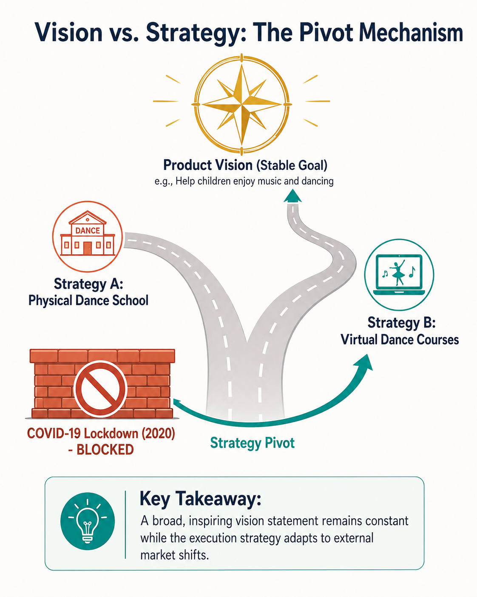

#### The Product Vision Board Template

**Source lecture:**  
[Exercise #3: Create a Product Vision Board](./01-introduction/01-introduction/19-create-a-product-vision-board.md)

**Purpose:** Layout template showing the five distinct columns of the Product Vision Board.

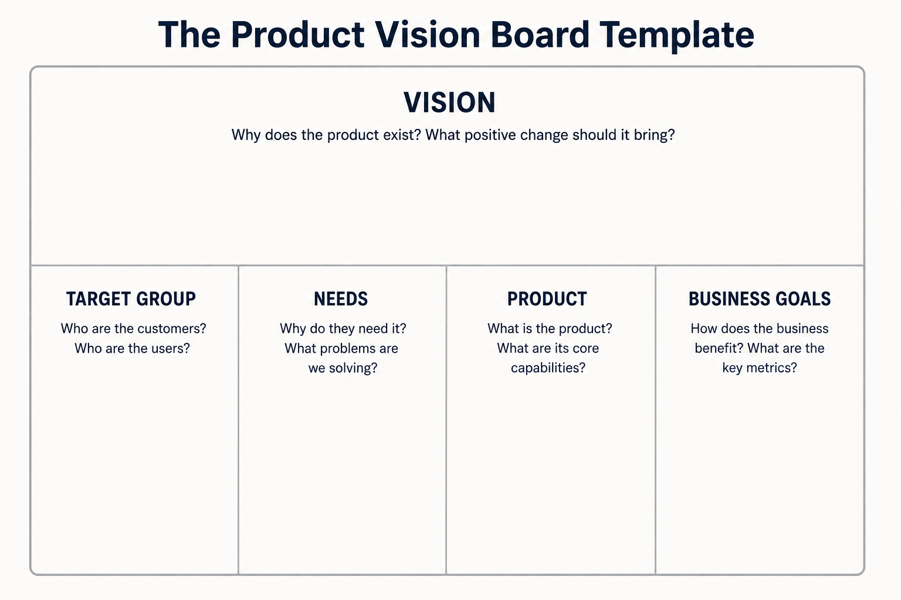

#### Case Study: Uber Cabs (2009) Vision Board

**Source lecture:**  
[Exercise #3: Create a Product Vision Board](./01-introduction/01-introduction/19-create-a-product-vision-board.md)

**Purpose:** Completed vision board for Uber Cabs (2009) displaying the strategic alignment for a two-sided marketplace.

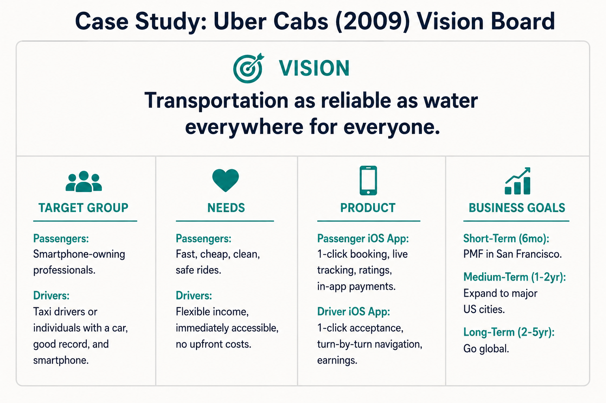

#### Product Vision Board Framework

**Source lecture:**  
[Exercise #3: Create a Product Vision Board](./01-introduction/01-introduction/19-create-a-product-vision-board.md)

**Purpose:** Process flowchart displaying the top-down alignment from the high-level Product Vision to the four strategic execution pillars.

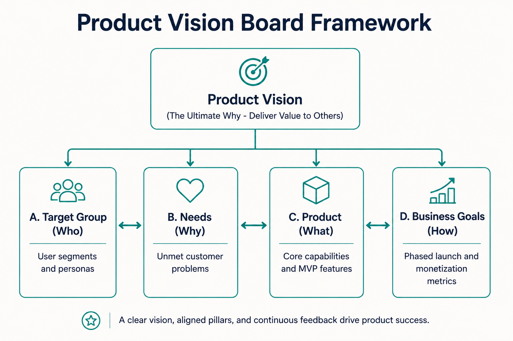

#### The Feature Audit Matrix (2x2 Grid)

**Source lecture:**  
[Evaluating Your Product](./01-introduction/01-introduction/20-evaluating-your-product.md)

**Purpose:** Plotted 2x2 matrix analyzing feature performance by adoption and frequency.

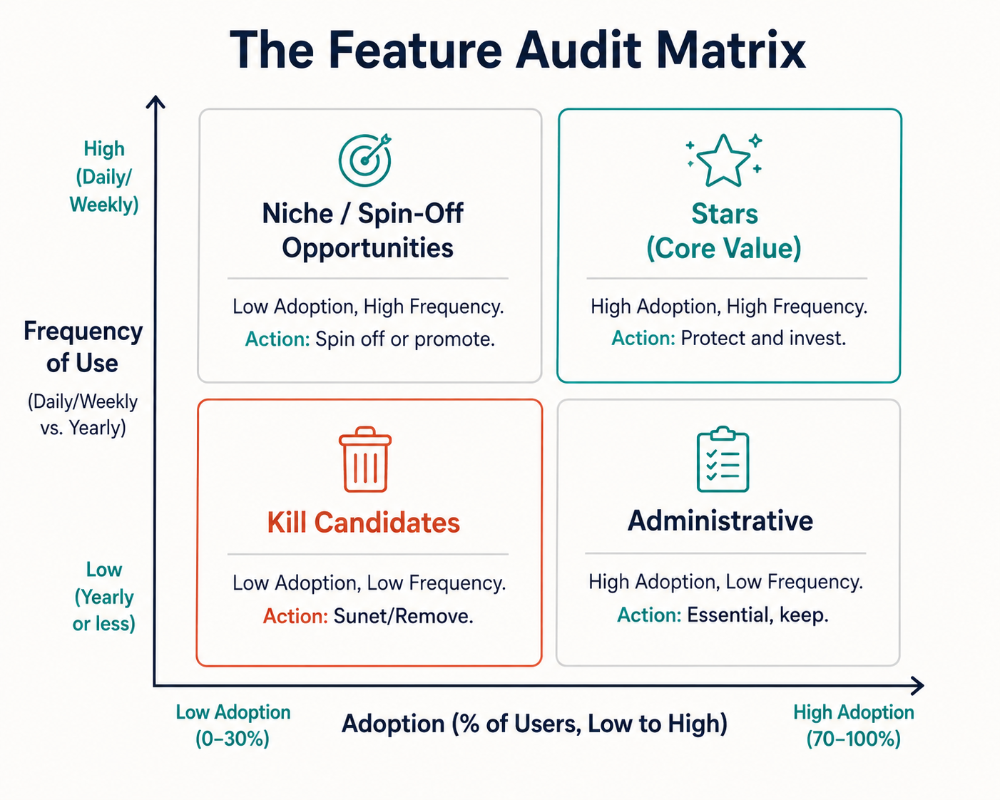

#### Feature Adoption: Clean vs. Messy Reality

**Source lecture:**  
[Evaluating Your Product](./01-introduction/01-introduction/20-evaluating-your-product.md)

**Purpose:** Contrasts a clean adoption pattern with the reality of feature bloat.

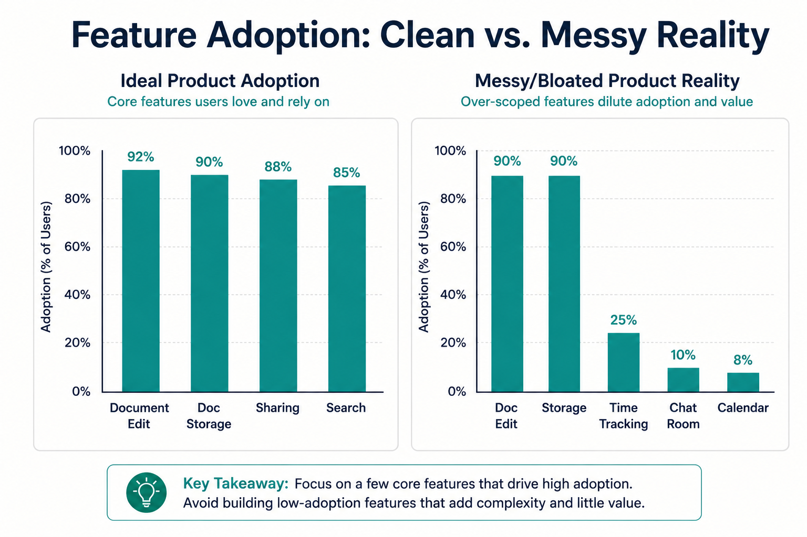

#### Disruption Vulnerability: The Bloated Product vs. The Simple Disruptor

**Source lecture:**  
[Evaluating Your Product](./01-introduction/01-introduction/20-evaluating-your-product.md)

**Purpose:** Explains why carrying unused features makes a product vulnerable to simple competitors.

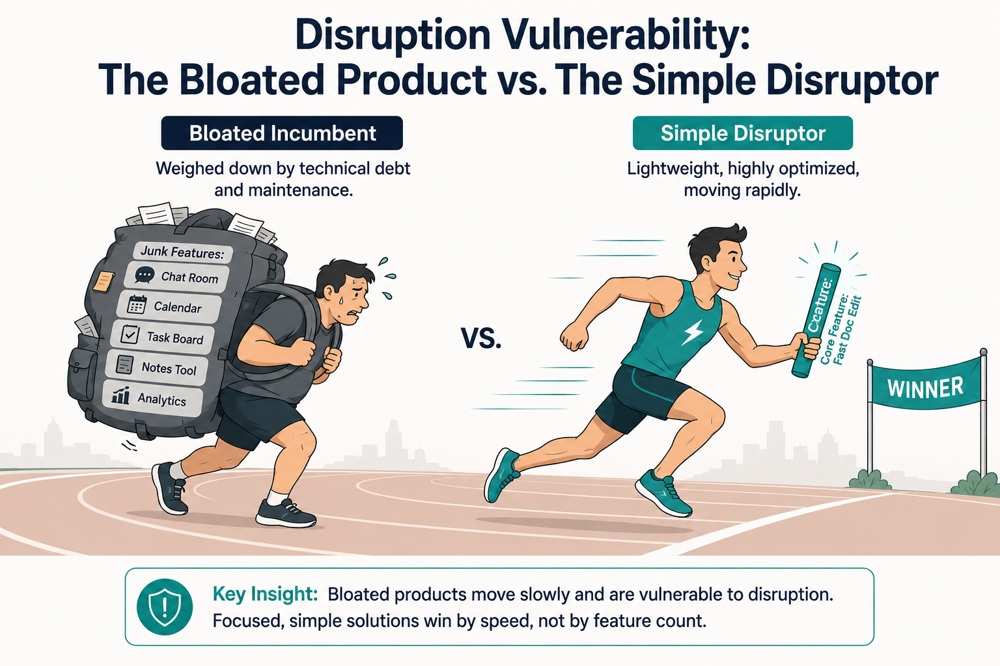

#### The Four Choices for Low-Adoption Features

**Source lecture:**  
[Evaluating Your Product](./01-introduction/01-introduction/20-evaluating-your-product.md)

**Purpose:** Strategic options and paths for handling underperforming features.

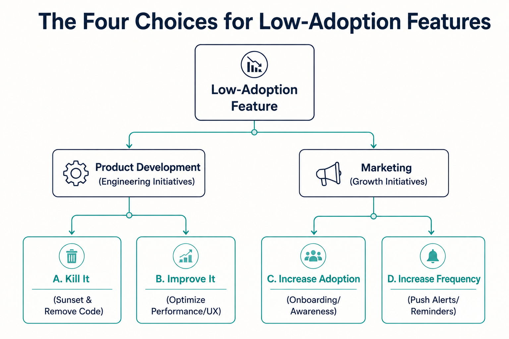

#### Feature Audit Matrix and Strategic Decisions

**Source lecture:**  
[Evaluating Your Product](./01-introduction/01-introduction/20-evaluating-your-product.md)

**Purpose:** Process flowchart displaying the top-down alignment from the high-level Product Vision to the four strategic execution pillars.

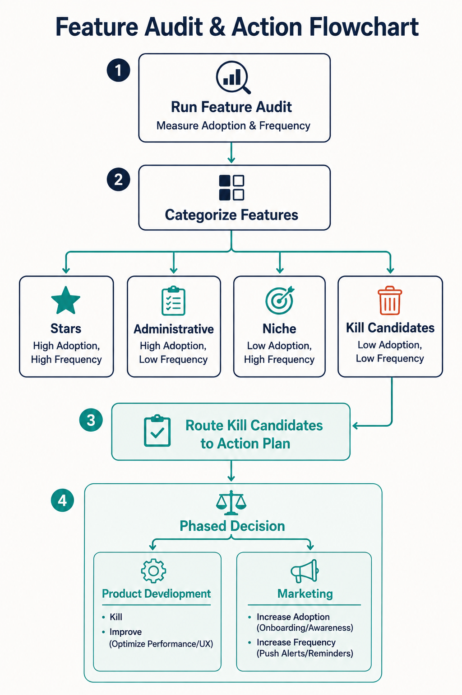

#### The Validation Loop (Hypothesis to Hard Numbers)

**Source lecture:**  
[Exercise #4: The Feature Audit](./01-introduction/01-introduction/21-the-feature-audit.md)

**Purpose:** Flowchart mapping the validation loop from single-user hypothesis to formal quantitative and qualitative validation.

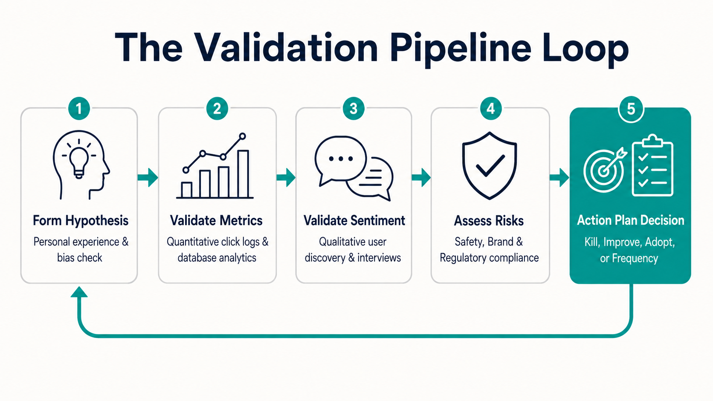

#### Correlation: Track Driver vs. In-App Chat Usage

**Source lecture:**  
[Exercise #4: The Feature Audit](./01-introduction/01-introduction/21-the-feature-audit.md)

**Purpose:** Diagrams showing how driver tracking and in-app chat volume exhibit an inverse correlation driven by user anxiety.

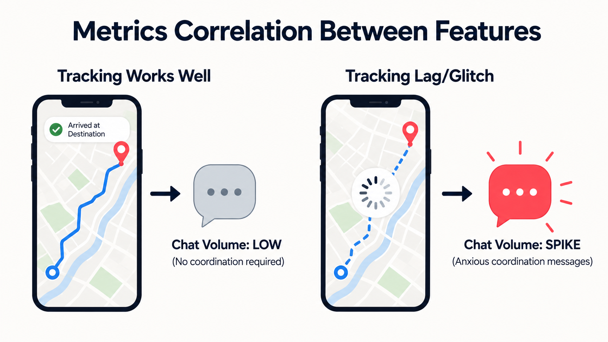

#### Uber (2020) Rider App Feature Audit Matrix

**Source lecture:**  
[Exercise #4: The Feature Audit](./01-introduction/01-introduction/21-the-feature-audit.md)

**Purpose:** Plotted matrix mapping the outliers of the Uber 2020 Rider App feature set based on adoption and frequency.

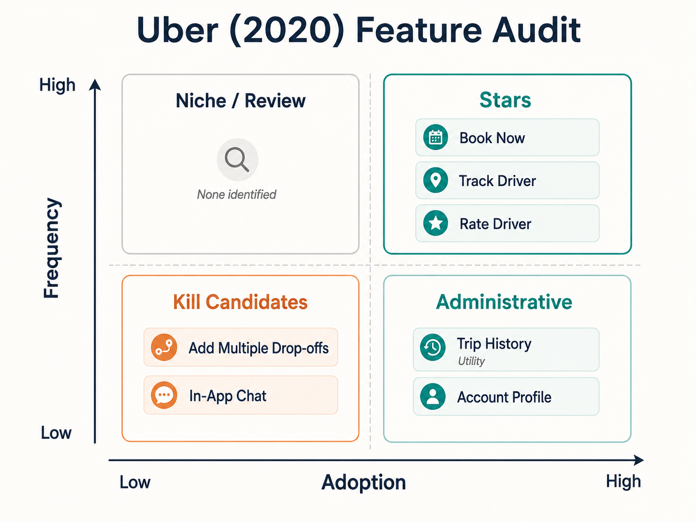

#### Decision Factors Beyond Usage (Add Multiple Drop-offs in 2020)

**Source lecture:**  
[Exercise #4: The Feature Audit](./01-introduction/01-introduction/21-the-feature-audit.md)

**Purpose:** Explains why sunsetting group rides in 2020 was driven by health/safety, brand backlash, and government lockdown regulations.

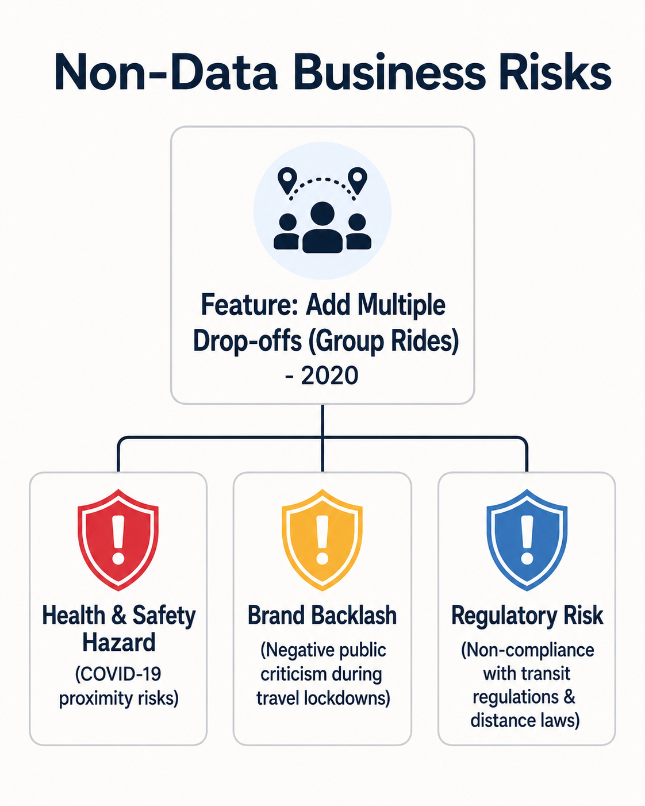

#### The Feature Audit Workflow

**Source lecture:**  
[Exercise #4: The Feature Audit](./01-introduction/01-introduction/21-the-feature-audit.md)

**Purpose:** Process flowchart mapping the Exercise 4 hypothesis formation, correlation analysis, verification, risk assessment, and decision routing.

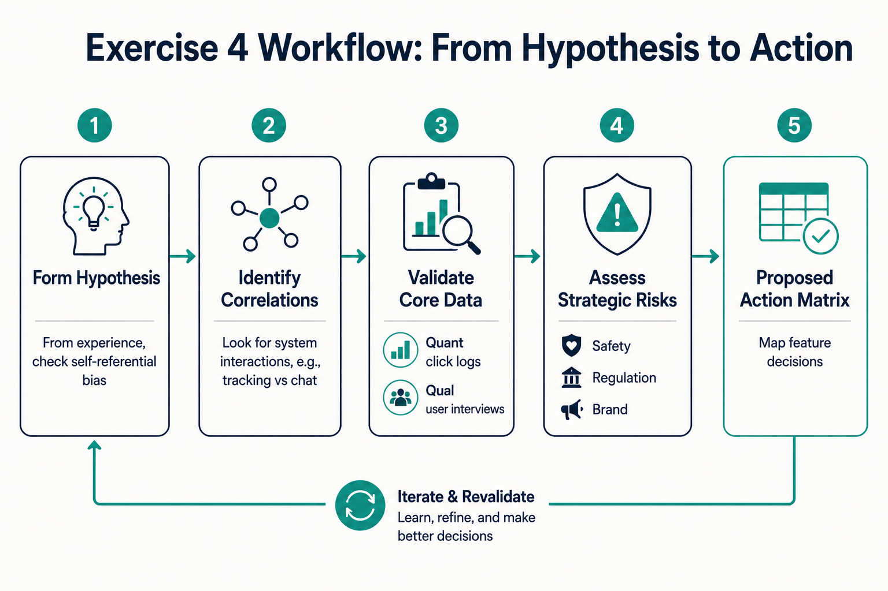

<!-- Example entry: #### The Traditional Product Process **Source lecture:** [Why Product Management Is Broken](./01-introduction/01-introduction/11-why-product-management-is-broken.md) **Purpose:** Shows the sequential product-development process and why validation often happens only after release. 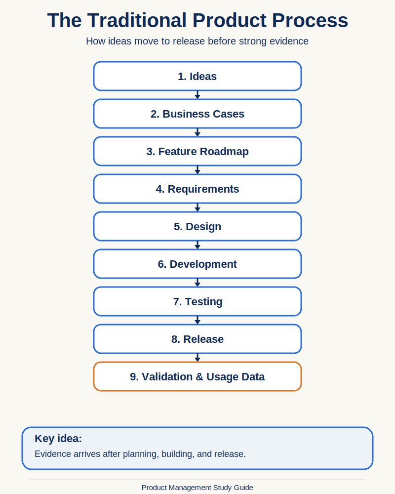 -->
## Part 2: Strategy

### Section 2: Strategy

#### Big Rocks vs. Sand Metaphor

**Source lecture:**  
[What is Product Strategy?](./02-strategy/02-strategy/22-what-is-product-strategy.md)

**Purpose:** Prioritization metaphor demonstrating how scheduling rocks (strategy) first ensures daily ad-hoc sand (tasks) does not overwhelm the calendar.


#### The Product-Market Fit Pyramid & Strategy Layer

**Source lecture:**  
[What is Product Strategy?](./02-strategy/02-strategy/22-what-is-product-strategy.md)

**Purpose:** Pyramidal diagram mapping Dan Olsen's tiers, highlighting that Product Strategy lives at the Value Proposition layer.


#### Problem Space vs. Solution Space Mapping

**Source lecture:**  
[What is Product Strategy?](./02-strategy/02-strategy/22-what-is-product-strategy.md)

**Purpose:** Comparative illustration helping developers isolate user benefits (Problem) from implementation code specs (Solution).


#### Problem Decomposition: Peeling the Onion (Uber Cabs 2009)

**Source lecture:**  
[What is Product Strategy?](./02-strategy/02-strategy/22-what-is-product-strategy.md)

**Purpose:** Onion ring structure decomposing passenger goals down to low wait times and zero billing fraud.


#### The Product Strategy Framework

**Source lecture:**  
[What is Product Strategy?](./02-strategy/02-strategy/22-what-is-product-strategy.md)

**Purpose:** Top-down flowchart mapping the progression from high-level Product Vision down to Solution Space backlog stories.

### Section 3: The Problem Space

#### Uber (2009) Decomposed Action-Verb Needs Tree

**Source lecture:**  
[Exercise #5: Problem Space Definition](./02-strategy/03-the-problem-space/23-problem-space-definition.md)

**Purpose:** Tree structure mapping decomposed rider needs into Faster, Cheaper, Cleaner, and Safer, written using action verbs.

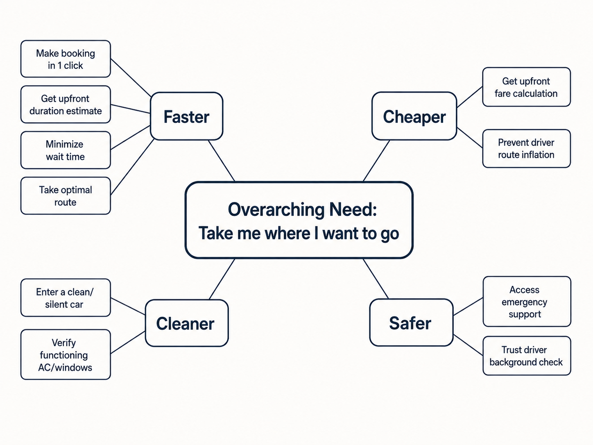

#### Reframing the Goal: Speed vs. Engagement

**Source lecture:**  
[Exercise #5: Problem Space Definition](./02-strategy/03-the-problem-space/23-problem-space-definition.md)

**Purpose:** Split comparison showing how to reframe wait time boredom to productivity/engagement solutions.

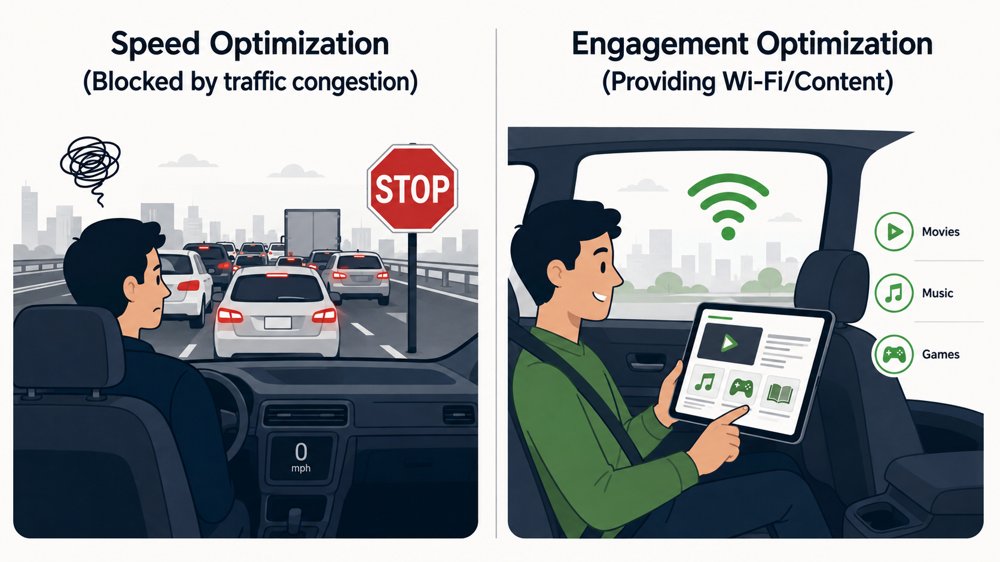

#### Reframing Cleaner Cars: The Nice Driver Experiment

**Source lecture:**  
[Exercise #5: Problem Space Definition](./02-strategy/03-the-problem-space/23-problem-space-definition.md)

**Purpose:** Balance scale demonstrating the reframe of vehicle cleanliness limits to driver hospitality experiments.


#### The Safety Boundary: Real Security vs. Security Theater

**Source lecture:**  
[Exercise #5: Problem Space Definition](./02-strategy/03-the-problem-space/23-problem-space-definition.md)

**Purpose:** Shield visual highlighting that safety must never be reframed, and real verification is required instead of UI shortcuts.


#### Problem Space Exploration Process (Visual Summary)

**Source lecture:**  
[Exercise #5: Problem Space Definition](./02-strategy/03-the-problem-space/23-problem-space-definition.md)

**Purpose:** Flowchart showing the sequence of problem space definition, tech bottlenecks, reframing choices, and safety boundaries.


#### The Kano Model Diagram (Core Grid)

**Source lecture:**  
[The Kano Model](./02-strategy/03-the-problem-space/24-the-kano-model.md)

**Purpose:** Priority graph illustrating Y-axis satisfaction vs. X-axis execution dimensions for must-haves, performance features, and delighters.


#### Excluded Roadmap Categories: Indifferent vs. Unwanted

**Source lecture:**  
[The Kano Model](./02-strategy/03-the-problem-space/24-the-kano-model.md)

**Purpose:** Infographic comparing wasteful indifferent features (car color selector) with dangerous unwanted privacy leaks (profile marital status display).


#### Must-Have Flattening Metaphor (The Seat Belt Rule)

**Source lecture:**  
[The Kano Model](./02-strategy/03-the-problem-space/24-the-kano-model.md)

**Purpose:** Visual comparison demonstrating how over-engineering expected basic must-haves results in flat customer satisfaction returns.


#### The Delighter Decay: GPS Navigation Migration Timeline

**Source lecture:**  
[The Kano Model](./02-strategy/03-the-problem-space/24-the-kano-model.md)

**Purpose:** Timeline illustrating how innovative delighters decay into standard performance features and expected must-have commodities.


#### Kano Model Strategy Grid (Visual Summary)

**Source lecture:**  
[The Kano Model](./02-strategy/03-the-problem-space/24-the-kano-model.md)

**Purpose:** Flowchart illustrating the workflow of triaging features out of the roadmap and mapping competitor priority grids.


#### The Product Strategy Grid Layout (Blank Template)

**Source lecture:**  
[Exercise #6: The Strategy Grid](./02-strategy/03-the-problem-space/25-the-strategy-grid.md)

**Purpose:** Matrix template table displaying columns for Kano categories, user needs, and competitor scores alongside scale measurement instructions.


#### Competitor Positioning: Uber (2009) Strategy Grid

**Source lecture:**  
[Exercise #6: The Strategy Grid](./02-strategy/03-the-problem-space/25-the-strategy-grid.md)

**Purpose:** Completed Strategy Grid positioning Uber's launch against taxis and limo services, showing points of parity and speed/safety differentiation.


#### Strategic Focus: Playing Offense vs. Defense

**Source lecture:**  
[Exercise #6: The Strategy Grid](./02-strategy/03-the-problem-space/25-the-strategy-grid.md)

**Purpose:** Split columns diagram separating offensive zones (investing to win in unique delighters) from defensive zones (maintaining baseline must-have parity).


#### The Developer Trade-Off Analogy (RAM vs. CPU vs. Business Strategy)

**Source lecture:**  
[Exercise #6: The Strategy Grid](./02-strategy/03-the-problem-space/25-the-strategy-grid.md)

**Purpose:** Analogy graphic mapping software system constraints (RAM vs. CPU) to strategic business product trade-offs (experience vs. cost).


#### Strategy Grid to MVP Workflow (Visual Summary)

**Source lecture:**  
[Exercise #6: The Strategy Grid](./02-strategy/03-the-problem-space/25-the-strategy-grid.md)

**Purpose:** Flowchart illustrating the logical progression from Kano categorization to competitor grid mapping and drafting MVP bounds.


#### The Product Validation Triangle (Triangle Test)

**Source lecture:**  
[Getting Product Strategy Right](./02-strategy/03-the-problem-space/26-getting-product-strategy-right.md)

**Purpose:** Triangle graphic displaying the Desirability, Viability, and Feasibility requirements intersecting at Product-Market Fit.


#### Problem Size vs. Frequency Grid

**Source lecture:**  
[Getting Product Strategy Right](./02-strategy/03-the-problem-space/26-getting-product-strategy-right.md)

**Purpose:** Coordinate grid mapping customer pain size vs. frequency of occurrence to identify viable business opportunities and exclude non-viable ones.


#### Price vs. Cost-to-Serve Business Model Grid

**Source lecture:**  
[Getting Product Strategy Right](./02-strategy/03-the-problem-space/26-getting-product-strategy-right.md)

**Purpose:** Business model matrix mapping prices vs. onboarding human touch levels, highlighting the fatal Low Price / High Touch Danger Zone.


#### Transcending Hype Cycles (Moat & Brand Extension)

**Source lecture:**  
[Getting Product Strategy Right](./02-strategy/03-the-problem-space/26-getting-product-strategy-right.md)

**Purpose:** Split graphic comparing transient technology wave peaks with permanent customer needs secured by brand moats.


#### Product Strategy Validation Flow (Visual Summary)

**Source lecture:**  
[Getting Product Strategy Right](./02-strategy/03-the-problem-space/26-getting-product-strategy-right.md)

**Purpose:** Flowchart outlining the sequence of problem validation, coordinate checks, sales model evaluation, and moat configuration.


#### Sizing the Problem Space: The Three Questions

**Source lecture:**  
[Exercise #7: Problem Type Analysis](./02-strategy/03-the-problem-space/27-problem-type-analysis.md)

**Purpose:** Infographic checklist detailing the three customer-centric questions (Pain, Volume, Gap) to evaluate the problem space scale.


#### Problem Type Matrix (Slack, Udemy, Nespresso, Airbnb, Uber)

**Source lecture:**  
[Exercise #7: Problem Type Analysis](./02-strategy/03-the-problem-space/27-problem-type-analysis.md)

**Purpose:** Coordinate matrix mapping the five brand case studies on problem size vs. usage frequency axes.


#### Sales Model Matrix (Slack, Udemy, Nespresso, Airbnb, Uber)

**Source lecture:**  
[Exercise #7: Problem Type Analysis](./02-strategy/03-the-problem-space/27-problem-type-analysis.md)

**Purpose:** Coordinate grid mapping the five brand case studies on price/margins vs. touch levels.


#### Price vs. Margin: The Nespresso Pod Metric

**Source lecture:**  
[Exercise #7: Problem Type Analysis](./02-strategy/03-the-problem-space/27-problem-type-analysis.md)

**Purpose:** Split bar chart illustrating how Nespresso's low-priced single capsules represent a high margin markup.


#### Problem Type Analysis Sequence (Visual Summary)

**Source lecture:**  
[Exercise #7: Problem Type Analysis](./02-strategy/03-the-problem-space/27-problem-type-analysis.md)

**Purpose:** Flowchart illustrating the 5 sequential steps to evaluate and coordinate problem and business model types.


#### Technology-Agnostic vs. Technology-Locked Problem Definition

**Source lecture:**  
[Expressing the Problem Space](./02-strategy/03-the-problem-space/28-expressing-the-problem-space.md)

**Purpose:** Split-column comparison card mapping technology-locked examples to technology-agnostic statements.


#### The Blockbuster Fall: A Decade of Decline

**Source lecture:**  
[Expressing the Problem Space](./02-strategy/03-the-problem-space/28-expressing-the-problem-space.md)

**Purpose:** Infographic displaying Blockbuster's scale and speed of failure due to locking strategy into retail storefronts.


#### Blockbuster vs. Netflix Strategic Pivot

**Source lecture:**  
[Expressing the Problem Space](./02-strategy/03-the-problem-space/28-expressing-the-problem-space.md)

**Purpose:** Path timeline contrasting Blockbuster's technology-locked trajectory with Netflix's technology-agnostic transitions.


#### Web Developer Abstraction Analogy (Framework vs. DOM)

**Source lecture:**  
[Expressing the Problem Space](./02-strategy/03-the-problem-space/28-expressing-the-problem-space.md)

**Purpose:** Stack layer graphic contrasting transient libraries with timeless web standards DOM APIs to illustrate software abstraction lock-in.


#### How to Express a Timeless Problem Space (Visual Summary)

**Source lecture:**  
[Expressing the Problem Space](./02-strategy/03-the-problem-space/28-expressing-the-problem-space.md)

**Purpose:** Flowchart outlining the 5 sequential stages to audit a problem statement to make it technology-agnostic.


#### Warm-Up Statement Evaluations

**Source lecture:**  
[Exercise #8: Timeless Problem Statements](./02-strategy/03-the-problem-space/29-timeless-problem-statements.md)

**Purpose:** Infographic listing locked statements, their specific locks (Bluetooth, Udemy, Car, Email/App), and their corrected timeless versions.


#### Uber's Product Vision Breakdown

**Source lecture:**  
[Exercise #8: Timeless Problem Statements](./02-strategy/03-the-problem-space/29-timeless-problem-statements.md)

**Purpose:** Diagram dissecting Uber's vision to prove its technology-agnostic and vendor-neutral structure.


#### Problem Statement Audit Checklist (Visual Summary)

**Source lecture:**  
[Exercise #8: Timeless Problem Statements](./02-strategy/03-the-problem-space/29-timeless-problem-statements.md)

**Purpose:** Flowchart checklist guiding PMs through checking for technology and vendor locks to reframe statements.


#### The Three Growth Lenses

**Source lecture:**  
[Growing Market = New Companies](./02-strategy/03-the-problem-space/30-growing-market-new-companies.md)

**Purpose:** Infographic displaying the Prevalence, Frequency, and Severity lenses with a warning message on shrinking markets.


#### New vs. Old Companies B2B Buyer Matrix

**Source lecture:**  
[Growing Market = New Companies](./02-strategy/03-the-problem-space/30-growing-market-new-companies.md)

**Purpose:** Grid diagram contrasting startup new entrant buyer characteristics with legacy established enterprises.


#### How Market Growth Fuels B2B Product Scaling (Visual Summary)

**Source lecture:**  
[Growing Market = New Companies](./02-strategy/03-the-problem-space/30-growing-market-new-companies.md)

**Purpose:** Flowchart showing how B2B product standardized workflows scale through startup cohorts.


#### Warm-Up Market Evaluations

**Source lecture:**  
[Exercise #9: Are you in a Growing Market?](./02-strategy/03-the-problem-space/31-growing-market-exercise.md)

**Purpose:** Infographic comparing password managers, dentist bookings, desktop antivirus, and used car trajectories.


#### Future Authentication Alternatives

**Source lecture:**  
[Exercise #9: Are you in a Growing Market?](./02-strategy/03-the-problem-space/31-growing-market-exercise.md)

**Purpose:** Grid showing Biometrics, Zero Login, Implanted Microchips, and Brain Passwords details and security vulnerabilities.


#### Steps to Audit a Market Trajectory (Visual Summary)

**Source lecture:**  
[Exercise #9: Are you in a Growing Market?](./02-strategy/03-the-problem-space/31-growing-market-exercise.md)

**Purpose:** Flowchart outlining how PMs analyze market scopes, timelines, lenses, and drivers to formulate strategy.


Part 3: Discovery

Visuals will be added when this part begins.

Part 4: Design

Visuals will be added when this part begins.

Part 5: Development

Visuals will be added when this part begins.

Part 6: Measurement

Visuals will be added when this part begins.

Part 7: Career

Visuals will be added when this part begins.

Part 8: Technology

Visuals will be added when this part begins.

Visual Entry Template

Use this format for each completed visual:

#### Visual Title

**Source lecture:**  
[Lecture Title](./part-folder/section-folder/lecture-file.md)

**Purpose:** One concise sentence explaining what the illustration teaches.


Visual Index Rules

When adding a visual:

Place it under the correct part and section.
Use the exact approved visual title.
Link to the source lecture.
Add a concise learning purpose.
Embed the image using its final relative path.
Use descriptive alt text.
Keep visuals in original lecture order.
Do not duplicate the same image in several index locations.
Do not use generic labels such as “Image 1.”
Remove placeholder text when the first real visual is added to a section.
Main Navigation
Repository Overview
Course Index
Product Management Glossary
Course Concept Map