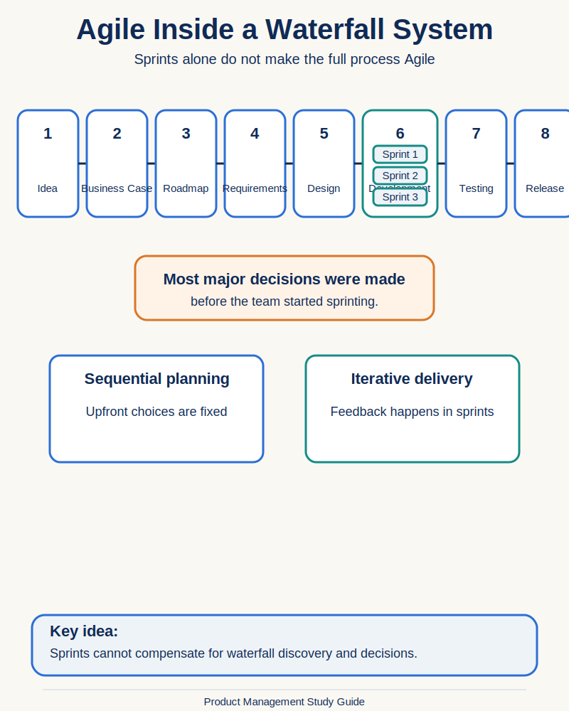
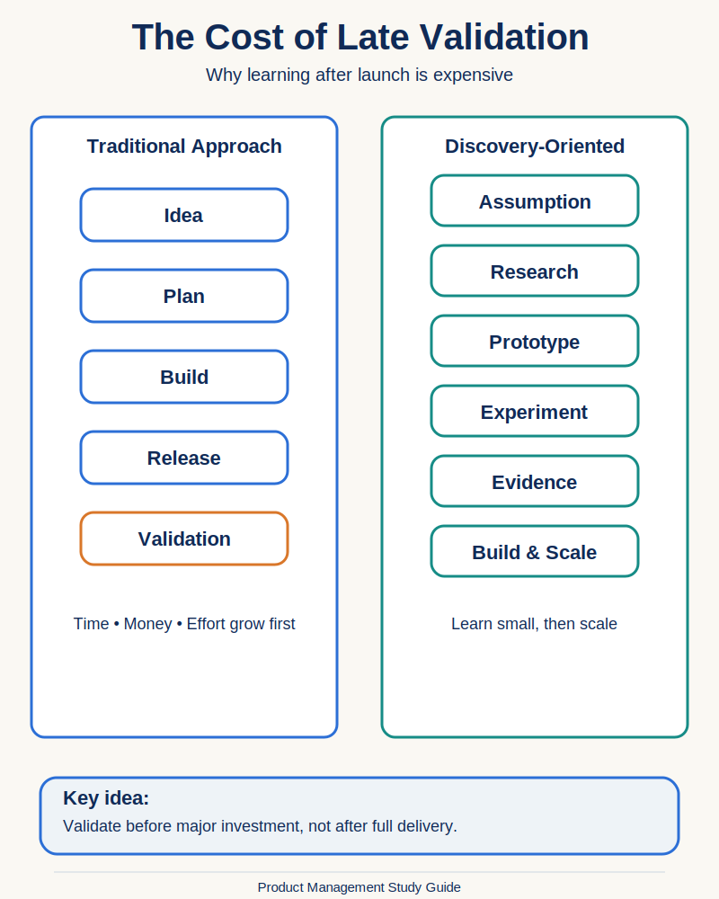
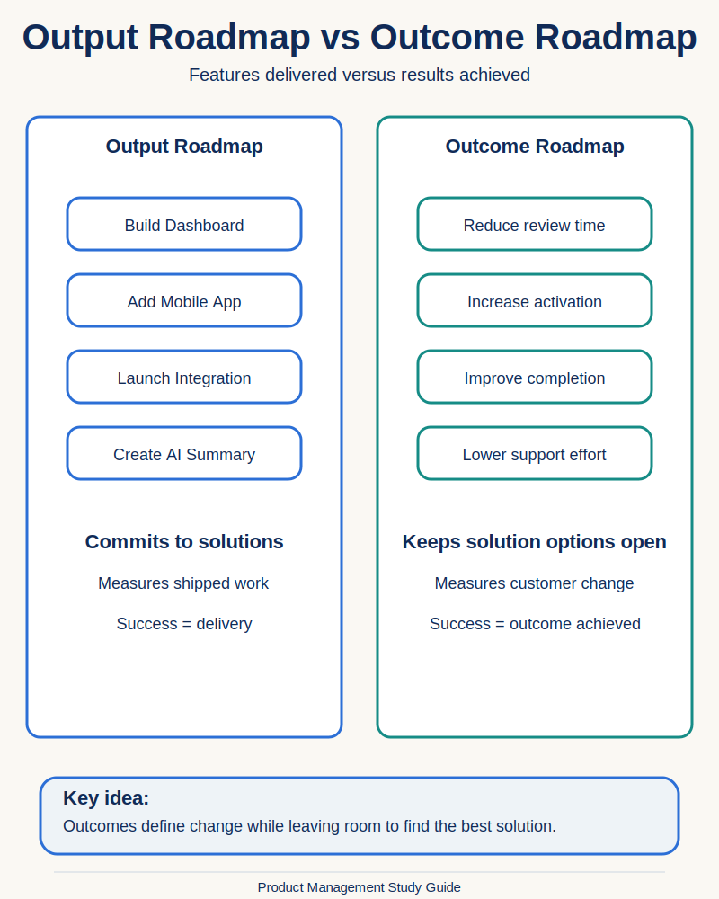
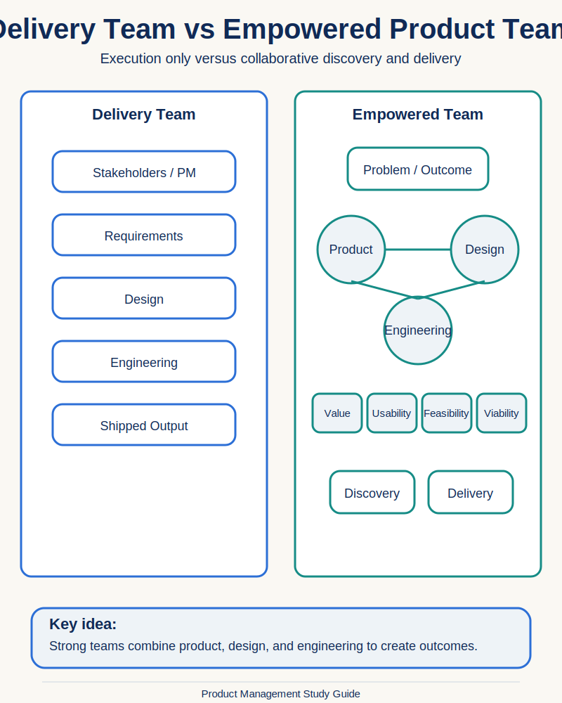

# Product Management Visual Index

This index collects the visual illustrations created across the study guide. Visuals remain embedded inside their source lecture notes; this file provides an additional browsing and revision layer.

## Part 1: Introduction

### Section 1: Introduction

#### The Traditional Product Process

**Source lecture:**  
[Why Product Management Is Broken](./01-introduction/01-introduction/11-why-product-management-is-broken.md)

**Purpose:** Shows the sequential product-development process and why validation often happens only after release.

#### Agile Inside a Waterfall System

**Source lecture:**  
[Why Product Management Is Broken](./01-introduction/01-introduction/11-why-product-management-is-broken.md)

**Purpose:** Shows that iterative sprints inside development do not make the wider product process Agile.

#### The Cost of Late Validation

**Source lecture:**  
[Why Product Management Is Broken](./01-introduction/01-introduction/11-why-product-management-is-broken.md)

**Purpose:** Compares learning after full delivery with validating before major investment.

#### Output Roadmap vs Outcome Roadmap

**Source lecture:**  
[Why Product Management Is Broken](./01-introduction/01-introduction/11-why-product-management-is-broken.md)

**Purpose:** Contrasts commitments to features with commitments to measurable customer or business change.

#### Delivery Team vs Empowered Product Team

**Source lecture:**  
[Why Product Management Is Broken](./01-introduction/01-introduction/11-why-product-management-is-broken.md)

**Purpose:** Contrasts execution-only delivery with collaborative discovery and delivery by a cross-functional product team.

## Part 2: Strategy

Visuals will be added when this part begins.

## Part 3: Discovery

Visuals will be added when this part begins.

## Part 4: Design

Visuals will be added when this part begins.

## Part 5: Development

Visuals will be added when this part begins.

## Part 6: Measurement

Visuals will be added when this part begins.

## Part 7: Career

Visuals will be added when this part begins.

## Part 8: Technology

Visuals will be added when this part begins.

## Main Navigation

- [Repository Overview](./README.md)
- [Course Index](./COURSE-INDEX.md)
- [Product Management Glossary](./GLOSSARY.md)
- [Course Concept Map](./COURSE-CONCEPT-MAP.md)
