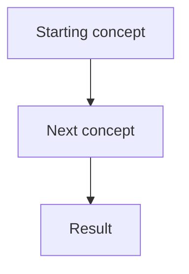

[← Previous Lecture](...)
·
[Section Overview](./README.md)
·
[Part Overview](../README.md)
·
[Next Lecture →](...)

# Lecture Title

> **Material level:** Level X — Briefly explain why this level fits the lecture.

## Lecture Overview

Explain:

- What the lecture covers
- Why the topic matters
- What the learner should understand by the end

Keep this section concise.

## Central Argument

State the lecture’s main message clearly.

For a short or simple lecture, rename this heading to:

```md
## Core Idea
```

## 1. First Major Concept

Explain the first major idea in a logical written structure.

Remove transcript repetition and spoken filler.

## 2. Second Major Concept

Explain the next major idea.

Add more numbered sections when needed.

## Comparison

Include this section only when the lecture contains a meaningful contrast.

| Concept A | Concept B |
|---|---|
|  |  |
|  |  |

## Practical Product Management Example

Include for Level 2 and Level 3 lectures.

Use a realistic example that directly supports the lesson.

Prefer SaaS, AI-product, recruitment, multi-tenant, pricing, onboarding, API,
discovery, roadmap, or analytics examples when relevant.

## Common Misunderstandings

Include only when the lecture could easily be oversimplified.

### “Possible misunderstanding”

Clarify what the instructor’s argument does and does not mean.

## Key Concepts and Definitions

| Concept | Simple definition |
|---|---|
|  |  |
|  |  |

## Key Takeaways

1.
2.
3.

Use approximately:

- 3–5 takeaways for Level 1
- 5–10 takeaways for Level 2
- 8–15 takeaways for Level 3

## Visual Summary

Use Mermaid when it improves understanding:



Use a simple text diagram instead when Mermaid is unnecessary.

## One-Minute Review

Provide a concise standalone review.

It should:

- Restate the central argument
- Include the most important distinctions
- Introduce no new concepts
- Be readable in approximately one minute

## Recommended Visual Illustrations

### Illustration 1: Visual Title

**Concept:** Explain what the illustration represents.

**Purpose:** Explain why it improves understanding or recall.

**Suggested structure:** Describe the main elements, sequence, or comparison.

### Illustration 2: Visual Title

**Concept:**

**Purpose:**

**Suggested structure:**

**Recommended total:** X illustrations

Do not generate the illustrations until the user explicitly requests them.

---

## Related Concepts

- [Related concept](../../path/to/existing-file.md)
- [Related concept](../../path/to/existing-file.md)

Include only links to existing files.

## Visuals in This Lecture

Include this section only after visuals have been created.

- [Visual title](./visuals/00-descriptive-visual-name.png)

## Interactive Lesson

Include this section only after an interactive HTML companion has been approved and created.

- [Open the interactive companion](./interactive/00-lecture-title.html)

## Source

- [Original lecture transcript](../../sources/part-folder/section-folder/00-lecture-title-transcript.md)

## Continue Learning

- Previous: [Previous Lecture](...)
- Section: [Section Name](./README.md)
- Part: [Part Name](../README.md)
- Next: [Next Lecture](...)
- Course index: [Full Course Index](../../COURSE-INDEX.md)
