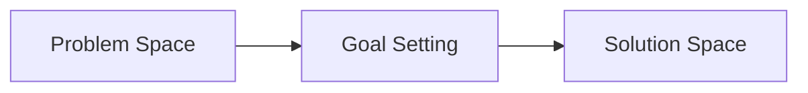

[← Previous Part](...)
·
[Part Overview](./README.md)
·
[Next Section →](./section-folder/README.md)

# Part X: Part Title

> **Material level:** Level 1 — This is a short introduction that establishes
> the purpose and structure of the course part.

## Part Overview

Explain:

- What this course part introduces
- Why the topic matters to Product Managers
- What the learner should expect from the upcoming sections

Keep this concise.

## Core Idea

State the main message of the part introduction.

## What This Part Covers

List the sections included in this part.

1. [Section One](./section-folder/README.md)
2. [Section Two](./section-folder/README.md)
3. [Section Three](./section-folder/README.md)

Include only existing section links.

## How the Sections Connect

Explain the learning sequence at a high level.

Example:

```text
Understand the problem
        ↓
Define the desired outcome
        ↓
Explore possible solutions
```

Use Mermaid instead when it improves clarity:



## Key Takeaways

1.
2.
3.

Keep this section brief.

## One-Minute Review

Summarize the purpose of the part and how its sections connect.

Do not introduce detailed concepts that belong to later lectures.

## Recommended Visual Illustrations

Part introductions normally need no more than one visual.

### Illustration 1: Part Learning Journey

**Concept:** Show how the major sections in this part connect.

**Purpose:** Give the learner a clear mental model before starting the part.

**Suggested structure:** A simple flow connecting the section names and their
main purpose.

**Recommended total:** 1 illustration

Do not generate the illustration until explicitly requested.

---

## Related Concepts

Include only links to existing related material.

- [Related concept](../path/to/existing-file.md)

## Source

- [Original part-introduction transcript](../sources/part-folder/00-part-introduction-transcript.md)

## Continue Learning

- Previous part: [Previous Part](../previous-part/README.md)
- Part overview: [Part Name](./README.md)
- Next section: [Next Section](./section-folder/README.md)
- Course index: [Full Course Index](../COURSE-INDEX.md)

Include only links to files that exist.