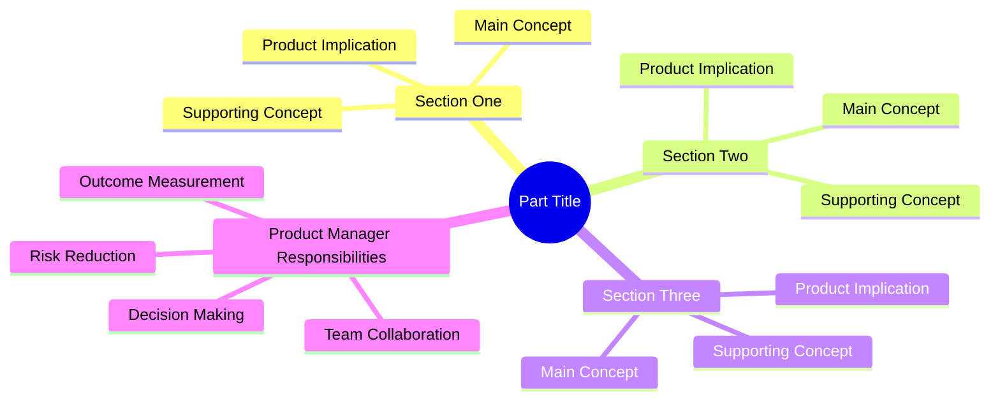
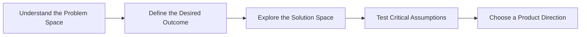

[Part Overview](./README.md)
·
[Part Summary](./part-summary.md)
·
[Course Index](../COURSE-INDEX.md)

# Part Mind Map: Part Title

## Conceptual Map

Use a Mermaid mind map when the part contains several connected themes,
capabilities, or Product Management concepts.



Replace all placeholders with concepts derived from the completed section
summaries.

The map should:

- Represent the complete course part
- Show how the sections connect
- Remain higher-level than section mind maps
- Emphasize relationships, not lecture order
- Avoid excessive detail
- Avoid copying section titles without showing conceptual meaning
- Remain readable in GitHub and Obsidian

## Alternative: Part Process Map

Use a flowchart instead when the part represents a clear learning or Product
Management process.

Example:



Choose either a mind map or a flowchart as the primary diagram.

Do not include both unless they communicate clearly different perspectives.

Suitable reasons to include both:

- A flowchart explains the sequence
- A mind map explains the broader conceptual relationships

## Section Relationships

Explain how the main sections influence one another.

### Section One → Section Two

Explain what the first section establishes and why the second section depends
on it.

### Section Two → Section Three

Explain the next important relationship.

### Cross-Section Relationship

Explain a concept that appears across multiple sections.

Keep this concise.

The detailed synthesis belongs in `part-summary.md`.

## Core Part Mental Model

State the most important mental model represented by the map.

Example:

> Product strategy moves from understanding a meaningful problem, to defining
> a desired outcome, to exploring and validating possible solutions.

This should be:

- Memorable
- Practical
- Broad enough to represent the entire part
- Consistent with the part summary

## Product Manager Perspective

Explain how the map should influence Product Manager behavior.

Consider:

- Which questions the PM should ask
- Which evidence the PM should seek
- Which risks should be reduced
- When design and engineering should be involved
- Which decisions should remain flexible
- Which outcomes should be measured

Keep this section high-level.

## Core Learning Path

Summarize the part as a compact sequence.

Example:

```text
Understand the context
        ↓
Define the problem
        ↓
Set the goal
        ↓
Explore solutions
        ↓
Validate assumptions
        ↓
Choose a direction
```

The learning path should help the learner recall the complete part quickly.

## How to Use This Map

Use this map to:

- Review the complete part quickly
- Understand how the sections connect
- Recall the major Product Management mental model
- Navigate back to section summaries
- Prepare for later parts of the course

## Sections Represented

List all completed sections included in the map.

1. [Section One](./section-one/README.md)
2. [Section Two](./section-two/README.md)
3. [Section Three](./section-three/README.md)

Add section summary links when they exist:

- [Section One Summary](./section-one/section-summary.md)
- [Section Two Summary](./section-two/section-summary.md)
- [Section Three Summary](./section-three/section-summary.md)

Do not include incomplete sections.

## Related Parts

Link only to existing parts that provide prerequisite knowledge or extend the
current domain.

- [Related Part](../related-part/README.md)

## Related Concepts

Link to useful existing glossary entries, lectures, section summaries, or
course-level resources.

- [Related Concept](../path/to/existing-file.md)
- [Related Concept](../path/to/existing-file.md)

---

## Continue Learning

- Part overview: [Part Title](./README.md)
- Part summary: [Part Summary](./part-summary.md)
- Previous part: [Previous Part](../previous-part/README.md)
- Next part: [Next Part](../next-part/README.md)
- Course concept map: [Course Concept Map](../COURSE-CONCEPT-MAP.md)
- Course index: [Full Course Index](../COURSE-INDEX.md)

Include only links to files that exist.