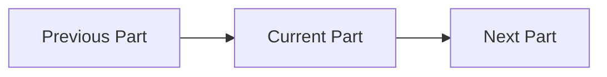
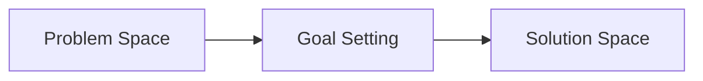

# Part X: Part Title

## Part Overview

Explain:

- What this major course part covers
- Why this domain matters to Product Managers
- Which sections belong to the part
- What the learner should understand after completing the part

Keep this high-level.

Do not duplicate the detailed content of section summaries or individual lectures.

## Part Learning Goals

After completing this part, the learner should understand:

- Learning goal one
- Learning goal two
- Learning goal three
- Learning goal four

Use outcome-oriented statements.

## How This Part Fits Into the Course

Explain how this part connects to:

- The previous major course part
- The next major course part
- The overall Product Management learning journey

Example:

```text
Previous Part
      ↓
Current Part
      ↓
Next Part
```

Use Mermaid when the relationship is clearer visually:



Do not add links to parts or files that do not exist.

## Sections

List the sections in their exact original course order.

1. [Section One](./03-section-one/README.md)
2. [Section Two](./04-section-two/README.md)
3. [Section Three](./05-section-three/README.md)

Add only section folders and README files that currently exist.

Do not create placeholder links.

## How the Sections Connect

Explain the logical relationship between the sections.

Focus on how one section prepares the learner for the next.

Example:

```text
Understand the problem
        ↓
Define the desired outcome
        ↓
Explore possible solutions
```

Use Mermaid when useful:



Keep this explanation concise.

Detailed synthesis belongs in `part-summary.md`.

## Part Resources

Add these links only after the files exist:

- [Part Introduction](./00-part-introduction.md)
- [Part Summary](./part-summary.md)
- [Part Mind Map](./part-mind-map.md)

When the summary or mind map does not yet exist, use:

> The part summary and mind map will be created after all sections in this part
> are complete.

Do not link incomplete placeholder files as finished resources.

## Key Themes

List the major themes covered across the part.

- Theme one
- Theme two
- Theme three
- Theme four

Keep these broader than individual lecture concepts.

Detailed definitions belong in lecture files and `GLOSSARY.md`.

## Related Parts

Link only to existing course parts with a meaningful relationship.

- [Related Part](../related-part/README.md)

A related part may:

- Provide prerequisite knowledge
- Extend the current domain
- Apply the current concepts later in the course

Do not add links merely to increase navigation.

## Part Progress

- [ ] Part-introduction transcript saved, when applicable
- [ ] Part introduction completed
- [ ] All section folders created
- [ ] All section lecture transcripts saved
- [ ] All lecture study guides completed
- [ ] All requested lecture visuals completed
- [ ] Visuals embedded within lecture notes
- [ ] All section summaries completed
- [ ] All section mind maps completed
- [ ] Part summary completed
- [ ] Part mind map completed
- [ ] Glossary updated
- [ ] Visual index updated
- [ ] Course concept map reviewed
- [ ] Cross-links between sections reviewed

Update this checklist as the part progresses.

## Navigation

- Previous part: [Previous Part](../previous-part/README.md)
- Next part: [Next Part](../next-part/README.md)
- Course index: [Full Course Index](../COURSE-INDEX.md)

Include only links to files that exist.