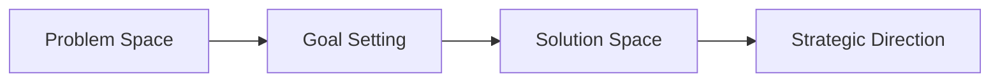
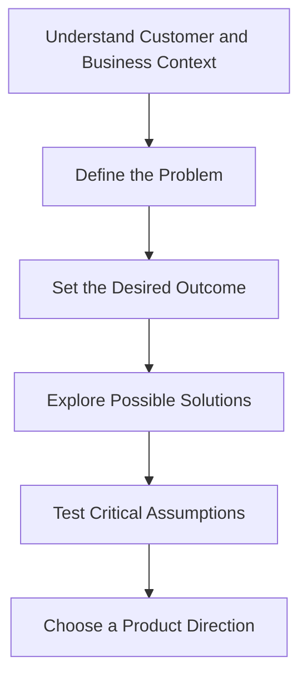
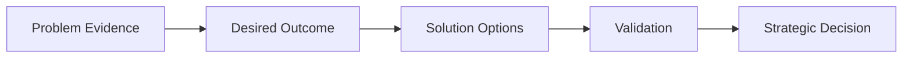

[Part Overview](./README.md)
·
[Part Mind Map](./part-mind-map.md)
·
[Course Index](../COURSE-INDEX.md)

# Part Summary: Part Title

## Part Overview

Explain the part as one connected Product Management domain.

Cover:

- The main subject of the part
- Why it matters to Product Managers
- The major learning journey across its sections
- What the learner should retain after completing the part

Do not summarize each section independently.

The purpose is to synthesize the complete part.

## The Central Theme

State the main idea that connects all sections in this part.

This should answer:

> What is the single mental model or Product Management capability developed
> across this part?

Use “Central Theme,” “Central Question,” or “Central Challenge,” depending on
the content.

## How the Sections Connect

Explain how the sections build on one another.

For example:

```text
Understand the problem
        ↓
Define the desired outcome
        ↓
Explore possible solutions
        ↓
Choose a strategic direction
```

Use Mermaid when useful:



Do not copy the section summaries.

Explain the relationships between them.

## Core Mental Model

Describe the most useful mental model for understanding the complete part.

It should be:

- Concise
- Memorable
- Practical
- Broad enough to connect all sections

Example:

> Strong product strategy begins by understanding a meaningful problem,
> defining the outcome to achieve, and then exploring solutions that can
> realistically create that outcome.

## Core Principles

List the most important principles from the complete part.

1.
2.
3.
4.
5.
6.

Each principle should combine ideas from more than one section where possible.

Avoid copying individual lecture takeaways.

## Main Sections

Summarize the role of each completed section in the larger part.

### Section X: Section Title

Explain:

- What this section contributes
- Which major risk or question it addresses
- How it connects to the next section

[Open section overview](./section-folder/README.md)

Repeat for each section in the part.

Keep each section explanation concise.

## Key Concepts

| Concept | Meaning within this part |
|---|---|
|  |  |
|  |  |
|  |  |

Use concise definitions.

Link to the root glossary when the relevant anchor exists:

```md
[Product strategy](../GLOSSARY.md#product-strategy)
```

Do not invent glossary anchors.

## Key Comparisons

Include only comparisons that are central to the complete part.

| Concept A | Concept B |
|---|---|
|  |  |
|  |  |

Possible examples:

- Problem space vs solution space
- Output vs outcome
- Strategy vs roadmap
- Discovery vs delivery
- Goal vs feature
- Evidence vs assumption

Do not force a comparison table when the part does not contain a meaningful
contrast.

## Complete Part Framework

Use this section when the part collectively describes a process or framework.

Explain:

1. The starting point
2. The major stages
3. The decisions made at each stage
4. The evidence required
5. The expected outcome

Example:



Omit this section when the part is primarily conceptual rather than
process-oriented.

## Product Manager Responsibilities

Explain how the complete part affects the Product Manager’s role.

Consider:

- Decisions the PM must own or facilitate
- Evidence the PM should seek
- Stakeholders the PM should align
- Collaboration with design and engineering
- Risks the PM should reduce
- Outcomes the PM should measure
- Common traps the PM should avoid

Focus on practical responsibilities rather than generic job descriptions.

## Practical Product Management Example

Provide one integrated example that applies concepts from multiple sections.

Prefer a realistic scenario involving:

- SaaS
- AI-powered products
- Candidate assessment
- Recruitment technology
- Multi-tenant platforms
- Pricing and packaging
- Onboarding
- APIs and integrations
- Product analytics

The example should show the full part-level mental model.

Do not repeat one lecture example without expanding it across the complete part.

## Common Mistakes Across the Part

Include only mistakes that connect several sections.

### Mistake 1: Short description

Explain why it happens and what better Product Management behavior looks like.

### Mistake 2: Short description

Explain the correction.

Do not repeat every misunderstanding from individual lectures.

## Part Visual Summary

Create one high-level Mermaid diagram or text model summarizing the complete
part.

Example:



This should be higher-level than:

- Lecture visual summaries
- Section summary diagrams
- Section mind maps

Do not duplicate the part mind map exactly.

The visual summary should show the main flow.

The part mind map should show broader relationships.

## Part-Level Review

Provide a concise review of the complete part.

It should:

- Explain the central theme
- Connect all major sections
- Include the most important distinctions
- Explain practical PM implications
- Introduce no new ideas
- Be useful for fast revision

Target approximately five to ten minutes of reading, depending on the
complexity of the part.

## Sections in This Part

List every completed section in original course order.

1. [Section One](./section-one/README.md)
2. [Section Two](./section-two/README.md)
3. [Section Three](./section-three/README.md)

Add links to section summaries when they exist:

- [Section One Summary](./section-one/section-summary.md)
- [Section Two Summary](./section-two/section-summary.md)
- [Section Three Summary](./section-three/section-summary.md)

Do not add links to files that do not exist.

## Related Parts

Link only to existing parts that provide prerequisite knowledge or extend this
domain.

- [Related Part](../related-part/README.md)

## Related Concepts

Link to useful existing lectures, glossary entries, section summaries, or
course-level resources.

- [Related Concept](../path/to/existing-file.md)

---

## Continue Learning

- Part overview: [Part Title](./README.md)
- Part mind map: [Part Mind Map](./part-mind-map.md)
- Previous part: [Previous Part](../previous-part/README.md)
- Next part: [Next Part](../next-part/README.md)
- Course index: [Full Course Index](../COURSE-INDEX.md)

Include only links to files that exist.