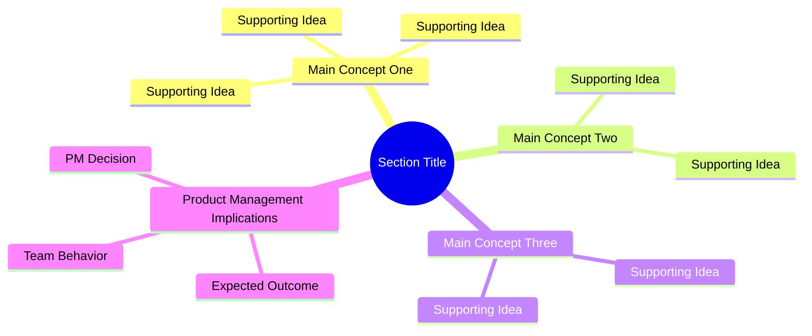
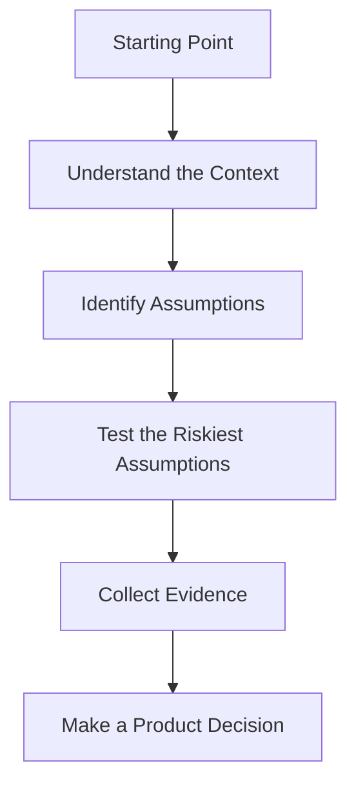

[Section Overview](./README.md)
·
[Section Summary](./section-summary.md)
·
[Part Overview](../README.md)

# Section Mind Map: Section Title

## Conceptual Map

Use a Mermaid mind map when the section contains several related concepts.



Replace all placeholder concepts with ideas derived from the completed lectures.

The map should:

- Represent the full section
- Show relationships among concepts
- Remain readable
- Stay more conceptual than procedural
- Avoid copying lecture headings mechanically
- Avoid excessive detail

## Alternative: Process Map

Use a flowchart instead when the section is primarily process-oriented.



Choose either a mind map or a flowchart as the primary diagram.

Do not include both unless they communicate clearly different views.

## Key Relationships

Explain the most important relationships represented in the map.

### Relationship 1

Explain how one concept influences or depends on another.

### Relationship 2

Explain the next important connection.

### Relationship 3

Explain how the concepts affect Product Management decisions or team behavior.

Keep this section concise. Its purpose is to help the learner interpret the
diagram, not repeat the section summary.

## Core Learning Path

Summarize the conceptual journey in a compact sequence.

Example:

```text
Understand the context
        ↓
Recognize the problem
        ↓
Test assumptions
        ↓
Collect evidence
        ↓
Make a better product decision
```

## How to Use This Map

Use this map to:

- Review the complete section quickly
- Understand how lecture concepts connect
- Recall the section before continuing the course
- Navigate back to detailed lecture explanations

## Lectures Represented

List all completed lectures included in the map.

1. [Lecture One](./01-lecture-one.md)
2. [Lecture Two](./02-lecture-two.md)
3. [Lecture Three](./03-lecture-three.md)

Do not include lectures that have not been completed.

## Related Concepts

Link to existing glossary entries, lectures, sections, or part resources.

- [Related Concept](../../path/to/existing-file.md)
- [Related Concept](../../path/to/existing-file.md)

---

## Continue Learning

- Section overview: [Section Title](./README.md)
- Section summary: [Section Summary](./section-summary.md)
- Part overview: [Part Title](../README.md)
- Previous section: [Previous Section](../previous-section/README.md)
- Next section: [Next Section](../next-section/README.md)
- Course index: [Full Course Index](../../COURSE-INDEX.md)

Include only links to files that exist.