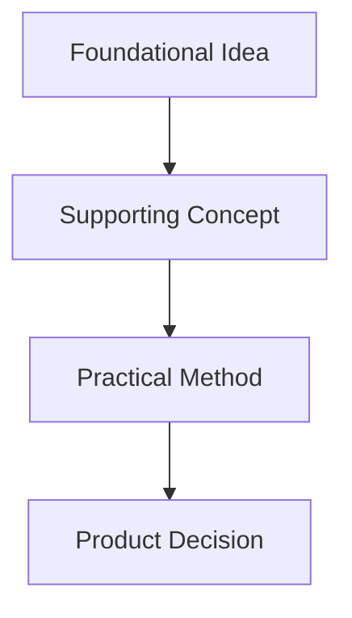
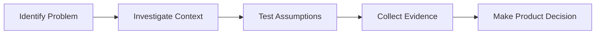
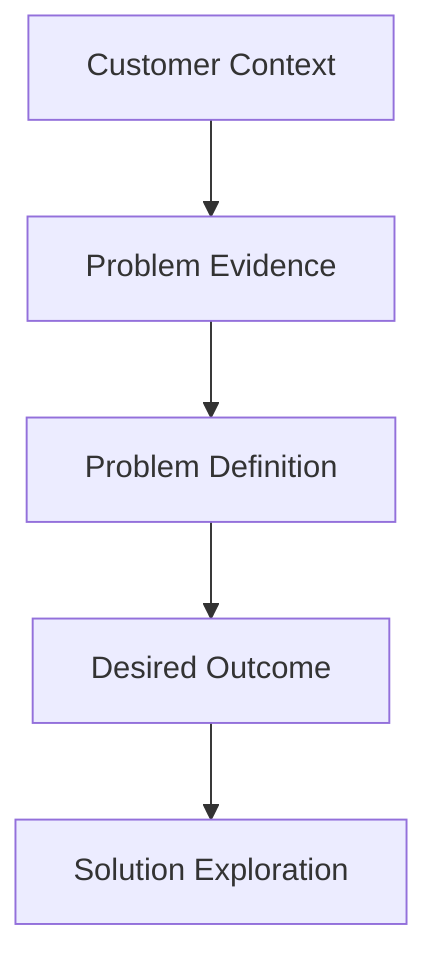

[Section Overview](./README.md)
·
[Section Mind Map](./section-mind-map.md)
·
[Part Overview](../README.md)

# Section Summary: Section Title

## Section Overview

Explain the section as one connected topic.

Cover:

- The central subject of the section
- Why it matters to Product Managers
- The major learning journey across the lectures
- What the learner should retain after completing the section

Do not summarize each lecture independently in this section.

The purpose is synthesis, not repetition.

## The Central Question

State the main question or challenge addressed by the section.

Example:

> How can a product team understand and validate a customer problem before
> committing to a solution?

Use “Central Problem,” “Central Question,” or “Central Theme,” depending on the
section.

## How the Lectures Connect

Explain the logical relationship between the lectures.

Show how one lecture:

- Establishes a foundation
- Introduces a new concept
- Extends a previous idea
- Adds a practical method
- Resolves a risk or misunderstanding

Use a concise sequence when useful:

```text
Foundational concept
        ↓
Deeper understanding
        ↓
Practical method
        ↓
Product Management implication
```

Use Mermaid when the relationship is clearer visually:



## Core Mental Model

Describe the single mental model that best represents the complete section.

This should answer:

> What framework or way of thinking connects all lectures in this section?

Keep it concise and memorable.

## Core Principles

List the most important principles from the complete section.

1.
2.
3.
4.
5.

Each principle should combine learning from multiple lectures where possible.

Avoid copying lecture takeaways word for word.

## Key Concepts

| Concept | Meaning within this section |
|---|---|
|  |  |
|  |  |
|  |  |

Use concise definitions.

Link to the root glossary when relevant:

```md
[Product discovery](../../GLOSSARY.md#product-discovery)
```

Only link to anchors that actually exist.

## Key Comparisons

Include only comparisons that are central to the section.

| Concept A | Concept B |
|---|---|
|  |  |
|  |  |

Possible examples:

- Problem vs solution
- Output vs outcome
- Qualitative vs quantitative evidence
- Discovery vs delivery
- Assumption vs validated learning

Do not force a comparison table when the section does not contain a meaningful
contrast.

## Section Process or Framework

Use this section when the lectures collectively describe a process, framework,
or sequence.

Explain:

1. The starting point
2. The major steps
3. The evidence or decisions produced
4. The expected result

Example:



Omit this section when the section is primarily conceptual rather than
process-oriented.

## Practical Product Management Implications

Explain how the complete section should influence a Product Manager’s work.

Consider implications for:

- Product discovery
- Strategy
- Prioritization
- Customer research
- Stakeholder communication
- Team collaboration
- Technical feasibility
- Roadmaps
- Delivery
- Metrics and learning

Focus on practical behaviors and decisions.

## Practical Example

Provide one compact example that applies several section concepts together.

Prefer a realistic SaaS, AI-product, recruitment, multi-tenant, onboarding,
pricing, API, or analytics scenario when relevant.

The example should demonstrate the complete section mental model rather than
repeat an example from one lecture.

## Common Misunderstandings Across the Section

Include only when several lectures collectively clarify common confusion.

### “Possible misunderstanding”

Explain the more accurate interpretation.

Do not repeat every misunderstanding from the individual lecture files.

## Section Visual Summary

Create one high-level Mermaid diagram or text model that summarizes the complete
section.

Example:



This diagram should be higher-level than individual lecture visuals.

Do not duplicate the section mind map exactly.

The section summary visual should explain the primary flow or mental model.

The section mind map should show broader conceptual relationships.

## Five-Minute Review

Provide a concise review of the complete section.

It should:

- Explain the central theme
- Connect the major concepts
- Include the most important distinctions
- Explain practical PM implications
- Introduce no new ideas
- Be readable in approximately five minutes

Do not organize it as separate lecture summaries.

## Lectures in This Section

List every completed lecture in original course order.

1. [Lecture One](./01-lecture-one.md)
2. [Lecture Two](./02-lecture-two.md)
3. [Lecture Three](./03-lecture-three.md)

Do not add links to lecture files that do not exist.

## Related Sections

Link only to existing sections that provide prerequisites or extensions.

- [Related Section](../../part-folder/section-folder/README.md)

## Related Concepts

Link to useful existing lecture, glossary, section, or part resources.

- [Related Concept](../../path/to/existing-file.md)

---

## Continue Learning

- Section overview: [Section Title](./README.md)
- Section mind map: [Section Mind Map](./section-mind-map.md)
- Part overview: [Part Title](../README.md)
- Previous section: [Previous Section](../previous-section/README.md)
- Next section: [Next Section](../next-section/README.md)
- Course index: [Full Course Index](../../COURSE-INDEX.md)

Include only links to files that exist.